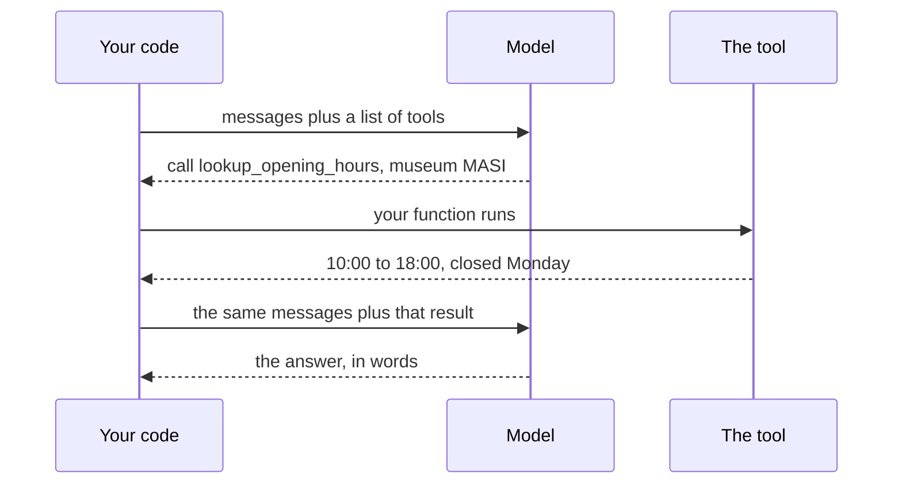

import Quiz from '@components/Quiz.astro';

Everything so far has treated a model as a box that takes text and returns text. That was the
right first picture, and it is now the limiting one.

Three additions to the same request are what make a model *designable* rather than merely
impressive: you can require the reply to arrive in a shape you defined, you can let the model
ask your code to do something, and you can put a picture in the request. Each is a paragraph of
mechanism and a large change in what you can build.

The mechanism underneath does not change. It is still the loop from the
[first lesson](/ares_materials_estudi/ai-as-a-material/what-a-language-model-is/), still one
token at a time, still capable of being confidently wrong. What changes is what those tokens
are allowed to be, and what happens to them next.

## Structured output

The [prompting lesson](/ares_materials_estudi/ai-as-a-material/prompting/) told you to ask for
JSON and then check what arrived, because a model likes to wrap it in a friendly sentence.
Asking is the chat-window version. From code you can do better.

Most providers let you send a **schema** — a description of the shape you want back: which
fields exist, what type each one holds, which are required, and for a field with a fixed set of
answers, the exact list of allowed values. The provider then constrains the generation so that
only tokens which keep the reply valid can be chosen. This is called **structured output**, and
the reply is valid by construction rather than by good manners.

A schema for a single tagged comment says roughly this, in whatever notation your provider uses:

```text
an object with
  sentiment  one of "positive", "neutral", "negative"   (required)
  theme      text                                        (required)
  quote      text                                        (required)
  confidence a number between 0 and 1                    (required)
```

What that buys you is not tidiness. It is the difference between two kinds of code:

| Asking for JSON | Requiring a schema |
|---|---|
| Strip the code fence, hope, `try` / `catch` around the parse | `JSON.parse` and carry on |
| A new field name appears one run in fifty | The field names are the ones you listed |
| `sentiment` comes back as `"quite positive"` | `sentiment` is one of your three values |

That last row is the one that matters for an interface. A value drawn from a list you wrote can
drive a filter, a colour, a sort order, a component variant — the model's output becomes a real
input to a design system instead of a paragraph you have to read first.

Two things it does not do, and both catch people.

**A valid shape is not a true answer.** The schema decides that `confidence` is a number between
0 and 1. Nothing makes that number mean anything. Enforced structure removes a whole class of
parsing bugs and removes none of the
[hallucination](/ares_materials_estudi/ai-as-a-material/what-a-language-model-is/).

**A shape with no way out gets filled in anyway.** If your only allowed sentiments are positive,
neutral and negative, a comment in another language about something else entirely still comes
back as one of the three. Put the escape hatch in the schema — an `unclear` value, an optional
field, a `notes` field for what did not fit — or you have designed a machine that never says it
does not know.

## Tool use

This is the one that changes the most, and it is the one people picture wrongly.

You send, alongside your messages, a list of **tools**: for each one a name, a sentence saying
what it does and when to use it, and a description of the arguments it takes. The model may then
reply not with an answer but with a request — *call `lookup_opening_hours` with
`{"museum": "MASI"}`*. Your code runs that function, sends the result back as another message,
and the model continues with the result in front of it.



Read that diagram twice, because the whole design argument is in the arrows. **The model never
runs anything.** It emits the name of a tool and some arguments — text, like everything else it
emits. Your code decides whether to run it, and can refuse. Providers call this *tool use* or
*function calling*; the two names mean the same thing.

Why it matters for interaction design:

- **It closes the gap with the present.** Training stopped at some point in time and the model
  has no idea what today's readings are. A tool that returns the current value fixes that
  properly, where a longer prompt cannot.
- **It reaches your material.** A tool can read your sensor log, query your dataset, control a
  light, move a servo, or search your own notes. This is where a model stops being a text box
  and starts being a component in the thing you are building.
- **It is how the language works.** A model plus tools plus a loop is what everyone means by an
  **agent** — the vocabulary the
  [adaptive and agentic](/ares_materials_estudi/design-methods/adaptive-and-agentic/) lesson
  gives you the design language for.
- **Arithmetic and lookups stop being a weakness.** A calculator tool is more reliable than any
  amount of asking a plausibility engine to be careful.

:::danger[Every tool you offer is a permission you granted]
[Prompt injection](/ares_materials_estudi/ai-as-a-material/calling-a-model/) was a warning about
text one lesson ago. With tools it is a live wire: a web page, a filename or a visitor's message
can contain instructions, and the model choosing which tool to call has read them. The defence
has not changed, it has only got more urgent. Give it tools that read; put a person in front of
any tool that sends, publishes, deletes, pays or contacts someone.
:::

Cost, since nobody mentions it: a tool call is at least two round trips instead of one, and the
tool's result is resent with the rest of the history on every later turn. A tool that returns
four hundred lines of JSON is a bill.

## Image input

Some models accept images alongside the text in a message — a photograph, a screenshot, a scan,
a frame grabbed from a webcam. You get back what you always get back: words.

For a designer this is the cheapest input device you own. A camera becomes a sensor that reports
in language rather than in numbers, which means you can ask it things a light sensor cannot
answer: *how many people are at this table*, *is this sketch symmetrical*, *what does this label
say*, *describe the mood of this room*. Sorting a folder of photographs, reading a handwritten
workshop wall, checking a print for the thing you always forget — all of that is a few lines
away from the request you already know how to write.

Four caveats, none of which should stop you.

- **It is the same plausibility engine.** It reads a gauge wrong, invents text in a blurry
  photograph, and describes what is usually in a picture like this one. Confident and wrong
  behaves exactly as it does with text.
- **Images are expensive in tokens.** A picture is converted into a large number of tokens
  before the model sees it, so images cost noticeably more than a sentence. Send them at a
  sensible size rather than at camera resolution.
- **Photographs of people are personal data.** Everything in
  [limits and ethics](/ares_materials_estudi/ai-as-a-material/limits-and-ethics/) applies, and
  more sharply: a face is identifying, and the people in a photograph of a public space did not
  consent to anything.
- **Fine spatial detail is not its strength.** Exact positions, precise measurements and small
  text are where it is weakest, which is worth knowing before you build a measuring tool.

## Putting it together

None of this is a different API. It is the same POST request from the
[previous lesson](/ares_materials_estudi/ai-as-a-material/calling-a-model/) with extra fields in
the JSON body: a schema for the reply, a list of tools, an image attached to a message. The
field names and the exact structure differ per provider and change over time — read their
current documentation, exactly as you did for the endpoint.

The habit worth taking from this page is not the syntax. It is that you now choose, per project,
**what the model is allowed to return and what it is allowed to reach**. Those two decisions are
the ones with a person on the other end of them.

:::tip[Reach for the smallest of the three]
A schema turns a model into a component you can build on and costs you almost nothing. Tools
make it capable and make every risk in this section real. Images open a new input entirely. Add
them one at a time, in that order, and keep the plain text version working first.
:::

<Quiz
	questions={[
		{
			q: 'You give a model a tool called delete_file and describe what it does. What can the model do?',
			options: [
				'Delete files, which is why a tool must always be read-only',
				'Emit a request to call it; your code decides whether to run',
				'Delete files, unless the provider blocks the call for safety',
			],
			answer: 1,
			explanation:
				'A tool call is text: a name and some arguments. Nothing runs until your code runs it, which is the whole point — the model proposes and you dispose. It is also why a tool that sends, publishes, deletes or pays needs a person between the proposal and the action.',
		},
		{
			q: 'Enforced schema output guarantees which of these?',
			options: [
				'That the fields and values are the ones you listed',
				'That the values in those fields are correct and checkable',
				'That the model understood the question you asked it',
			],
			answer: 0,
			explanation:
				'The provider constrains generation so the reply fits the shape. Shape is all it constrains: a confidence of 0.97 is a valid number and may still be nonsense. Structured output removes parsing bugs, not hallucination.',
		},
		{
			q: 'Your schema allows only positive, neutral and negative, and a comment arrives in Portuguese about the parking. What comes back?',
			options: [
				'An error, since the comment does not fit any of the values',
				'One of your three values, chosen anyway and with no signal',
				'An empty reply, because the model declines to guess at it',
			],
			answer: 1,
			explanation:
				'A constrained reply is always valid, and validity is not a judgement. If there is no way for the model to say the input did not fit, it cannot say so — put an unclear value or a notes field in the schema and you get the signal back.',
		},
	]}
/>

Next: [running a model on your own machine](/ares_materials_estudi/ai-as-a-material/running-a-model-locally/), where these three capabilities are exactly what you trade away.
