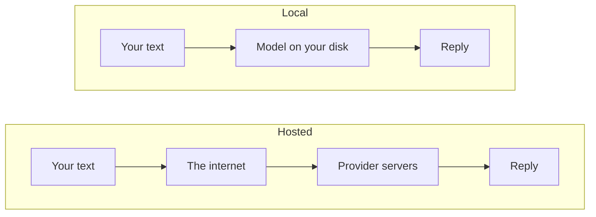

The syllabus for *Intelligence as a Material* names "private, local models" alongside cloud
APIs, and that pairing is deliberate. A model running on your own machine is a different
material with different properties, and some of the things you will want to build in this
master are only possible with one.

**Local** here is literal: a file of several gigabytes sits on your disk, the computation
happens on your processor, and nothing you type crosses the network. No account, no key, no
request, no bill.

The difference is easiest to see as a question of where your words travel:



Every argument in this lesson, for and against, comes from that missing middle step.

## Why you would

**Privacy.** Interview transcripts, a client's unreleased work, anything with a real person's
name in it. When the model is local, the question "where did this data go" has the answer
"nowhere". The [ethics lesson](/ares_materials_estudi/ai-as-a-material/limits-and-ethics/)
takes this up properly, because it is the reason that matters most for design research.

**No per-call cost.** Once it is downloaded you can run it ten thousand times. That changes
what you are willing to try — batch experiments, brute-force variation, leaving something
running overnight — in a way that a per-token bill quietly discourages.

**Offline.** An installation in a gallery with terrible wifi, a workshop in a basement, an
exhibition where the venue's network goes down an hour before the opening. A piece that depends
on somebody else's server is a piece that can be switched off by somebody else's outage.

**No rate limits, no surprises.** Nobody throttles you, and nobody updates the model underneath
your project. If your degree work has to behave the same way in six months as it does today,
that is a real argument.

## What you give up

**Capability.** A model that fits on a laptop is far smaller than a hosted one. It follows long
or layered instructions less reliably, invents more, and is noticeably weaker in languages
other than English. The gap narrows every year and it has not closed.

**Disk and memory.** Models are gigabytes each, and the whole thing has to be held in memory
while it runs. Collecting six of them is a straightforward way to fill a laptop.

**Speed.** Without a capable GPU, the text comes out slowly enough to feel it. Apple Silicon
Macs do unusually well here because the processor and graphics share one pool of fast memory. A
Windows or Linux laptop with no discrete graphics card will run small models, patiently.

**You are now the maintenance.** Nobody is fixing it at three in the morning.

Local is not a cheaper cloud. It is a trade: capability for control.

## Size, and whether it will fit

Model names carry a number like **7B** or **3B**. That is the count of **parameters** — the
internal numbers learned during training, in billions. More parameters generally means more
capable, a bigger file, and more memory needed to run it.

The second number is **quantisation**, and it is the one that decides whether a model runs on
your machine at all.

Each of those billions of parameters is a number, and a number can be stored precisely or
approximately. Quantisation stores them with less precision — the same model, rounded off.
Labels look like `Q4` or `Q8`, meaning roughly four or eight bits per parameter instead of the
sixteen a model is usually trained at. Four-bit quantisation cuts the file to roughly a quarter
of its original size while doing surprisingly little damage to the output. It is not free: very
aggressive quantisation makes a model sloppier, more repetitive, and worse at precise work. In
practice, four bits is where most people settle.

Two rules of thumb are enough to shop with:

- **Look at the download size, not the parameter count.** A quantised model's file size is the
  honest number, because that is roughly what has to fit in memory.
- **You want it comfortably below your free memory.** Your operating system, browser and editor
  are already using several gigabytes. If the model file is close to your total RAM, expect
  your machine to crawl; if it exceeds it, expect it to fail.

A laptop with 8 GB of memory runs the smallest models. 16 GB opens up the middle. Beyond that
you are into models that are genuinely useful for real work, and into machines the school
computer lab is more likely to have than your rucksack.

## Two ways in

**[Ollama](https://ollama.com)** is the terminal-first option and the one to start with. You
install it once, then pull and run models by name. It handles the download, the quantisation
choice and the memory management for you.

```bash
ollama run <model-name>
```

Take the exact name from the model list on ollama.com rather than from a tutorial — the popular
models turn over every few months, and last year's name gives you a confusing error. That
single command downloads the model the first time (expect gigabytes and a wait) and then drops
you into a prompt where you can type at it. The list shows each model's size; pick a small one
first and see how your machine copes before pulling something ambitious.

The handful of other commands worth knowing:

```bash
ollama list          # what you have downloaded
ollama rm <model>    # delete one and reclaim the disk space
```

**LM Studio** is the same idea with a window: a desktop application where you browse models,
see their file sizes, download with a click and chat in a built-in interface. If a terminal
still feels like a foreign country, start here — it makes the size-and-quantisation decision
visible instead of implicit. Download it from [lmstudio.ai](https://lmstudio.ai) rather than
a mirror.

## The part that connects to the last lesson

Both of these can also run as a **local server** on your machine, which means the code from the
[previous lesson](/ares_materials_estudi/ai-as-a-material/calling-a-model/) works nearly
unchanged: the same `fetch`, the same list of messages, an address on your own computer instead
of a provider's, and no API key to protect. Each tool documents its own local address and
request format — check its documentation, exactly as you would a hosted provider's.

That is the moment local models become interesting for this course. Your sketch, your
installation, your Arduino piece talking to a model, all of it running on a laptop in a room
with no internet.

:::tip[The first run is slow and this is normal]
Downloading is minutes to tens of minutes. The first response is slower than the ones after it,
because the model has to be loaded into memory. If your fans spin up, that is the machine doing
the work a data centre usually does.
:::

## Try it

This one needs your hands rather than a quiz. Budget an hour, most of it waiting for a
download.

- [ ] I have installed Ollama from ollama.com, or LM Studio from lmstudio.ai
- [ ] I have checked how much free disk space and memory my laptop has
- [ ] I have chosen a small model and noted its download size before pulling it
- [ ] I have pulled it and asked it a question, and seen text come back
- [ ] I have watched how fast the words appear, and compared that with a hosted chat model
- [ ] I have turned off my wifi and asked it another question, and it still answered
- [ ] I have asked it something factual and specific that I can verify, and checked the answer
- [ ] I have asked it the same thing twice and compared the two replies
- [ ] I know how to list my downloaded models and delete one to reclaim disk space

The seventh and eighth items are the interesting ones. A small local model hallucinates more
readily than the hosted ones you are used to, and seeing that on your own machine, on a
question you know the answer to, teaches the point of the next lesson faster than reading it
will.
