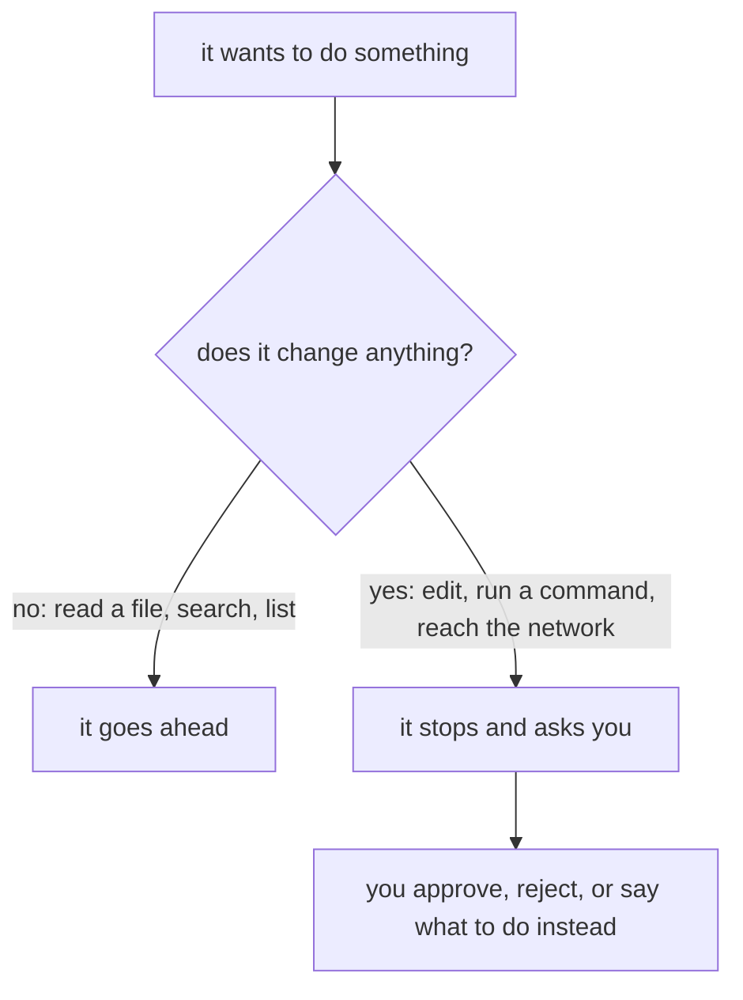

import Quiz from '@components/Quiz.astro';

A tool that edits your files is only comfortable to use once you know exactly when it will and
when it will not. That is what this lesson is for. Read it before you let it change anything, and
the nervousness goes away — not because the tool is harmless, but because you will know where the
brakes are.

## The rule in one line

It asks before it changes anything. It does not ask to look.



Concretely, it will stop and ask before:

- **editing or creating a file**
- **running a shell command that has side effects** — installing something, deleting something,
  a git command that writes
- **making a network request to a domain that is not on the allowed list**

It will not ask before **reading or searching files** inside your working directory. Opening a
file to see what is in it changes nothing, and asking each time would make it unusable — a single
question can involve reading thirty files.

That distinction is worth holding onto, because it tells you what the tool has seen. Everything
in the folder you started in is readable by it, without a prompt. Do not run it in a folder
containing something you would not want sent to a server — passwords in a text file, a client's
unreleased material, your tax returns.

## The four modes

Modes change how much it asks. You cycle through them with **`Shift+Tab`**, and the current one
is shown near the prompt.

| Mode | What it does |
|---|---|
| **Default** (manual) | Asks before every edit and every command with side effects. Where you should be. |
| **Accept edits** | Stops asking for file edits and safe filesystem commands. Still asks for the risky ones. |
| **Plan** | Reads, explores and writes you a proposal. Changes nothing at all, ever. |
| **Auto** | Asks least. For work you have already done enough of to predict. |

### Stay in default

Not out of caution for its own sake. In default mode, every proposed change is shown to you
before it happens, which means you read the code it wrote — and reading it is how you learn
anything from this tool. Accept-edits mode is faster and teaches you nothing, because the code
appears already applied and the natural thing to do with an applied change is not read it.

The speed you gain is real. Give it up for now anyway; you are here to end the semester able to
write this yourself.

### Plan mode is the one to actually learn

**Plan mode** explores your project and tells you what it would do, without touching a single
file. For someone learning, this is the most valuable setting in the tool, and it is the one
almost nobody uses.

```text
Shift+Tab until it says plan mode, then:

Explain how the button in index.html ends up changing the text on the page.
Walk me through it file by file. Do not write any code.
```

You get a guided tour of your own project with no possibility of it being rearranged behind your
back. Use it whenever your goal is to understand rather than to ship.

## Reading the diff

When it proposes an edit, what you see is a **diff**: the file's old and new versions shown
together, with removed lines marked `-` and added lines marked `+`. You met this idea in the
[git section](/ares_materials_estudi/git-and-github/branches-and-pull-requests/) — it is the same
thing a pull request shows.

Read it before you approve. Every time, while you are learning. Three separate things come out of
that habit:

1. **You catch the wrong ones.** Most bad changes are obvious in the diff and invisible in the
   result — a line deleted that you needed, a file touched that had nothing to do with the
   request.
2. **You find out what it thought you asked for.** A diff that solves a different problem means
   your request was ambiguous. That is useful information about your own prompting, and you only
   get it by looking.
3. **You read code you did not write, with the intent already in your head.** This is close to the
   best available exercise for someone at your stage, and it happens for free as a side effect of
   being careful.

If a diff is too long to read, the request was too big. Say no, and ask for the first step only.

## Undoing

Edits hit the disk immediately — there is no separate save step to withhold. So the undo matters:

- **`Esc` twice** rewinds the conversation and undoes the edits that came with it. This is the
  in-the-moment fix, for when you approved something and immediately thought better of it.
- **`git restore .`** throws away every uncommitted change in the folder and returns you to your
  last commit. This is the real safety net, and it works no matter how confused things got.

Which is why the previous lesson told you to commit before you start. A clean commit turns any
session, however badly it goes, into something you can walk away from.

:::caution[Approving is a decision, not a formality]
The moment you find yourself pressing yes without reading, you have quietly switched into
accept-edits mode without gaining the speed. If that happens, it is usually a sign you are tired
or the task is too big. Stop the session; both problems are worse the longer you push.
:::

<Quiz
	questions={[
		{
			q: 'Which of these will Claude Code do without asking you first?',
			options: [
				'Edit a file in your project',
				'Read and search the files in your working directory',
				'Install a package',
			],
			answer: 1,
			explanation:
				'Reading changes nothing, and a single question can involve reading dozens of files, so it is not gated. Anything that changes your machine — an edit, a command with side effects, a network request to a domain not on the allowed list — stops and asks. The useful consequence: assume everything in the folder you started in has been read.',
		},
		{
			q: 'Why should someone learning to code stay in the default permission mode rather than accept-edits?',
			options: [
				'Accept-edits mode is unsafe and can damage your machine',
				'Because default mode shows you every change before it happens, and reading those changes is where the learning is',
				'Because accept-edits mode costs more',
			],
			answer: 1,
			explanation:
				'Accept-edits is not dangerous, it is faster. The problem is that an already-applied change does not get read, and reading the diff is the part that teaches you anything. Giving up the speed is a deliberate trade while your course is still testing you individually.',
		},
		{
			q: 'What is plan mode good for?',
			options: [
				'Making it work faster on large tasks',
				'Having it explore and explain your project, and propose an approach, without changing any file',
				'Planning which files to delete',
			],
			answer: 1,
			explanation:
				'It reads and proposes but never edits, which makes it the safest way to ask "how does this work" or "how would you approach this" about a project you are still finding your way around. It is the most useful mode for learning and the least used.',
		},
		{
			q: 'You approved an edit and immediately realised it was wrong. What are your two ways out?',
			options: [
				'Press Esc twice to undo, or git restore . to return to your last commit',
				'Close the terminal window quickly before it saves',
				'Ask it to remember the old version and put it back',
			],
			answer: 0,
			explanation:
				'Edits are written to disk straight away, so there is nothing to cancel by closing the window. Esc twice rewinds the conversation and its edits; git restore . discards everything uncommitted and is the reliable one — which is why you commit before you start.',
		},
	]}
/>

Next: [learning, not outsourcing](/ares_materials_estudi/claude-code/learning-not-outsourcing/) —
the lesson this section exists for.
