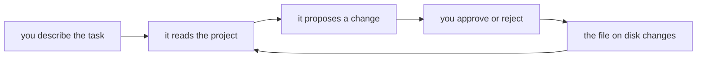

import Quiz from '@components/Quiz.astro';

You have spent several sections of this site learning to do things by hand: open a terminal,
move around a filesystem, record a commit, write an element, close a bracket. This section is
about a tool that can do a good deal of that for you.

That is worth being careful with, and this section is going to be honest about why rather than
enthusiastic about what.

## What it actually is

**Claude Code** is an **agentic coding tool** you run in the terminal. Agentic means it does not
only answer — it acts, and it keeps acting until a task is finished or it gets stuck. Given a
request, it will read the files in your project, search them, run commands, write changes to
disk, run the code to see whether it worked, and try again if it did not.

The word for the whole set of files that make up a project is **codebase**. The distinguishing
feature of Claude Code is that it works on the codebase, not on a snippet you pasted.

That loop is the thing. Everything else in this section is about controlling it.

## How it differs from a chat window

You have used a chat interface with a language model. The exchange goes: you describe your
problem, you paste some code, it answers, you copy the answer back into your editor, you run it,
it fails, you paste the error, and around again. You are the transport layer between the two
programs.

Claude Code removes that loop. It opens the files itself, so you do not paste them. It runs the
code itself, so it sees the error without you copying it. It edits the file rather than printing
a version for you to retype.

The cost of that convenience is that a mistake now lands on your disk instead of in a chat log.
The [permissions lesson](/ares_materials_estudi/claude-code/permissions/) is entirely about that
and is the one to read before you let it near anything you care about.

## How it differs from editor autocomplete

**Autocomplete** is the editor feature that suggests the rest of the line while you type — VS
Code does it, and AI-powered versions of it will finish two or three lines at a time. It is fast,
it is local, and it sees roughly the file you are in.

Claude Code sees the project. Ask autocomplete to "rename this thing everywhere it is used" and
it cannot; it does not know where else the thing is used. Ask it to "run the site and tell me why
the button does nothing" and it cannot, because it does not run anything.

Different tools for different sizes of question. Autocomplete is for the line you are currently
writing. Claude Code is for the task you are currently doing.

## It edits real files

This deserves its own heading because it is the fact people are most often surprised by.

When Claude Code changes a file, the file on your disk changes. There is no preview mode you
have to accept afterwards, no separate copy, no sandbox. If your editor has that file open, you
will watch it change in front of you.

This is why the [git section](/ares_materials_estudi/git-and-github/what-version-control-is/)
came first. A project with a clean commit behind it can be put back exactly as it was with one
command. A project with three days of unsaved work in it cannot. Commit before you start; it
turns every possible disaster into an inconvenience.

## Where it runs

Start in the terminal — that is the primary interface and the one this section teaches. The
others exist and you will meet them later:

| Where | What it is |
|---|---|
| Terminal CLI | The main one. Type `claude` in a project folder. |
| Desktop app | The same tool in its own window. |
| Web | Runs in a browser at [claude.ai/code](https://claude.ai/code). |
| VS Code, JetBrains | Extensions that put it inside the editor you already use. |
| Slack | For teams, so a request in a channel can turn into a change. |

## It needs a paid account

Say this to yourself before you invest an afternoon in the setup: **the free tier of Claude does
not include Claude Code.** You need one of the paid consumer or team plans, or a Console account
with API credits — API credits meaning you pay for what you use rather than a monthly amount.

Current options and what they cost are on the [pricing
page](https://claude.com/pricing). Prices change, so that page is the answer rather than anything
written here.

There is no trick to get around this, and it is worth deciding now whether it is a tool you want
to pay for during the master or one you would rather read about and skip. Both are reasonable.

## The part that matters more than any of the above

Creative Coding Foundations (ID102.01) is 94 hours of your first semester. Its assessment
includes, every week, *"a brief individual written test covering all previous topics, which will
be evaluated"*.

Individual. Written. Weekly. No machine in the room.

A tool that writes working code for you will get you through the exercises. It will not get you
through those tests, and it will make you feel more prepared for them than you are, because
reading code that works is a completely different mental act from producing it from nothing.
Recognising a `for` loop is easy. Writing one correctly on paper on a Tuesday morning is not, and
the gap between the two is invisible from the inside.

So the framing for this whole section is: **this is a tool for learning faster, not for avoiding
learning.** Used one way it is a patient tutor that never sighs at a basic question and is
available at eleven at night. Used the other way it is a loan against your own competence, at
interest, due on the day of the test.

[Lesson 4](/ares_materials_estudi/claude-code/learning-not-outsourcing/) is about which way is
which, in specific terms. It is the important one in this section, and if you only read one, read
that.

:::note[Why teach it at all, then]
Because it is what practising designers and developers use, because the master will not pretend
it does not exist, and because the failure mode above comes from using it badly rather than from
using it. A student who understands where it helps and where it quietly hurts is in a better
position than one who avoids it out of vague guilt or uses it out of vague hope.
:::

<Quiz
	questions={[
		{
			q: 'What is the main difference between Claude Code and pasting code into a chat window?',
			options: [
				'It runs a larger model than the chat window has access to',
				'It reads your project and edits the files on disk itself',
				'It keeps a permanent memory of every project you open',
			],
			answer: 1,
			explanation:
				'It acts rather than only answers: it opens files, runs commands, sees the errors and writes the changes. That removes the copy-paste loop, and it also means a mistake lands on your disk rather than in a chat log — which is why the permissions lesson comes early.',
		},
		{
			q: 'You have a free Claude account. Can you use Claude Code?',
			options: [
				'Yes, with a lower daily message limit than paid plans',
				'No — it needs a paid plan or API credits',
				'Yes, but only the version that runs in the browser',
			],
			answer: 1,
			explanation:
				'The free tier does not include it. That is worth knowing before you spend an afternoon on setup. The pricing page is the current answer on what the options cost.',
		},
		{
			q: 'Why does this section keep returning to the weekly test in ID102.01?',
			options: [
				'Because using Claude Code on the assignments would be against the rules',
				'Because code produced for you passes the assignment and not the test',
				'Because the course forbids AI tools in submitted coursework',
			],
			answer: 1,
			explanation:
				'The risk is not a rule you would be breaking. It is that reading working code feels like understanding it, an assignment cannot tell the difference, and a written individual test can. That gap is the whole reason this section exists in this form.',
		},
	]}
/>

Next: [installing it](/ares_materials_estudi/claude-code/installing-it/).
