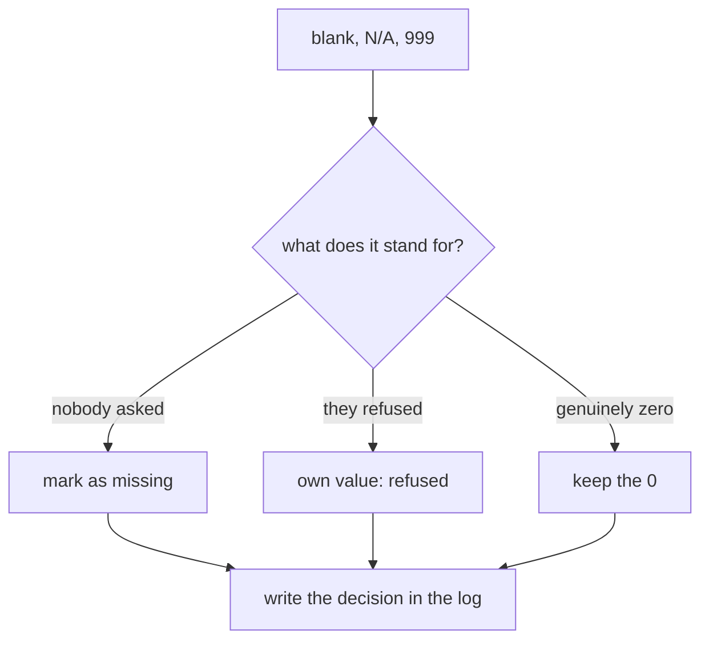

import LiveCode from '@components/LiveCode.astro';
import Quiz from '@components/Quiz.astro';

The chart takes an afternoon. Getting the data into a state where the chart is not a lie
takes the rest of the week. Everyone who works with data says some version of this, and
every student discovers it personally anyway.

None of it is difficult. It is a checklist, and this lesson is the checklist.

## Missing values

An empty cell can mean at least four different things: nobody asked, they were asked and
refused, the sensor was unplugged, or the value is genuinely zero. Those are not the same,
and a program treating a blank as `0` will average it in and quietly drag your numbers down.

Decide what blank means in your dataset, write it down, and be consistent. If refusal and
"not applicable" are both meaningful, they need separate values — `refused` and `na` — not
one shared emptiness.

Watch for the fake blanks too. `N/A`, `-`, `unknown`, `999`, `-1` and `0` are all used by
somebody as a stand-in for missing, and they are far more dangerous than an empty cell
because they arrive looking like data. A dataset whose ages include a lot of `999` will give
you an average age of sixty.

Then choose per field what to do: leave the record out of that one calculation, or drop the
record entirely, or fill the gap with a value you invent. The third option is legitimate in
statistics and needs to be labelled wherever the result appears, because you made those
numbers up.

The shape of the decision is the same every time, and it ends in the same place:



The last box is not decoration. Whichever branch you took, the record of having taken it is
what the last section of this page is about.

## Duplicates

Two kinds. **Exact duplicates** — the same record twice, usually from a double form
submission or a merge that went twice — are easy to find and safe to remove. **Near
duplicates** — the same participant entered twice with a typo in the name, the same object
catalogued under two numbers — are the ones that inflate counts, and only a person who
understands the data can spot them.

Before removing anything, check that it really is a duplicate and not two genuinely
identical observations. Two visitors on the same day with the same age are not one visitor.
This is exactly why a record deserves an `id` field of its own.

## Categories that disagree with themselves

A **categorical** field is one whose values are labels rather than quantities: city, colour,
material, yes/no. Any field people typed by hand will fragment: `Zurich`, `zurich`,
`Zürich `, `ZH`, `Zurich (CH)`. To you these are one city. To a program counting values they
are five, and your bar chart grows five short bars where one tall one belongs.

<LiveCode
	title="Six spellings, two cities"
	height={300}
	code={`<pre id="out"></pre>
<script>
  console.log = (...values) => out.textContent += values.join(" ") + "\\n";

  const raw = ["Zurich", " zurich", "Zürich ", "Lugano", "lugano", "LUGANO"];

  // A lookup you write by hand: every variant you have actually seen.
  const canonical = { "zurich": "Zurich", "zürich": "Zurich", "lugano": "Lugano" };

  const tally = {};
  for (const value of raw) {
    const key = value.trim().toLowerCase();
    const name = canonical[key];
    if (name === undefined) {
      console.log("unrecognised:", value);
      continue;
    }
    tally[name] = (tally[name] || 0) + 1;
  }

  console.log("raw values:", raw.length);
  for (const name of Object.keys(tally)) {
    console.log(name, tally[name]);
  }
</script>`}
/>

Three moves, in order. `.trim()` removes the spaces at the ends, which are invisible and
therefore vicious. `.toLowerCase()` settles the capitals. The `canonical` object settles
everything else, and it is written by hand on purpose — a machine cannot know whether `ZH`
means Zurich or a person's initials.

`tally[name] = (tally[name] || 0) + 1` is the counting idiom: take what is there, or zero if
this is the first time, then add one. Add `"ZH"` to the raw list and press Run — an
unrecognised value announces itself rather than vanishing, which is the behaviour you want.

## Dates, numbers and units

**Dates.** `03/04/2026` is the third of April in Lugano and the fourth of March in Chicago,
and nothing in the file tells you which. Convert everything to **ISO 8601** —
`2026-04-03`, year first, always two digits, always hyphens. It is unambiguous, it sorts
correctly as plain text, and every tool understands it. If the time matters, keep it in the
same field: `2026-04-03T14:30`. If you have times from several places, record which time
zone they are in, or you will be comparing an afternoon in one city with a morning in
another.

**Numbers.** Decide whether a decimal is written with a point or a comma, and convert.
Strip thousands separators — `1'200`, `1,200` and `1 200` are all text, not numbers.
Percentages need one rule: either they are all `0.42` or they are all `42`, never a mix.

**Units.** Records arriving from two sources will be in two units, and the file rarely says
so. Put the unit in the field name — `duration_s`, `height_mm`, `temp_c` — and the problem
becomes visible the moment two files are side by side. A mismatch here does not look like an
error; it looks like a finding.

## Outliers

An **outlier** is a value far away from the rest. Three terms make that measurable, and this
is as much statistics as this section needs.

- The **mean** is the average: add the values, divide by how many there are.
- The **median** is the middle value once they are sorted, with half above and half below.
- The **spread** is how far apart the values are. The simplest measure is the **range** —
  the smallest and the largest.

The difference between mean and median is the diagnostic. Nine people earn 3,000 and one
earns 300,000: the mean is 32,700 and the median is 3,000. The mean has been dragged by one
value; the median has not. When the two are far apart, something is pulling.

An outlier can be three different things, and you have to look to tell.

- **An error.** An age of 219, a temperature of -300, a duration of 0 for a session that
  happened. Fix it if the true value is recoverable, otherwise mark it as missing.
- **A different thing measured by accident.** The reading from the day the sensor sat in
  direct sun. The response from your flatmate testing the form. Remove, and say so.
- **The real finding.** The one visitor who stayed two hours. The building that uses six
  times the energy of its neighbours. Deleting this because it spoils the chart is the
  single worst thing you can do in this section.

Deciding is a judgement, not a calculation. Discarding is sometimes right, and it is only
ever right when it is written down.

## Write down every decision

Two habits carry all of this, and they cost nothing.

**Never edit the raw file.** Keep the original exactly as it arrived, read-only if you can,
and produce a cleaned copy — `visitors-raw.csv` and `visitors-clean.csv`. Manual edits to
the only copy are unrepeatable and invisible.

**Keep a cleaning log** next to the data — a `README.md` in the same folder, in the
repository, so its own history is recorded too. One line per decision:

```md
## Cleaning log — visitors-clean.csv

- Removed 3 exact duplicate rows (ids 44, 45, 91).
- Merged "zurich", "Zürich", "ZH" into "Zurich".
- 12 blank age values kept as blank, excluded from the mean, not from the counts.
- Removed row 118: age 219, an obvious typing error, true value unknown.
- Converted all dates from DD/MM/YYYY to ISO 8601.
- Converted duration from minutes to seconds (field renamed duration_s).
```

That log is what the course means by protocol documentation, and it is the difference
between a result and a claim. It lets a reader judge your choices, it lets you redo the work
in six months, and it is the first thing anyone reviewing a data-driven project asks for.

The stronger version is to do the cleaning in code rather than by hand — a script that reads
the raw file and writes the clean one. Then the log and the method are the same artefact,
and re-running it after the second batch of responses arrives takes a second.

<Quiz
	title="Check yourself"
	questions={[
		{
			q: 'Ages in your dataset include several values of 999, and your average age comes out at 61. What is going on?',
			options: [
				'Your participants really were old',
				'999 is being used as a stand-in for a missing value and is being averaged in as a real number',
				'The mean is the wrong measure for age',
			],
			answer: 1,
			explanation:
				'Stand-ins like 999, -1 and N/A are more dangerous than blanks, because they survive every check that looks for emptiness. Find them, convert them to genuine missing values, and decide explicitly what each calculation does with them.',
		},
		{
			q: 'In a survey of ten studios, nine report budgets around 3,000 and one reports 300,000. The mean is 32,700, the median 3,000. What should you do?',
			options: [
				'Delete the 300,000 row so the chart looks sensible',
				'Look at that record to find out what it is, report the median alongside the mean, and write down whatever you decide',
				'Report only the mean, because it uses every value',
			],
			answer: 1,
			explanation:
				'The gap between mean and median is a signal to investigate, not a problem to hide. That studio may be a typo, a different kind of organisation, or the most interesting record you have. Whatever you conclude goes in the cleaning log.',
		},
		{
			q: 'Why keep the raw file untouched and write a separate cleaned copy?',
			options: [
				'To save disk space',
				'Because manual edits to the only copy are unrepeatable and invisible — the raw file plus a log is what makes the work checkable',
				'Because CSV files cannot be edited safely',
			],
			answer: 1,
			explanation:
				'Cleaning is a series of judgements. Keeping the original means any of them can be revisited, by you or by someone reviewing your project, and it means a mistake costs a re-run rather than the dataset.',
		},
	]}
/>
