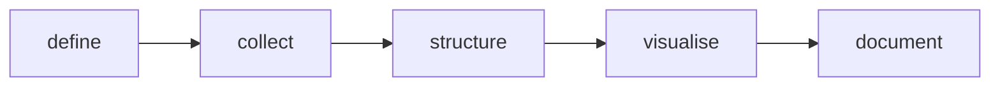

import LiveCode from '@components/LiveCode.astro';
import Quiz from '@components/Quiz.astro';

Two different things get called data in a design school, and keeping them apart makes the
rest of this section much easier.

The first is **data as inquiry**. Numbers and text you gather to find out something true
about the world: how long people actually wait at the counter, what they say when the
prototype fails, how often that door is opened on a Tuesday. Here data is evidence, and its
job is to change your mind.

The second is **data as material**. A poster whose typography is driven by a year of
air-quality readings. A lamp that brightens with the noise in the room. A screen that
rearranges itself around who is standing in front of it. Here the data is not proving
anything — it is the stuff the piece is made of, in the same sense that paper, light and
sound are.

Making Sense of Data (ID190.01) asks you to do both, and the two use the same craft: get
data, get it into a shape a program can read, look at it, and write down what you did.

## Quantitative and qualitative

**Quantitative** data is counted or measured. Forty-two visitors, 21.4 degrees, three
clicks, 1.8 seconds. It answers *how many*, *how much*, *how often*.

**Qualitative** data is described. An interview transcript, a photograph, a field note, the
open answer at the bottom of a form. It answers *why* and *what is it like*.

Neither is the serious one. A number tells you the queue is eleven minutes long and cannot
tell you that people leave because they cannot see the front of it. An interview tells you
that and cannot tell you whether it happens twice a day or twice a year. Most good design
research runs both and lets each ask the next question of the other.

You can turn qualitative into quantitative by **coding** it: reading nineteen transcripts,
deciding on a set of categories, and marking which ones each transcript touches. Then you
can say "eleven of nineteen participants mentioned the door". What you gain is comparison.
What you lose is everything the eleven actually said, so keep the originals and never let
the count be the only thing that survives.

## Where design data comes from

- **Interviews and observation** — you make it, one person at a time. Rich, slow, small.
- **Forms and surveys** — you make it, many people at a time. Thinner, faster, and shaped
  entirely by how well you wrote the questions.
- **Sensors** — a microcontroller reading light, distance or temperature. This is the
  bridge to Physical Computing, and the reason a data project can have a physical half.
- **Logs** — data a system already produces without being asked: timestamps, page visits,
  error messages, the history of your own repository.
- **Public and open datasets** — published by statistical offices, cities, museums,
  transport operators and research groups, often free to download and reuse.
- **Your own prototype** — instrumented so that using it leaves a trace. Often the most
  interesting source in the room, and the one people forget they have.

All six are covered in [collecting data](/ares_materials_estudi/data/collecting-data/),
including the parts about consent that are not optional.

## The words for the parts

A **dataset** is one collection of data held together: one file, one export, one table.

A **record** is one entry in it: one survey response, one sensor reading, one museum
object. Also called a *row*, or an *observation*.

A **field** is one thing recorded about every entry: the city, the temperature, the
timestamp. Also called a *column*, or a *variable*.

A **value** is what sits where a record and a field meet: `Lugano`, `21.4`, `2026-03-14`.

Spreadsheet people say rows and columns; programmers say records and fields; researchers
say observations and variables. Three vocabularies, one idea, and you will hear all three
this year.

You have already built this shape. An array of objects, each object with the same
properties, *is* a table — the objects are the records and the properties are the fields.

<LiveCode
	title="A dataset, in JavaScript"
	height={220}
	code={`<pre id="out"></pre>
`}
/>

`Object.keys(someObject)` hands you the object's property names as an array, which is how
you ask a record what fields it has. Add a fourth record and press Run; add a field to only
*one* record and notice that nothing complains — a dataset where the records disagree about
their fields is the normal state of real data, and the lessons on file formats and cleaning
are about exactly that.

## The pipeline

The course describes the work as five moves. They are the map of this section.

1. **Define** — write down the question before you gather anything. Not "data about the
   station" but "how long do people wait at the ticket machine, and does it change by time
   of day".
2. **Collect** — get the data, from the sources above, with a written record of how.
3. **Structure** — get it into a tidy table and clean it. This is where most of the hours
   go: [spreadsheets, CSV and JSON](/ares_materials_estudi/data/spreadsheets-csv-json/) and
   [structuring and cleaning](/ares_materials_estudi/data/structuring-and-cleaning/).
4. **Visualise** — choose a form that answers the question, then draw it:
   [choosing a visual model](/ares_materials_estudi/data/choosing-a-visual-model/) and
   [making a chart](/ares_materials_estudi/data/making-a-chart/).
5. **Document** — the protocol: what you collected, from whom, when, and every decision you
   made along the way. Nobody can trust a chart whose provenance is missing, including you
   in three weeks.

The step people skip is the first one. Data collected without a question is a pile you will
later stare at hoping something jumps out, and something usually does, whether or not it is
there. A question written down in advance is what makes the answer mean anything — and it
is also what tells you which fields to record, which is the difference between a usable
dataset and a re-run.

:::tip[Your design training already covers a third of this]
Choosing a visual model is a composition problem with correctness attached, and structuring
a dataset is the same instinct as naming layers properly in Figma. The unfamiliar part is
only the middle: the file formats and the loops.
:::

<Quiz
	title="Check yourself"
	questions={[
		{
			q: 'A spreadsheet of 200 survey responses, each with a city, an age and an answer. How many records and how many fields?',
			options: [
				'200 records, 3 fields',
				'3 records, 200 fields',
				'600 records, 1 field',
			],
			answer: 0,
			explanation:
				'A record is one entry — one response — so there are 200. A field is one thing recorded about every entry, so city, age and answer are three. Rows and columns, records and fields, observations and variables: the same two ideas under three vocabularies.',
		},
		{
			q: 'You count how many interviewees mentioned the broken door: eleven of nineteen. What have you done?',
			options: [
				'Replaced weak qualitative evidence with strong quantitative evidence',
				'Coded it — comparison gained, what they actually said lost',
				'Nothing that counts as data, because interviews are not measurements',
			],
			answer: 1,
			explanation:
				'Coding is a legitimate and common move, and it is a trade. Eleven of nineteen can be compared and charted; the sentence one of them used cannot be recovered from the number. Keep the transcripts.',
		},
		{
			q: 'Which step of the pipeline is most often skipped, and what does skipping it cost?',
			options: [
				'Visualise — without a chart nobody can see what is in the data',
				'Define — without a written question you record the wrong fields',
				'Collect — most projects can reuse someone else’s dataset',
			],
			answer: 1,
			explanation:
				'Defining the question first is what decides which fields to record, and it is what stops you finding a pattern after the fact and treating it as a finding. It costs ten minutes and saves a re-run.',
		},
	]}
/>
