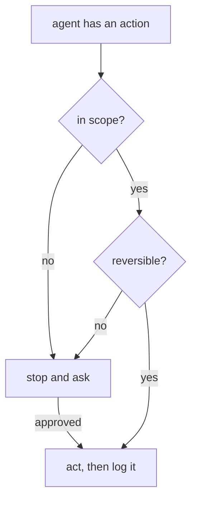

import Quiz from '@components/Quiz.astro';

This is the lesson where your existing experience helps least, so it is the one worth the
most time.

The 2026/27 version of *Designing Digital Experiences* rests on a claim: an experience is no
longer defined by a single product or a single screen. It happens across screens, voice,
ambient interfaces, and **agentic systems that act on the user's behalf**. Among the stated
outcomes is choosing the right **modality** for an experience — user interface,
conversational, agentic — and recognising **when a UI is the wrong answer**.

That last phrase is the sharp edge. For most of the last two decades, "design the
experience" and "design the screens" were close enough to the same sentence that the
difference did not cost anything. It does now.

## Modality is a design decision

**Modality** is the form an interaction takes: a graphical interface you look at and
manipulate, a conversation in text, speech, a gesture, a physical control, an ambient signal
like a light or a sound or a vibration, or delegation to something that acts for you.

Choosing between them used to be settled by the platform. Now it is a decision you make
per task, and it carries the weight that layout decisions used to carry. Six questions do
most of the work:

- **Is the person's attention available?** Standing at a machine with resin on both hands is
  not a reading situation.
- **Is it easier to say than to find?** "Move my Thursday booking to Friday morning" is one
  sentence and four screens. Language wins when the request is easy to express and the
  option space is large.
- **Is it easier to recognise than to describe?** Choosing between eleven fabric swatches is
  a looking task. No amount of conversation replaces seeing them side by side.
- **How expensive is a mistake?** Reversible and cheap tolerates ambiguity. Irreversible,
  costly or public does not, and wants an explicit, visible confirmation.
- **Is the setting private?** Voice in a shared studio broadcasts your content to everyone in
  the room, and everyone in the room becomes an input to your system.
- **Does the result need to be inspectable later?** Speech leaves nothing behind. If the
  outcome has to be checked, compared or handed to someone else, something has to persist.

Two shorthand rules that follow, and that you can defend in a crit:

**A UI is usually the wrong answer** when the task is high-frequency and low-decision, when
the whole content of the request is one sentence, when the person's eyes and hands are
committed elsewhere, or when what is needed is status rather than interaction — a light that
means the machine is free does not need a screen, an app, or an account.

**A UI is usually the right answer** when people are comparing options, when precision
matters, when the action cannot be undone, when someone is browsing without knowing what
they want, and — importantly — **whenever the system is not confident**. Uncertainty needs
somewhere to show alternatives, and a voice-only channel has nowhere to put them.

## Multimodal means shared state

**Multimodal** means more than one modality in a single experience. It comes in two shapes
and they have different failure modes.

**Complementary**: two modalities at once, each doing what it is better at. Pointing at a
thing while saying what to do with it. The design work is deciding which channel carries
which part of the meaning.

**Handoff**: modalities in sequence. Start by voice in the workshop, confirm on a screen
later, receive an email. Here the design work is entirely in the seams — what is carried
across, what the person has to repeat, and whether the second channel knows what happened in
the first.

The rule that prevents most of the damage: **one system, several doors.** If the voice route
and the screen route are built as separate features, they will disagree, and a service that
contradicts itself is worse than one that only offered a single way in. Every modality reads
and writes the same state.

## Adaptive interfaces

An **adaptive interface** changes with the user, their history, or their context — time,
place, device, what they are doing, what they did last week.

Worth keeping two words apart, because they get used interchangeably and the difference is
who is in control. **Personalisation**: the person chooses, and the system remembers.
**Adaptation**: the system decides on the person's behalf, from inferred signals. The first
is a preference. The second is a bet.

Adaptation is genuinely useful, and it has real costs that experienced designers underrate
because static interfaces never had them:

- **Nothing is repeatable.** "Click the third item in the list" stops being sayable. Support,
  documentation, teaching a colleague and testing all quietly depend on two people seeing the
  same thing.
- **Spatial memory is destroyed.** Expertise in an interface is largely muscle memory for
  where things are. An interface that reorders itself helpfully resets its most competent
  users to novices.
- **The loop feeds itself.** The system promotes what you used; you use what is promoted; it
  concludes it was right. A preference the person never had gets manufactured out of one
  accidental click.
- **Cold start.** Day one has no history, and day one is when the person decides whether to
  come back.

Four rules that keep the benefit and most of the trust:

1. **Keep the frame stable, adapt the contents.** Navigation, layout and vocabulary stay put.
   What sits inside them can reorder.
2. **Re-rank, do not remove.** Emphasise, surface, sort. The moment adaptation deletes a
   destination, people can no longer form a model of what the system contains.
3. **Make it visible and reversible.** "Why am I seeing this" and "show me everything" are
   the two controls that turn adaptation from something done to a person into something they
   supervise.
4. **Design the empty case first.** The version with no history is a real state with real
   users in it, and it is the one most often left undesigned.

## Agentic systems

In this context an **agent** is a system that pursues a goal on your behalf, taking actions
in the world, rather than only responding to one instruction at a time. **Agentic** describes
that quality. The change from a tool is not intelligence — it is **initiative** and
**consequence**: it may act when you are not watching, and its actions land somewhere real.

Autonomy is not a switch, it is a scale, and the design decision is where each *action*
sits — not where the product sits:

```
  suggests ▸ drafts, you send ▸ acts, asks first ▸ acts, tells you after ▸ acts silently
```

Drafting a message and sending it belong at different points on that line, in the same
product, on the same day.

### What you actually specify

The deliverable for an agent is mostly not screens. It is a description of behaviour, and
these are its sections:

- **Scope.** What it may touch, and what is out of bounds no matter what it is asked.
- **Initiative.** When it may act unprompted, and what triggers that.
- **Permission boundaries.** Which actions require a human before they happen. The reliable
  test is not importance, it is **reversibility**: anything irreversible, anything that costs
  money, anything visible to other people.
- **Escalation.** What it does when it is uncertain, blocked, or out of scope. "Stops and
  asks" is a design decision that has to be specified, not a default.
- **Transparency.** A legible record of what it did, when, why, and on what basis — reviewable
  after the fact by someone who was not watching.
- **Interruptibility and undo.** Stop, correct mid-action, revert. If an action cannot be
  undone it belongs behind a confirmation, and that is the same sentence twice on purpose.
- **Memory.** What it retains between sessions, and how the person sees, edits and deletes
  that. Memory is the feature that turns a helpful agent into an unnerving one fastest.
- **Failure behaviour.** What it does when it cannot do the thing. Silence is the worst
  available answer and the most common one.

Scope, permission and escalation are one question asked of each action, in this order:



### Trust is calibrated, not maximised

The goal is not maximum trust. It is trust that **matches the system's actual reliability**.
Someone who checks everything an accurate agent does has lost the entire benefit; someone
who approves without reading what an unreliable one proposes will eventually sign something
they should not have. Over-trust is a design failure of the same size as under-trust, and it
is the one that gets shipped, because in testing it looks like satisfaction.

What moves calibration in the right direction: showing the work rather than the conclusion,
signalling confidence in a way that varies with actual confidence, admitting the boundary of
what it knows, conservative defaults early with scope that widens as the person accumulates
evidence, and visible, cheap correction — every correction is the person teaching themselves
where the edges are.

## Evaluating something with no fixed interface

You cannot run a screen-by-screen usability test on a system whose interface is different
each time and whose output varies between two identical runs. What replaces it:

**Define acceptable outcomes, not correct pixels.** Write the task and what would count as a
good result, a tolerable result and a bad one, before you run anything. For open-ended
output, that means agreeing the criteria in advance with the people who will judge it.

**Run the same task many times.** Behaviour that varies run to run cannot be characterised by
one session. You are measuring a distribution, and the tail is where the interesting failures
are.

**Wizard of Oz.** A person plays the system from behind a screen while the participant
believes it is automatic. It is still the cheapest way to test agent behaviour before the
agent exists, and it tests the thing that actually matters — how people delegate, what they
assume, when they check.

**Script the failures deliberately.** The ambiguous request, the out-of-scope request, the
request the system will get wrong, the interruption halfway through, the request that should
be refused. The happy path tells you almost nothing about a system whose defining risk is
what it does when it is wrong.

**Measure things static interfaces did not need:**

- Did the person **notice** the system's mistake? Over what timeframe?
- How often did they **accept output they should have questioned**?
- How many **corrections** per task, and did corrections stick?
- What did recovery **cost** when it went wrong?
- Would they hand it the same task **unsupervised** next time? Would they hand it a bigger
  one?

**Go longitudinal.** Adaptive and agentic systems misbehave over weeks, not in an hour —
accumulated memory, drift, the loop feeding itself. This is where the diary study from
[planning research](/ares_materials_estudi/design-methods/planning-research/) comes back as
the central method rather than a supporting one.

**Walk back through the log with the participant.** Replay what the system did and ask what
they thought was happening at each point. The gap between their model and the actual
behaviour is your finding, and it is invisible from observation alone.

:::caution[Acting on someone's behalf is acting in the world]
The moment a system takes actions, the questions stop being usability questions. Who
consented to what, at what point. What is reversible. Who is accountable when it acts wrongly
— and "the user approved it" is not an answer when the interface was built to make approving
frictionless. These are design decisions, made by whoever draws the confirmation step, which
in the projects ahead of you is you.
:::

<Quiz
	title="Check yourself"
	questions={[
		{
			q: 'A technician needs to know whether a machine is free while walking across a workshop with both hands full. What is the strongest modality choice?',
			options: [
				'A phone app showing live machine status',
				'An ambient signal at the machine — a light visible from across the room',
				'A voice assistant that answers when asked',
			],
			answer: 1,
			explanation:
				'Hands are busy, attention is partial, and the information is a single bit that never needs to be interacted with. That is the textbook case for an ambient signal: no account, no device, no attention cost. The app requires a free hand and the voice route requires speaking a question in a noisy shared room to learn something a light could have said first.',
		},
		{
			q: 'An agent can draft replies to messages and send them. Where should the confirmation step sit?',
			options: [
				'Before drafting, since that is where the agent starts working',
				'Before sending, because sending is the irreversible and publicly visible action',
				'Nowhere, if the drafts test as accurate enough',
			],
			answer: 1,
			explanation:
				'Autonomy is set per action, not per product. Drafting is private, cheap and fully reversible, so gating it only adds friction. Sending is irreversible and visible to another person, which is exactly the boundary that requires a human. Accuracy in testing does not remove the need — it is precisely accurate systems that produce the over-trust that makes the rare failure land unchecked.',
		},
		{
			q: 'You are evaluating an assistant whose output differs slightly every run. What is the most serious flaw in testing it with eight participants doing one scripted task each?',
			options: [
				'Eight participants is too small a sample',
				'One run each cannot characterise behaviour that varies, and a scripted happy path never exercises the failure cases',
				'Scripted tasks are unrealistic, so only field research would be valid',
			],
			answer: 1,
			explanation:
				'Eight is a normal qualitative sample. The problem is what each session covers: a single run of a system with variable output tells you about that run, and the defining risk of an agentic system is what it does when it is wrong. Repeated runs plus deliberately scripted ambiguous, out-of-scope and failing requests is what turns this into a real evaluation.',
		},
	]}
/>
