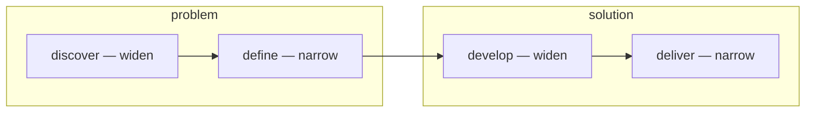

import Quiz from '@components/Quiz.astro';

This section is the one place on the site where you are not a beginner. You have run a
design process before, under some name, with some diagram on the wall. So this page is not
here to teach you a process. It is here to align the words, and then to spend most of its
length on the part that is genuinely different: **co-design**, which is what
*Co-Design: From Research to Concept* is named after.

## The double diamond, as shared vocabulary

Two diamonds side by side. The first covers the problem, the second the solution, and each
one widens before it narrows:

You will hear all four words used as verbs in studio, and you will hear **diverge** and
**converge** used for the widening and narrowing.

The diagram is not a schedule and nobody follows it in order. What it is good for is
locating yourself in a conversation. "We are still diverging" is a complete answer to
"why do we have eleven ideas and no decision". "That is a second-diamond question" is a
complete answer to someone proposing a screen layout in week one. Its real value is that
everyone in the room already knows it, so it costs nothing to use.

The one claim inside it worth taking seriously is the first diamond existing at all: the
brief you are handed is a guess at the problem, and it is allowed to change once you have
been out in the world. Programmes that skip that are doing the second diamond twice.

## Designing with, not for

Standard practice is that you research people, synthesise what you learned, and then design
on their behalf. You hold the pen the whole time. The participants are a source.

**Co-design** — also called **participatory design** — moves the pen. People who will live
with the outcome take part in making it, not only in being studied. The starting assumption
is that they are experts in their own experience in a way you cannot become by interviewing
them, and that the way to get at that expertise is to have them make something rather than
answer questions.

That is a claim about *access to knowledge*, not about politeness. Some things people know
about their own lives never surface in an interview, because they are habitual, or hard to
put into words, or embarrassing, or because nobody has ever asked in a way that made them
thinkable. Give the same person materials, a scenario and permission, and it comes out.

Participatory design also has a political root worth knowing about: it came out of workplace
projects in Scandinavia in the 1970s and 80s, where the people whose jobs were about to be
computerised argued for a say in the systems being built for them. The idea that those
affected by a design should have a hand in it is older than any of the toolkits.

## What a session actually looks like

The recurring shape is: you prepare materials, people make something with them, and the
making is what you study.

- **Generative sessions.** Participants build, draw, collage or arrange rather than answer.
  The artefact is not the output — the talking that happens while they make it is.
- **Toolkits.** Sets of parts deliberately loose enough to be recombined: cards, blank
  shapes, stickers, a board with a timeline on it. You design the toolkit; they design with
  it.
- **Sensitising, in advance.** A small task sent out days before the session — photograph
  this, note when that happens — so people arrive already thinking about the subject rather
  than warming up in your first twenty minutes.
- **Probes.** Materials left with someone for a period, designed to provoke and record
  fragments of their life rather than to measure it.

Two roles to keep straight, because the words get used loosely: **stakeholders** are people
with an interest in the outcome — staff, clients, whoever pays. **Participants** are the
people you are designing with. They overlap sometimes, and a session that mixes them without
noticing the power difference will produce whatever the most senior person in the room
thinks.

## What changes for you

**Your role.** You move from author to facilitator. The skill on display is no longer the
artefact you produce, it is whether the session produced something the group could not have
produced without you. That includes deciding who is in the room, and noticing who is not.

**The output.** Co-design does not produce consensus, and it should not try to. Averaging
everyone's contribution gives you a shape nobody wanted. What you are looking for is
direction, tension, and the constraints that would otherwise have surfaced far too late.
You still make the design decisions. You now make them with far better information about
what is actually at stake.

**Degrees of participation.** "We co-designed it" covers everything from showing people a
finished concept to giving them a vote on what gets built. Be specific about which one you
did. The word is used as decoration often enough that being precise about it will make your
work stand out.

:::caution[The failure mode has a name]
Extractive participation: you run the workshop, take the ideas home, and the participants
never hear from you again. It is common, it burns the community for the next person, and it
is visible from outside. The minimum you owe people is honesty about how much influence
they actually have, an account of what happened to their contribution, and — where the
context allows — compensation for their time.
:::

## Research to concept

The course title states the arc. Co-design sits on the seam between the two diamonds: it is
still research, in that you are learning something you did not know, and already concept, in
that the material it produces is made rather than said. The next two lessons deal with the
rest of that seam — [planning the research](/ares_materials_estudi/design-methods/planning-research/)
and [turning what you collected into something a design can be built
on](/ares_materials_estudi/design-methods/from-findings-to-insights/).

<Quiz
	title="Check yourself"
	questions={[
		{
			q: 'A team runs a workshop where participants arrange cards into a timeline of their own week and talk while they do it. What is the primary output?',
			options: [
				'The completed timelines, which become the research findings',
				'What participants said and did while making the timelines',
				'A ranked list of features the group agreed on',
			],
			answer: 1,
			explanation:
				'In a generative session the artefact is a prompt, not a result. It gives people something to think with and something to point at, and the value is in the reasoning that surfaces around it. A pile of collages with no record of the conversation is close to worthless.',
		},
		{
			q: 'Halfway through a co-design session the group splits: three participants want one direction, two want the opposite. What should you do with that?',
			options: [
				'Facilitate towards a compromise everyone can accept',
				'Take the majority direction, since more people preferred it',
				'Record the split as a genuine finding about the problem',
			],
			answer: 2,
			explanation:
				'A disagreement between users is information about the problem space, not a procedural obstacle. It usually means there are two different situations or two different groups in the room. Averaging it away produces a design that serves neither, and you lose the most useful thing the session gave you.',
		},
		{
			q: 'Which statement best describes the difference between user research and co-design?',
			options: [
				'Co-design is research done with a larger and more representative sample',
				'In research people are a source of information; in co-design they take part in making the thing',
				'Co-design replaces research, because the participants already know what they need',
			],
			answer: 1,
			explanation:
				'The move is in who holds the pen. Co-design does not replace research either — you still need to understand the situation before you can design a session that is worth anyone attending, which is why the course is called "from research to concept".',
		},
	]}
/>
