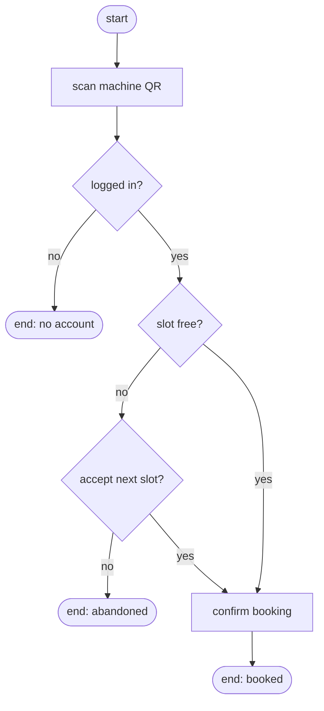
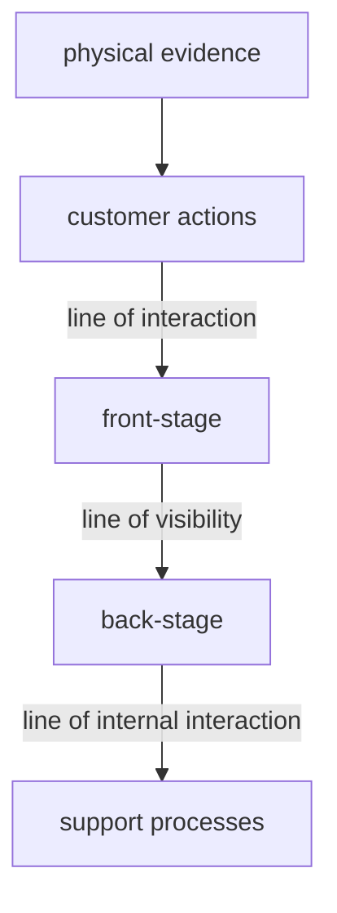

import Quiz from '@components/Quiz.astro';

*Designing Digital Experiences* names two things explicitly: **user flows** and
**customer-experience mapping**. They sound like the same activity at different zoom levels.
They are not. They answer different questions, they are read by different people, and the
most common failure in this area is producing a beautiful artefact that answers a question
nobody asked.

Four tools, then the part that matters — how to pick one.

## A user flow

**A user flow is one task, in one system you control, drawn as states and the transitions
between them.** Time is short: minutes. The reader is you, your team, and whoever builds it.

The conventions are worth using because everyone reads them without being taught: boxes are
states, diamonds are decisions, arrows are transitions, rounded shapes are entry and exit
points. One start. Several ends, **including the failures** — a flow that only draws the
path where everything goes right is the one that ships with no error message written.

Three habits separate a useful flow from a decorative one:

- **Draw states, not screens.** "Booking confirmed" is a state. "Screen 4b" is a filename.
  Working in states lets you discover that two of your screens are the same state, or that
  one screen is quietly three.
- **Every decision diamond needs every branch drawn.** The unanswered branch is where the
  bug lives.
- **Include the boring states.** Loading, empty, first-run, offline, expired session, denied
  permission. These are the majority of what a developer has to build and the minority of
  what most design files contain.

Two neighbouring terms you will hear: a **task flow** is the same drawing with no branches —
the single happy path, useful for agreeing scope in one minute. A **wireflow** is a flow
drawn with small wireframes in place of the boxes, useful when the argument is about what is
on each screen rather than what the sequence is.

## A journey map

**A journey map is one actor, one scenario, over a stretch of real time, including
everything that happens outside your product.** Time is long: days, months, a whole
relationship. The reader is anyone who needs to feel the shape of the experience, which
usually includes people who will never open your design file.

Stages run across the top. Rows run down:

| | Hears about it | Signs up | First use | Stuck | Gives up or stays |
|---|---|---|---|---|---|
| **Doing** | asks a coursemate | fills the form | books a slot | sheet is out of date | messages a technician |
| **Thinking** | "is it worth it" | "why do they need this" | "did that work" | "am I about to break it" | "next time I'll ask someone" |
| **Feeling** | curious | irritated | uncertain | anxious | resigned |
| **Touchpoints** | corridor, coursemate | web form | booking app, machine | printed sheet, machine panel | chat, technician |
| **Pain** | — | address field | no confirmation | sheet unreliable | technician not available |
| **Opportunity** | — | ask later | confirm on the panel | show provenance | roster visible |

Three things a journey map does that a flow cannot. It contains **time you do not control** —
waiting, forgetting, asking a friend, receiving an email three days later. It contains
**emotional trajectory**, which is what makes it legible to people outside design. And it
crosses **touchpoints that are not screens at all**.

:::caution[A journey map is a research artefact]
Built from what you observed, with the evidence behind each cell. Built from a workshop
where the team imagined a user's feelings, it is a record of the team's assumptions —
sometimes a useful one, but say so on the map. If you are drawing a future state, label it
*to-be* and keep the *as-is* map beside it, or within a month nobody will remember which one
described reality.
:::

## Touchpoints and channels

A **touchpoint** is any moment of contact between a person and the service: a screen, an
email, a printed sheet on a wall, a package, a room, a member of staff, a voice assistant, a
notification at 7am. A **channel** is the medium a touchpoint arrives through — app, web,
phone, in person, post, voice, physical space.

This is the vocabulary shift the course is pointing at, and it is small to say and large to
absorb. **You are not designing screens in a sequence, you are designing a set of
touchpoints that a person meets in an order you do not fully control.** Someone books on a
phone in a corridor, gets an email confirmation they never read, arrives at a machine with a
sticker on it contradicting both, and asks a technician who has a fourth version. Every one
of those is your design, including the sticker.

Two consequences worth designing for on purpose:

- **Continuity.** State that starts in one channel and has to survive into another. Begun on
  a phone, finished on a laptop, confirmed by email, presented at a door. Where the state
  fails to travel is where people feel the organisation is not one organisation.
- **Consistency of promise, not of appearance.** The email and the machine panel do not need
  to look alike. They need to not contradict each other. Most cross-channel failures are
  factual, not visual.

## A service blueprint

A journey map shows the person's side. **A service blueprint extends it downwards, into what
the organisation does to make each moment happen.** It exists because a huge share of
experience failures have nothing wrong on the surface at all.

Read top to bottom:

Physical evidence is the sheet, the machine, the email, the room. Support processes are the
systems, databases, suppliers and other departments underneath everything else.

**Front-stage** is everything the person can perceive: the booking screen, the technician at
the desk, the confirmation email. **Back-stage** is the work that makes it possible and stays
invisible: the technician who recalibrates the machine and updates a spreadsheet, the
overnight job that syncs the calendar. The **line of visibility** between them is the most
useful line on the diagram, because "the experience is bad and nothing on the front-stage is
broken" is a sentence that only resolves below it.

What a blueprint is for: diagnosing failures whose cause is organisational. The settings
sheet is out of date because updating it is nobody's job and it lives in a channel the
technician does not use. No amount of interface work fixes that, and the blueprint is the
artefact that gets the conversation into the room where it can be fixed.

## Choosing the map

The skill being taught is this table, not the drawing.

| The question | The map |
|---|---|
| Where exactly do people drop out of sign-up? | **User flow** — states and branches |
| What states must be built, including errors? | **User flow** |
| Why does the whole thing feel exhausting even though each step works? | **Journey map** |
| Where should we intervene across a long relationship? | **Journey map** |
| Why does this fail every time even though the front end is fine? | **Service blueprint** |
| Who owns the step that keeps breaking? | **Service blueprint** |
| Does this screen work? | **None of them** — put it in front of a person |
| Which opportunity should we take first? | **None of them** — that is a prioritisation decision, informed by the maps |

And the honest constraint: **one map, one question, one actor.** The universal map that
covers every user type across every channel with the back-stage included is a poster. It
takes four weeks, it is presented once, and no one ever consults it, because to answer a
specific question you have to filter it back down to the map you should have drawn.

Two more habits that keep maps honest: mark cells that are assumption rather than evidence,
visibly, so the map cannot quietly launder a guess into a fact. And date it, with the version
of the service it describes — services change, and an undated map is trusted long past its
expiry.

Everything on this page assumes touchpoints hold still long enough to be drawn. The
[next lesson](/ares_materials_estudi/design-methods/adaptive-and-agentic/) is about what
happens when they do not.

<Quiz
	title="Which map answers the question?"
	questions={[
		{
			q: 'Customers complain that deliveries always slip by a day. The tracking page is accurate, the notifications arrive, the app tests well. Which artefact will get you closest to the cause?',
			options: [
				'A user flow of the order and tracking screens',
				'A service blueprint of the delivery process',
				'A journey map of the customer’s week',
			],
			answer: 1,
			explanation:
				'Everything the customer can see is working, so the cause is below the line of visibility — a handover, a system, a supplier, a shift that ends before the parcels are picked. The blueprint is the only one of the three that draws that region, and it also names who owns the step, which is what the fix requires.',
		},
		{
			q: 'What is the clearest difference between a user flow and a journey map?',
			options: [
				'A journey map is more detailed than a user flow',
				'A user flow covers one task inside your system; a journey map covers a longer experience including what happens outside it',
				'A user flow is for developers and a journey map is for clients',
			],
			answer: 1,
			explanation:
				'The difference is scope and timeframe, not detail or audience. A flow is minutes inside a system you control and is exhaustive about states and branches. A journey map is days or months and its most valuable cells are usually the ones describing time you have no control over at all.',
		},
		{
			q: 'A journey map row is filled in with emotions the team believes users feel at each stage. No research covers those stages. What should you do?',
			options: [
				'Leave it — informed guesses from an experienced team are close enough',
				'Delete the row until research exists',
				'Keep it, mark those cells as assumptions, and treat them as the research questions',
			],
			answer: 2,
			explanation:
				'The danger is not that the team guessed, it is that a guess printed on a wall becomes a fact within two weeks. Marking assumption cells preserves the map’s usefulness for planning while keeping it honest, and the marked cells make an excellent shortlist of what to research next.',
		},
	]}
/>
