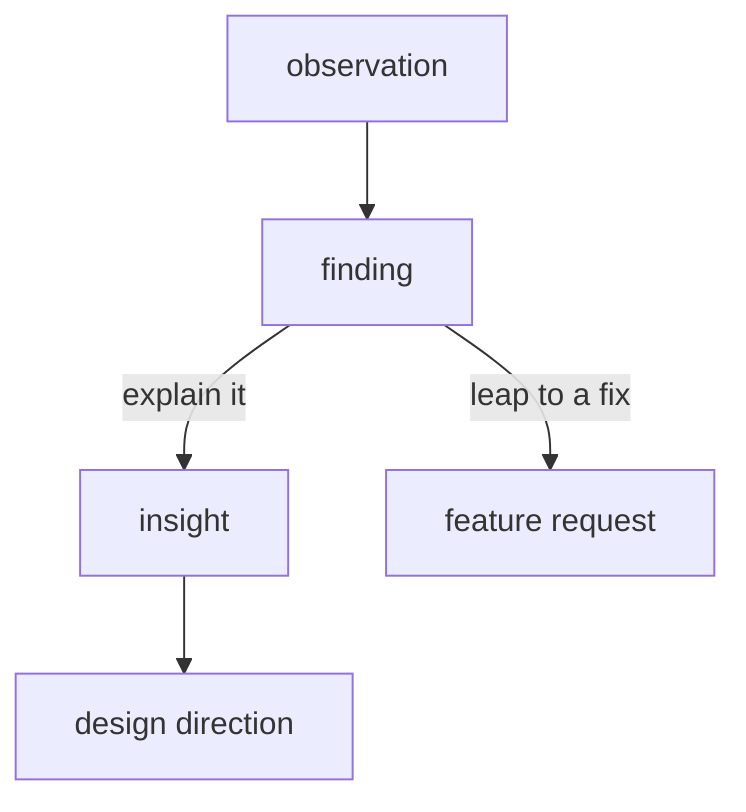

import Quiz from '@components/Quiz.astro';

Research rarely fails during the sessions. It fails afterwards, in the week where a hundred
pages of notes are supposed to become something a team can design from. The usual symptoms
are a deck of quotes that changes nobody's mind, or a set of statements so general they were
already true before anyone was interviewed.

This is the step the third learning outcome of *User Research Design* names:
**synthesise findings and communicate insights**. Two different words, deliberately.

## Three levels of the same material

Take a small study about students booking machines in a shared workshop. Nine participants,
a mix of interviews and watching people at the machines.

**Level 1 — observations.** What was said or seen, one participant, one moment, no
interpretation. This is your raw material.

> P3 photographed the laser cutter's control panel with her phone before leaving.
> P7 has a note on her phone reading "3mm ply / 40 speed / 60 power / 2 passes".
> P1 asked a technician to confirm settings while a printed settings sheet hung on the wall
> beside her.
> P5, unprompted: "the sheet is from last year, someone changed the lens since."

Observations are boring on purpose. If your notes contain the word "frustrated", that is
already an interpretation — write down what the person did and said, and leave the adjective
for later, when you can check it against eight other people.

**Level 2 — findings.** Patterns across participants. Still descriptive, still countable,
no explanation yet.

> Six of nine participants keep a private record of machine settings outside any shared
> system. Four of nine sought confirmation from a person despite a written reference being
> available. No participant referred to the printed sheet as a source they trusted.

A finding earns the word by appearing more than once. One striking quote is an observation
wearing a suit. Findings are where counts belong, even small ones — "six of nine" is honest
and useful; "users generally" is neither.

**Level 3 — insights.** An explanation that accounts for the findings, names the tension
underneath, and implies a direction.

> The shared settings sheet is treated as a rumour rather than a record, because nothing on
> it says when it was last true. People are not archiving out of preference; they are
> compensating for a shared record that cannot vouch for itself. Anything shared here has to
> carry its own provenance — who set it, on which machine, when — and be editable by the
> person standing at the machine. Otherwise private copies stay rational and the shared
> record decays further.

Notice what happened between levels 2 and 3. The findings could support a lazy conclusion:
*people prefer their own notes, so give them a personal notes feature*. The insight goes the
other way — private records are a symptom, and building a nicer version of the symptom makes
the shared record worse. That reversal is the entire value of synthesis, and it happens at one
fork:

## What makes an insight an insight

Four tests. A statement that fails any of them is a finding, a truism, or a feature request:

- **It explains rather than describes.** "Six of nine keep private notes" is what happened.
  "Because the shared record cannot say when it was last true" is why.
- **It is traceable.** You can name the observations behind it. If you cannot, it is your
  opinion, which may still be good, but should be labelled.
- **It changes a decision.** Read it to the team and ask what they would do differently. If
  the answer is nothing, you have written a wall poster.
- **It could have come out otherwise.** "People want the process to be easier" was never at
  risk of being false. An insight has a shape that the evidence could have contradicted.

Two common counterfeits, both worth being able to name in a crit:

**The solution in disguise.** "Users need a dark mode." That is a proposed feature, and it
smuggles the design decision past the point where anyone could argue with it. The insight
underneath might be about people working in shared spaces at night, which opens a much wider
set of options.

**The confirmation.** Research that returns exactly the plan the team arrived with. It
happens honestly — you find what you went looking for — and the guard against it is
recording the observations that did *not* fit before you decide what the material means.

## Affinity mapping

The standard way of getting from level 1 to level 2, and it survives because it works: get
every observation onto its own note, cluster the notes by what they have in common, and let
the categories emerge from the pile rather than deciding them first.

What separates a good session from a wall of decoration:

- **One observation per note, atomic.** If a note contains "and", it is probably two notes.
- **Participant code on every note.** Without it you cannot tell a pattern from one person
  saying the same thing five times, and you cannot trace an insight back later.
- **Use their words.** A note that says "trust issue" has already thrown away the evidence.
  A note that says "the sheet is from last year, someone changed the lens" still has it.
- **Cluster bottom-up, name the cluster last.** Naming first turns the exercise into sorting
  into boxes you brought with you.
- **Name clusters as sentences, not nouns.** "Trust" tells you nothing. "Nobody believes the
  shared sheet is current" is already halfway to a finding.
- **Do it with the people who ran the sessions**, and fast. A day is normal. A cluster
  everyone remembers arguing about is worth more than a tidy one produced alone.
- **Keep an odd pile.** The notes that fit nowhere are often where the next study lives.
  Resist forcing them.
- **Split anything over about ten notes.** Big clusters are usually two ideas that share a
  word.

At the end, photograph the wall, and then type up the cluster names and their contents.
Physical artefacts are gone in a week; the transcription is what you actually reuse. That
transcription is also the point at which cluster membership can become a count — six of nine —
which is [coding](/ares_materials_estudi/data/what-data-is-in-design/) in the sense the data
section uses the word, with the same trade: you gain comparison and you lose what they said.

## Communicating to people who were not there

You spent three weeks in the material. Your audience gets twenty minutes and has a budget
meeting afterwards. Everything about the readout follows from that asymmetry.

**Lead with the insight, not the method.** The temptation is to walk through what you did,
because it was a lot of work and it is chronological. Nobody needs the chronology. Method
goes in an appendix, and it goes there in enough detail to defend.

**One insight per page.** Statement at the top, the evidence beneath it — a quote, a photo,
a clip, and the count. Then what it means for the decision at hand, and what remains
uncertain. Four to six of these is a full readout.

**Show the raw material.** Thirty seconds of someone failing at the task moves a room in a
way your summary of it cannot. Play the clip. Consent, participant codes, faces blurred if
that is what you agreed.

**Answer "was that one person or many" before it is asked.** Counts, every time, including the
inconvenient ones. Say six of nine when it is six of nine.

**Keep their words in it.** The verbatim quote survives the meeting and gets repeated in the
next one. Your paraphrase does not.

**Separate what you saw from what you recommend**, and say which is which out loud. Evidence
and interpretation carry different weights, and mixing them is how a whole readout gets
dismissed when one recommendation turns out to be wrong.

:::tip[The debrief is not the report]
Within an hour of each session, the people who were there write down the three things that
surprised them. It takes ten minutes, it is where half your eventual insights first appear
in rough form, and it costs nothing. A team that only synthesises at the end is
reconstructing from notes what it already knew on the day.
:::

<Quiz
	title="Finding or insight?"
	questions={[
		{
			q: 'Which of these is an insight rather than a finding?',
			options: [
				'Seven of ten participants abandoned the form at the address step, most within a minute',
				'They leave at the address step because most of them move every year',
				'Participants said the form felt long and asked for more than it needed',
			],
			answer: 1,
			explanation:
				'The first is a finding — a counted pattern with no explanation attached. The third reports how the form felt, which describes rather than explains. Only the second says why the behaviour happens, and only it changes what you would do: the fix is not a shorter form, it is a form that does not assume an address holds still.',
		},
		{
			q: 'During affinity mapping one note refuses to fit any cluster. What is the right move?',
			options: [
				'Put it in the nearest cluster so the wall stays legible',
				'Discard it as an outlier one participant produced',
				'Leave it in its own pile and keep it in the write-up',
			],
			answer: 2,
			explanation:
				'Outliers are either noise or the first sighting of something you have not sampled enough of yet, and at synthesis time you cannot tell which. Forcing it into a cluster corrupts that cluster and hides the signal. Naming it as an open question is honest and often seeds the next study.',
		},
		{
			q: 'You have twenty minutes with stakeholders who did not attend any session. How should it open?',
			options: [
				'With the method: how many people, recruited how, over what period',
				'With the most important insight and the evidence behind it',
				'With a chronological walkthrough of the sessions',
			],
			answer: 1,
			explanation:
				'Attention is highest in the first two minutes and the audience is there for what it means, not how it was obtained. Method still matters and still gets written down, in an appendix, ready to defend when someone asks. Leading with it spends your best minutes on your least decision-relevant material.',
		},
	]}
/>
