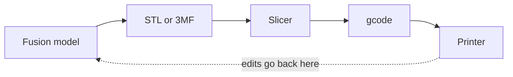

import Quiz from '@components/Quiz.astro';

The printers you will meet at a Fablab mostly work the same way: a nozzle heats plastic
filament until it is soft, draws one flat layer of your object with it, moves up a fraction
of a millimetre, and draws the next layer on top. Hundreds or thousands of times. The name
for this is **FDM**, fused deposition modelling.

Everything that is strange about designing for a 3D printer comes from that description.
Each layer has to physically rest on the one below, the layers are glued to each other by
heat rather than being one solid piece, and the whole thing takes hours.

## The chain from model to object

Four steps, three file handovers, and each one loses something. The dashed arrow is the only
way back: nothing downstream can be edited into a better shape.

**STL** is the oldest and most common export. It describes the outer surface of your object
as thousands of triangles — nothing else. No units, no colour, no history, no parameters.
Curves become many small flat facets, so the export dialogue has a refinement setting;
choose high for anything with a curved surface, or you get visible faceting.

**3MF** is the newer format. It also carries a mesh, but it keeps the units and can hold
extra information the printer's software understands. Prefer it where the lab's slicer
accepts it, and keep STL as the universal fallback.

In Fusion: `File → Export` and pick the format, or right-click the body in the browser and
look for the mesh export option. Either way you are producing a *dead* copy of your model —
edits happen back in Fusion, followed by a fresh export. There is no round trip.

## What a slicer does

A **slicer** is the program that turns your 3D model into instructions for a specific
printer. It is a separate application from your CAD tool, and it does far more than the name
suggests:

- Cuts the model into horizontal layers.
- Decides the path the nozzle takes for each layer — outlines first, then the fill.
- Adds structures that are not in your model at all: supports, a skirt or brim, the
  internal lattice.
- Works out temperatures, speeds and how much plastic to push.
- Writes **gcode**, the plain list of movement and temperature commands the printer
  executes, and tells you how long the job will take and how much material it needs.

The common ones are **PrusaSlicer**, **Cura** and **Bambu Studio**. Which one you use is
decided by the machine, not by preference — the settings are matched to a specific printer.
**Get the lab's slicer profile for their machine rather than tuning your own.** A profile is
a saved set of hundreds of values that someone already got right.

Load your file, look at the preview, read the estimated time. That estimate is the single
most useful thing on the screen.

## The settings worth understanding

You will leave most of them alone. These five you should be able to reason about.

**Layer height** — how thick each layer is, typically between 0.1 and 0.3 mm, with 0.2 mm as
a common default. Halving it doubles the print time and makes curved surfaces visibly
smoother. Vertical detail improves; horizontal detail does not change at all, because that
is set by the nozzle width.

**Walls**, also called perimeters — how many outlines the nozzle draws around the edge of
each layer, usually two or three. This is where a part's strength mostly comes from. A part
that keeps breaking wants more walls before it wants more infill.

**Infill** — the internal lattice that fills the space inside the walls, given as a
percentage. Solid plastic is slow, heavy and rarely needed, so parts are printed hollow with
a honeycomb or grid inside them. Something between 10% and 20% is normal; going to 50% costs
a lot of time and adds much less strength than it sounds like it should.

**Supports** — scaffolding the slicer adds under parts of your model that would otherwise be
printed into thin air. They work, and they are a nuisance: you break them off afterwards,
they leave a rough scar on the surface they touched, and they consume material and time.
Every support you avoid by designing differently is a small win.

**Bed adhesion** — a *brim* (a flat collar of plastic around the first layer) or a *raft* (a
disposable slab underneath the whole thing), added when a part has a small footprint or a
tendency to lift. Cheap insurance on a tall or spindly part.

## Overhangs and the 45-degree rule

An **overhang** is any part of the model that sticks out over empty space, so a layer would
have nothing beneath it to rest on.

Plastic can lean. As long as each layer is supported by most of the layer below, the part
prints cleanly. The working limit is around **45 degrees from vertical** — steeper than
that and the surface starts to droop, sag and pick up a rough, stringy texture, and past
about 60 degrees it fails outright.

Consequences you can design around:

- **Chamfer instead of overhang.** A 45-degree chamfer under a ledge prints perfectly where
  a flat 90-degree ledge needs support.
- **Short bridges are fine.** A straight horizontal run between two supported points — the
  top of a doorway shape — prints as a bridge, sagging slightly, up to a few centimetres.
- **Horizontal holes come out droopy at the top.** The classic fix is a **teardrop** profile:
  a circle with a small point at the top, so the roof of the hole is two 45-degree faces
  rather than a flat overhang.

The 45 figure varies with the printer, the plastic, the cooling fan and the speed. Treat it
as the number to design towards and confirm with a test print.

## Orientation is a design decision

Nothing in your model says which way up it prints. The slicer lets you rotate it freely, and
that choice changes four things at once:

- **Strength.** The layers are bonded to each other, and that bond is weaker than the plastic
  itself. A part breaks between layers far more easily than across them. So a hook, a clip or
  a bracket should be laid down so the load runs *along* the layers, not perpendicular to
  them. This is the most common cause of a printed part snapping in use.
- **Surface quality.** The face lying on the bed comes out flat and slightly shiny; the top
  is decent; the sides show layer lines; any surface touched by support comes out rough.
  Decide which face people will look at.
- **Support requirement.** Rotating a part 45 degrees can remove every support in the job.
- **Time.** Height is what costs time, more than volume. A part printed lying down can be
  substantially faster than the same part standing up.

You often cannot win all four, so choose deliberately rather than accepting whatever
orientation the model happened to be modelled in.

## Warping and the first layer

Plastic shrinks as it cools, and a large flat part shrinks unevenly enough to peel its own
corners off the bed. That is **warping**, and it is why the first layer gets so much
attention: if it is not properly stuck down, everything above it is wasted.

Practical points: **PLA** is the forgiving default filament and what you should use unless
someone tells you otherwise. Large flat footprints with sharp corners are the worst case —
rounding the corners of the base, or adding a brim, mostly solves it. If a job is going to
fail, it usually fails in the first two minutes, so watch the start.

## Tolerance: making two parts fit

**Tolerance** is the allowance you leave between parts that have to fit together — the gap
that turns "the same size" into "assembles".

The thing to know: **a printed hole comes out undersized**. The nozzle deposits a round bead
that squeezes slightly inwards on inside corners, and the plastic shrinks as it cools. Design
a 5 mm hole for a 5 mm shaft and it will not go in.

So build a clearance into the model:

- For a **sliding or loose fit**, something in the region of 0.3–0.5 mm total on the
  diameter is a common starting point.
- For a **press fit** that you want to grip, something smaller — around 0.1–0.2 mm.
- For a hole that must take a specific screw or a specific sensor, print a small test coupon
  with the hole at several sizes and measure which works.

Those numbers depend on the printer, the nozzle, the material and the speed, so confirm them
against the machine you will actually use. The habit that matters more than any number:
**never design two printed parts to be exactly the same size at the interface.**

The same applies to holes for components from your Physical Computing kit. Measure the real
button, the real sensor and the real cable with callipers rather than trusting a datasheet
drawing, and put the measurement in a
[named parameter](/ares_materials_estudi/digital-fabrication/parametric-modelling/) so you
can adjust it after the first test print.

## Print time is a real constraint

A palm-sized enclosure is a three-to-eight-hour print. A Fablab has a handful of machines and
a queue. This has a design consequence that nobody mentions in tutorials:

**Do not iterate on the whole object.** Cut a 20 mm square out of your model containing only
the joint, the hole or the clip you are unsure about, and print that. Ten minutes, and it
answers the same question the four-hour print would have answered. Test the risky detail
first, then commit to the full part.

It is also why the laser cutter is often the better prototyping machine early on: a whole
enclosure in plywood takes four minutes. Print the parts that have to be curved, cut the
parts that can be flat.

<Quiz
	questions={[
		{
			q: 'You print a hook with the curve standing vertically, and it snaps under load at the base. What is the likeliest cause?',
			options: [
				'Infill was set too low',
				'The load ran across the layer lines, and the bond between layers is weaker than the plastic itself',
				'The layer height was too small',
			],
			answer: 1,
			explanation:
				'Layers are fused to each other by heat, and that join is the weak axis of any printed part. Reorienting the model so the force runs along the layers rather than trying to peel them apart usually fixes the failure without changing the design. Extra walls help more than extra infill.',
		},
		{
			q: 'What does the slicer add to your model that you did not draw?',
			options: [
				'Nothing — it only converts the format',
				'Layers, nozzle paths, internal infill, supports and bed adhesion, then writes it all out as gcode',
				'Only the supports',
			],
			answer: 1,
			explanation:
				'The slicer is where most of the decisions about the physical object are made. Your model describes the outer surface; the slicer invents the inside, the scaffolding and every movement the machine makes, and reports the time it will take.',
		},
		{
			q: 'You need a 5 mm steel rod to slide through a printed part. What diameter do you model the hole at?',
			options: [
				'Exactly 5 mm, and ream it out afterwards if needed',
				'A few tenths of a millimetre larger than 5 mm, confirmed with a small test print',
				'A few tenths smaller, because plastic stretches',
			],
			answer: 1,
			explanation:
				'Printed holes come out undersized, because the extruded bead squeezes inwards and the plastic shrinks as it cools. A clearance of roughly 0.3 to 0.5 mm on the diameter is a normal starting point for a sliding fit, but the exact figure depends on the machine and material — which is why a ten-minute test coupon beats guessing.',
		},
	]}
/>
