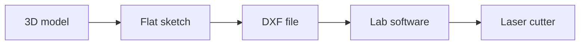

import Quiz from '@components/Quiz.astro';

A laser cutter reads flat artwork and follows the lines in it with a beam. That is worth
saying plainly, because it means the file you send is closer to something you would prepare
for print than to a 3D model: a set of **vectors** — shapes stored as coordinates and paths
rather than as pixels — laid out on a rectangle the size of the machine bed.

The machine has no idea what your object is. It knows where to go and how hard to burn.

## Cut, score, engrave

A laser does three things, and you tell it which by how you draw the line.

- **Cut** — full power, all the way through the sheet. The part falls out.
- **Score**, sometimes called *vector engrave* — the same beam turned down, marking a line
  on the surface without going through. Fold lines, alignment marks, decorative line work.
- **Engrave**, or *raster engrave* — the head sweeps back and forth like an inkjet printer,
  burning a filled area into the surface. This is how a photograph, a logo or solid text
  gets onto a panel. Slow, and it works from a filled shape rather than a path.

How you signal the difference is **not standard**. Common conventions:

- **By line colour** — pure red means cut, blue means score, black means engrave, with the
  mapping set up in the machine's driver.
- **By line width** — a *hairline* stroke means cut, anything thicker gets engraved. Software
  that has no hairline setting usually wants **0.001 inch** (about 0.025 mm), which is the
  same convention written as a number.

Which one applies depends on the machine and its software, and getting it wrong means either
a scorched sheet or a part that never separates. **Ask Fablab SUPSI for their convention and
their template file on your first visit**, and use their template rather than starting a
document from scratch. Every lab has one, and it also carries the correct bed size.

Two rules that hold everywhere:

- **A cut line has no fill and no thickness of its own.** The beam is the thickness.
- **Overlapping duplicate lines get cut twice.** Two parts sharing an edge means the machine
  travels that edge twice: slower, scorched, and sometimes on fire. Delete duplicates before
  exporting, or deliberately share edges only where the lab's software supports it.

## Kerf

The beam is not infinitely thin. It vaporises a narrow channel of material as it travels,
and that channel is called the **kerf**.

Because the beam is centred on your line, half a kerf comes off each side of it. So:

- **Holes come out bigger than drawn.** A 10 mm circle loses material from its inside edge,
  arriving at maybe 10.2 mm.
- **Parts come out smaller than drawn.** A 10 mm tab loses material from its outside edge,
  arriving at maybe 9.8 mm.
- **Therefore a press-fit joint comes out loose by two kerfs**, because the two errors add.
  The slot gained a kerf and the tab lost one: 10.2 mm of hole around 9.8 mm of tab is 0.4 mm
  of slack. A tab drawn exactly the width of its slot will rattle.

That factor of two is the one to remember. Compensating by a single kerf halves the gap and
leaves you with a joint that still moves, which feels like bad luck rather than arithmetic.
Either take a whole kerf off the slot *and* add one to the tab, or take two off one of them.

Kerf on a typical CO2 laser is somewhere around **0.1–0.3 mm**, and it changes with the
material, the thickness, the power and how well the lens was cleaned this morning. Treat any
number you read, including that one, as a starting point rather than a fact.

The way everyone actually solves this is a **test piece**: a small strip with five slots in
it, drawn at 2.7, 2.8, 2.9, 3.0 and 3.1 mm, cut from the same sheet as the real job. Push
your material into each and keep the one that grips without forcing. That measurement is
your slot dimension — and if you built the model with a named parameter, updating it is one
edit.

:::note[Measure the sheet, do not trust the label]
Plywood sold as 3 mm regularly measures anywhere from 2.6 to 3.2 mm, and it varies across a
single sheet. Acrylic is better but not perfect. Measure the actual material with callipers
before you finalise a model, and cut all the parts of one object from one sheet.
:::

## Building 3D out of flat parts

The laser gives you flat pieces of exactly one thickness. Objects come from joining them.

**Press-fit** is the basic move: a tab on one part, a slot in another, sized so friction
holds them. Sized correctly it needs no glue, comes apart for iteration, and looks
deliberate.

**Finger joints** — a comb of alternating tabs and gaps along two mating edges, interlocking
like clasped fingers — are the standard way to build a box. They give a lot of glue area, they
locate the parts for you, and they survive being taken apart a few times. Fingers roughly two
to three times the material thickness look and behave well.

**Bolted joints** are the option when a thing must open repeatedly. A T-slot joint captures a
nut in a slot cut into one panel and takes a bolt through the other. Fiddly to draw, and the
only honest answer for an enclosure you will open twenty times while debugging your
electronics.

Two constraints that shape the whole design:

- **One thickness per job.** Every part in a cut comes from the same sheet, so if your design
  needs 3 mm and 6 mm parts, that is two jobs — and two thickness parameters in your model.
- **No undercuts and no varying thickness.** The beam travels straight down, so a part's
  profile is identical on the top and bottom face. You cannot chamfer an edge, taper a wall
  or vary depth. On thick acrylic you get a slight taper as a side effect of the beam
  shape — not a feature you can design with, but visible when two edges meet.

Think of it as designing in cardboard, then having it cut in something better.

## Getting a file out of Fusion

Your model is 3D and the laser wants 2D outlines. Two routes, in order of preference.

**Right-click a sketch → Save As DXF.** The direct one. Draw the flat outlines of your parts
as sketches, right-click the sketch in the browser tree, and choose the DXF option. A **DXF**
(Drawing Exchange Format) is a plain vector format from AutoCAD that every fabrication
machine and every drawing program can read. It carries lines and curves and nothing else,
which is exactly what the laser needs.

**Sketch on the face you want to cut.** If your part already exists as a solid, create a
sketch on the flat face, use `Project` to copy the face outline into it, and export that
sketch. This keeps the flat file linked to the model, so a change upstream reaches the DXF.

Either route takes the same path to the machine:

Compare that with the chain a
[3D printer needs](/ares_materials_estudi/digital-fabrication/designing-for-3d-printing/). The
laser never receives a 3D model, and the printer never receives a sketch. Both start in the
same Fusion file, and the second step is where they part company.

Then, before cutting:

- **Check the scale.** Open the DXF in whatever the lab uses and measure something you know
  the length of. DXF units are a recurring source of parts arriving at ten times their
  intended size. Putting a 100 mm reference square in the file makes this a five-second check.
- **Lay out the parts.** Fusion exports one sketch per file with your parts where you drew
  them. Arranging them efficiently on the sheet is usually done afterwards in the lab's
  software, or in Illustrator or Inkscape. Leave a few millimetres between parts, and keep
  clear of the very edges of the bed.
- **SVG** — Scalable Vector Graphics, the vector format the web and Illustrator use — is
  accepted by some laser software and not others. DXF is the safer default for a machine;
  SVG is more convenient if you are passing through a graphics program anyway. Ask which the
  lab prefers.

## Materials, including the ones that can hurt you

Good on a laser: plywood, MDF, cardboard and paper, cast acrylic (PMMA), leather, felt, cork,
many textiles. Anodised aluminium can be marked, not cut.

:::danger[Never put PVC or anything chlorinated in a laser]
Cutting PVC releases **chlorine gas, which becomes hydrochloric acid** in the extraction
ducts and in your lungs. It is poisonous to everyone in the room and it corrodes the machine
from the inside, permanently and expensively.

The trap is that chlorinated plastic is not always labelled as such. Watch for **vinyl**,
**faux or synthetic leather**, **cling film and shrink wrap**, some **foam sheet**, some
**oilcloth**, and any sheet whose composition you cannot confirm. If you do not know exactly
what a material is, it does not go in the machine.

Other materials to keep out: **polycarbonate** (burns, yellows, cuts badly),
**ABS** (melts and gives off cyanide compounds), **fibreglass and carbon fibre**,
**HDPE** (melts and catches fire), and anything with a coating you cannot identify.
:::

Two more habits from every Fablab in the world: **never leave a running laser unattended** —
material catches fire, and the first thirty seconds decide whether that is an anecdote or an
incident — and **always run the extraction**, because even permitted materials produce smoke
you do not want to breathe.

<Quiz
	questions={[
		{
			q: 'You draw a 3 mm slot and a 3 mm tab, cut both from the same sheet, and the joint is loose. Why?',
			options: [
				'The plywood was thinner than the label claimed',
				'The kerf widened the slot and narrowed the tab',
				'The laser was out of focus when it cut them',
			],
			answer: 1,
			explanation:
				'The beam is centred on your line and vaporises a channel a tenth to three tenths of a millimetre wide. Inside the slot that makes the slot bigger; outside the tab it makes the tab smaller. The two errors add, so an exact-looking fit comes out loose by two kerfs — which is why compensating by one still rattles.',
		},
		{
			q: 'A classmate offers you an offcut of synthetic leather for a laser-cut cover. What do you do?',
			options: [
				'Cut it at low power, which keeps the fumes down',
				'Leave it out until someone confirms it holds no PVC',
				'Cut it, since leather is on the approved list',
			],
			answer: 1,
			explanation:
				'Faux leather is very often PVC-based, and cutting PVC releases chlorine gas that turns into hydrochloric acid — poisonous to everyone in the room and corrosive to the machine. Lowering the power does not help. Unknown material stays out of the laser.',
		},
		{
			q: 'Why can a laser cutter not produce a part that is 3 mm thick at one end and 6 mm at the other?',
			options: [
				'It can, with two passes at different power settings',
				'The beam goes straight down, so parts are one sheet thick',
				'The lab software accepts only one thickness per file',
			],
			answer: 1,
			explanation:
				'A laser is a two-dimensional machine working on flat stock. Depth is always the thickness of the sheet, which is why three-dimensional objects are built by joining flat pieces, and why parts of two thicknesses mean two separate cutting jobs.',
		},
	]}
/>

## Do this before the next lesson

You have no lab, no induction and no machine yet, and none of that stops the design work. The
cutting waits for Fablab SUPSI; the file, the arithmetic and the fit do not. Everything below
happens in Fusion, in a PDF viewer, and with a knife and a cereal box.

Model a small open tray — four walls press-fitted into a base, nothing more — and put the
material thickness in a
[named parameter](/ares_materials_estudi/digital-fabrication/parametric-modelling/) from the
first sketch.

- [ ] I measured a piece of card or plywood with a ruler and used the number I measured, not
      the number on the label
- [ ] Every slot and tab in my sketch is driven by a `material_thickness` parameter rather than
      by a typed number
- [ ] I changed that parameter from 3 mm to 2.6 mm and watched every joint follow
- [ ] I added a 100 mm reference square to the sketch, so scale can be checked in one glance
- [ ] I exported a sketch as DXF with right-click → Save As DXF
- [ ] I opened the DXF in Inkscape, Illustrator or a free online DXF viewer and measured the
      reference square — it came out 100 mm
- [ ] I printed the DXF or a PDF of it at 100% scale, checked the square with a ruler, and cut
      the parts out of cardboard by hand
- [ ] I assembled the cardboard version and found at least one thing about the design I would
      not have noticed on screen
- [ ] I drew a kerf test strip — five slots at 2.7, 2.8, 2.9, 3.0 and 3.1 mm — ready to cut on
      the first day I get access to a machine
- [ ] I can say out loud why a joint drawn to exact size comes out loose by two kerfs rather
      than one
