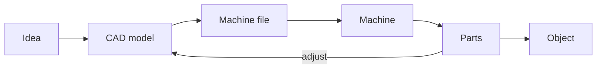

import Quiz from '@components/Quiz.astro';

A **Fablab** — short for fabrication laboratory — is a workshop full of machines that are
driven by files instead of by hands. You send a drawing to a laser cutter and it cuts that
drawing out of a sheet of plywood. You send a 3D model to a printer and it builds that model
out of plastic, a fraction of a millimetre at a time.

SUPSI has one. Over the semester you will spend real hours in it, because the course
*Digitally Designed Objects for Fast Prototyping* is 104 hours long and ends with objects,
not slides.

## Digital fabrication versus making by hand

Both end with a physical thing. The difference is where the design lives.

When you make something by hand, the design and the object are the same act. You cut, you
look, you adjust, you cut again. Your judgement is applied continuously, and it is applied
to the material in front of you.

In **digital fabrication**, the design lives in a file and the machine executes it without
judgement. That has three consequences worth internalising before you touch a machine:

- **The machine makes your mistake perfectly.** A slot drawn 0.4 mm too narrow is cut 0.4 mm
  too narrow, twenty times, in eleven seconds. Nothing in the process will notice.
- **The file is the real object.** It can be copied, sent to someone in another country,
  cut again in three years, and kept in version control the same way you keep
  [a git repository](/ares_materials_estudi/git-and-github/what-version-control-is/).
  Two identical pieces cost the same effort as one.
- **Iteration moves upstream.** You stop refining the object and start refining the file.
  A cycle is: change a number, export, cut, hold it, change the number again.

Drawn out, the process has one loop in it, and that loop is also the shape of this section:

The arrow going back is where the hours go. Everything to the left of the machine is a file
you can edit, which is why the rest of these lessons are mostly about files.

None of that makes hand skills irrelevant. Sanding, gluing, filing and clamping are still
how a set of machine-made parts becomes an object.

## Subtractive and additive

Every machine in the lab does one of two things.

**Subtractive** machines start with a block or a sheet of material and remove what is not
wanted. Carving, in other words. A laser cutter, a CNC router and a vinyl cutter are all
subtractive. The material you remove is waste, and the shapes you can reach are limited by
what the cutting tool can physically get to.

**Additive** machines start with nothing and add material until the object exists. 3D
printing is the additive one. Almost no waste, and shapes are possible that no tool could
carve — a hollow ball with something already inside it, for instance.

The rule of thumb: subtractive is fast, strong and constrained; additive is slow, weaker
and nearly unconstrained in form.

## The four machines

### Laser cutter

A laser beam moves in two directions over a **flat sheet** and burns through it. That is
the entire mechanism, and every strength and limitation follows from it.

- **Good at:** speed — a full sheet of parts in minutes; precise edges; engraving artwork
  onto a surface in the same job; plywood, MDF, acrylic, card, leather, fabric.
- **Bad at:** anything that is not flat. The cut goes straight down through the sheet, so
  every part is exactly one material thickness thick, with a profile that is identical on
  the top and the bottom face.
- **Refuses:** metal (on the CO2 lasers a Fablab normally has), and a short list of
  materials that are genuinely dangerous — covered in
  [designing for laser cutting](/ares_materials_estudi/digital-fabrication/designing-for-laser-cutting/).

You build three-dimensional things on a laser by cutting flat pieces and joining them, the
way flat-pack furniture works.

### 3D printer

The common type melts a plastic filament and lays it down in thin layers, each one resting
on the one below.

- **Good at:** shapes that could not be made any other way — curves, internal cavities,
  organic forms, one-off brackets and adapters that exist nowhere in a catalogue.
- **Bad at:** time. A part the size of your fist is measured in hours, not minutes. Parts
  are also weakest along the layer lines, so a printed hook can snap in the direction the
  layers stack.
- **Watch for:** overhangs. A layer needs something underneath it.

### CNC router or mill

A spinning cutting tool moves under computer control through wood, plastic or aluminium.
CNC stands for **computer numerical control**, meaning the tool path comes from a file
rather than from a person turning a handle.

- **Good at:** thick material, large sheets, and real structural strength. This is the
  machine for furniture-scale work and for milling a mould.
- **Bad at:** internal corners. The tool is round, so every inside corner comes out with a
  radius — you design relief cuts to compensate. It is also loud, messy, and the one
  machine where a mistake can destroy an expensive cutting tool.
- **Access:** expect a mandatory induction and supervision. Do not plan your first week
  around it.

### Vinyl cutter

A small blade drags along a path through thin flexible sheet, cutting the sheet but not
its backing paper.

- **Good at:** stickers, labels, painted stencils, heat-transfer graphics for textiles, and
  — the one interaction designers care about — cutting copper or conductive tape into
  flexible circuits and capacitive touch sensors.
- **Bad at:** anything with thickness. It cuts sheet material well under a millimetre.

## Why you need any of this

In [Physical Computing](/ares_materials_estudi/physical-computing/what-a-microcontroller-is/)
you will build something that senses and reacts: a board, a sensor, a motor, a tangle of
jumper wires on a breadboard. It works, and it is impossible to show to anyone, because it
looks like a fault rather than a proposal.

The thing that turns it into a prototype someone can hold is an **enclosure** — a housing
with the sensor pointing the right way, the button reachable, the cable exiting somewhere
sensible, and the electronics hidden. That housing is a digital fabrication job. Laser-cut
plywood box, printed bracket to hold the sensor at the correct angle, vinyl-cut label on
the front.

This is also where the two courses collide productively: the diameter of the hole for your
button is a number in your CAD file, and getting it wrong by half a millimetre means
cutting the panel twice. Measuring components accurately is a design skill here.

:::note[Before your first visit]
Every Fablab has its own rules and they are not decoration: an induction before you use a
machine, a booking system, a limit on how long you can occupy a printer, and a strict policy
about bringing your own material. Ask about all four on day one, and ask for the template
file they hand out for the laser — it will save you an afternoon.
:::

<Quiz
	questions={[
		{
			q: 'You need a bracket that holds a sensor at 30 degrees inside a box, with a curved cable channel through it. Which machine?',
			options: [
				'Laser cutter, because it is faster',
				'3D printer, because the shape varies through its thickness',
				'Vinyl cutter, because the part is small',
			],
			answer: 1,
			explanation:
				'A laser cuts straight down through a flat sheet, so every part it makes is one uniform thickness with the same profile top and bottom. An angled bracket with an internal channel varies in all three dimensions, which is exactly what an additive process is for.',
		},
		{
			q: 'What does it mean that a laser cutter, a CNC router and a vinyl cutter are all subtractive?',
			options: [
				'They all remove material from something that already exists, so the tool has to be able to reach every surface it makes',
				'They subtract a fixed amount from your design file automatically',
				'They are cheaper to run than additive machines',
			],
			answer: 0,
			explanation:
				'Subtractive means starting with material and taking away what is not wanted. Because a physical tool has to reach every cut surface, shapes that are enclosed or hidden inside the material are impossible. Additive processes build up instead, which is why they can make cavities.',
		},
		{
			q: 'Which of these is the most important practical difference from making the same object by hand?',
			options: [
				'Machines produce better-looking results than hands do',
				'The design lives in a file, so the machine reproduces your errors exactly and iteration means editing numbers rather than the object',
				'Digital fabrication removes the need for sanding, gluing and assembly',
			],
			answer: 1,
			explanation:
				'The machine applies no judgement. That is what makes the process repeatable and shareable, and also what makes a 0.4 mm mistake come out as a 0.4 mm mistake every time. Assembly by hand remains part of nearly every job.',
		},
	]}
/>
