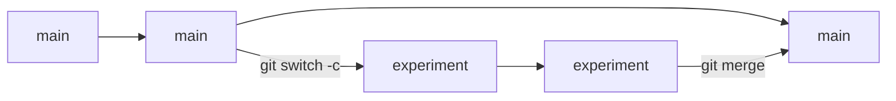

import Quiz from '@components/Quiz.astro';

So far your history is one straight line of commits. That works alone, on a small thing,
when every idea you have turns out well. It stops working the moment you want to try
something risky, or a second person joins.

## The problem branches solve

You have a working prototype. You want to try a completely different interaction — the kind
of change that touches everything and might be worse. Your options without branches are
poor: overwrite the working version and hope, or copy the folder and lose the shared
history.

A **branch** is a parallel line of commits. You leave the working version untouched, build
the experiment beside it, and either bring it back in or abandon it. Abandoning costs
nothing; the branch is a label on a chain of commits, not a copy of the folder.

The branch you have been using is called `main`, by convention the one that always works.

## Making one

```bash
git switch -c sound-experiment
```

`switch` moves you between branches; `-c` creates one first. Your files do not appear to
change, because a new branch starts from exactly where you were.

Now work as normal — edit, `git add`, `git commit`. Those commits land on
`sound-experiment` and `main` is untouched.

```bash
git branch
```

Lists your branches and marks the one you are on. To go back:

```bash
git switch main
```

Look at your files after that: the experiment is **gone from the folder**. Not deleted —
git has rewound the working folder to how `main` looks. Switch back and it returns. This is
the part that feels like magic the first time, and it is the whole point.

:::note[git checkout]
Older tutorials use `git checkout` for this, and it still works. It was split into `switch`
and `restore` because it did too many unrelated jobs. Prefer `switch`; recognise `checkout`
when you see it.
:::

## Bringing the work back

Once the experiment is good, **merge** it: combine the changes from one branch into another.
You merge *into* the branch you are standing on, so switch there first.

```bash
git switch main
git merge sound-experiment
```

The whole manoeuvre has one shape. Each box below is a commit, and the label says which
branch it sits on:



The line never breaks. `main` keeps working the whole time the experiment is being built, and
merging is what brings the two ends back together.

`main` now contains the experiment. The branch has served its purpose and can go:

```bash
git branch -d sound-experiment
```

## Merge conflicts

If two changes touched the **same lines of the same file**, git cannot decide who is right,
and stops with a **merge conflict**. It says so, and `git status` lists the files involved.

This is not only a team problem. The commonest way to meet your first conflict is alone, and
the [previous lesson](/ares_materials_estudi/git-and-github/github/) sets it up exactly: edit
the README on the GitHub website, edit the same lines on your laptop, then run `git pull`.
Two versions of one paragraph, and nobody to blame.

Git does not choose. It writes both versions into the file, one after the other, wrapped in
markers:

```
Some text that both versions agree on.

<<<<<<< HEAD
background: #f7f7f7;
=======
background: #1b1b1b;
>>>>>>> sound-experiment

More text that nobody touched.
```

Read it as three fence posts:

- `<<<<<<< HEAD` opens the version **you already had** — `HEAD` is git's word for the commit
  you are standing on.
- `=======` is the divider. Above it is yours, below it is theirs.
- `>>>>>>> sound-experiment` closes the version **coming in**, labelled with where it came
  from.

Resolving it is ordinary text editing. Open the file, decide what the final lines should be —
one side, the other, or something new that combines them — and **delete the three marker
lines along with everything you do not want**. The file must end up as the file, with no
angle brackets left in it. Then finish the merge exactly as you would any other change:

```bash
git add style.css
git commit
```

`git commit` with no `-m` here opens the editor with a message already written for you, so
you can save and leave it as it is.

:::tip[The way out]
If you would rather not deal with it at this moment:

```bash
git merge --abort
```

Everything goes back to how it was before you typed `git merge`, conflict markers and all.
Nothing is lost either way — both versions exist in the history throughout, which is why a
conflict looks alarming and is routine.
:::

## Pull requests

Everything above is local. A **pull request** is the GitHub layer on top: a formal proposal
to merge one branch into another, which people can read, comment on, and approve before it
happens. Despite the name, nothing is pulled until someone accepts it. Think of it as
handing in a piece of work with a note attached.

The flow, end to end:

```bash
git switch -c week-3-exercise
# work, then:
git add .
git commit -m "Add week 3 exercise"
git push -u origin week-3-exercise
```

Push a branch that GitHub has not seen and the response in your terminal includes a link for
opening a pull request. The repository page also shows a banner offering the same thing.
Follow it and you get a form: a title, a description, and a comparison showing every line
you changed.

What happens then:

- **Anyone with access reads the changes**, line by line, and can leave comments attached to
  specific lines rather than to the whole thing.
- **You keep working on the branch.** New commits pushed to it appear in the open pull
  request automatically — there is nothing to resubmit.
- **When it is approved**, someone presses Merge and the branch becomes part of `main`.
- **Afterwards**, run `git switch main` and `git pull` so your machine has the merged
  result.

This is how you will hand technical work in, and how teams anywhere review each other. Notice
what it gives a reviewer that a folder of files never could: exactly what changed, why,
according to you, and a place to argue about it before it becomes permanent.

:::tip[One branch, one idea]
Name branches after what they do — `contact-form`, `fix-mobile-nav` — and keep them short.
A branch open for three weeks with forty unrelated commits is unreviewable, and reviewers
who cannot read a change tend to approve it without reading.
:::

<Quiz
	questions={[
		{
			q: 'You switch from a branch back to main and your new files vanish from the folder. What happened?',
			options: [
				'The work was deleted and will have to be done again',
				'Git rewound the folder to match main; it comes back',
				'The files were moved into the .git folder as a backup',
			],
			answer: 1,
			explanation:
				'The working folder always shows the branch you are standing on. Committed work on another branch is safe and reappears the moment you switch to it — which is exactly what makes experimenting cheap.',
		},
		{
			q: 'What does opening a pull request actually do?',
			options: [
				'Merges your branch into main as soon as you open it',
				'Proposes the merge and opens it for comment first',
				'Downloads the latest version of the project to your machine',
			],
			answer: 1,
			explanation:
				'Nothing is merged until a person accepts it. The pull request is the discussion that happens in between, with your changes displayed line by line. The name is misleading; the request is the point.',
		},
		{
			q: 'A merge stops with a conflict. What is git telling you?',
			options: [
				'Both branches changed the same lines, so you have to choose',
				'One branch is broken, and merging it would break main',
				'You had uncommitted changes when you started the merge',
			],
			answer: 0,
			explanation:
				'Git merges different parts of a file without help. It only stops when two changes overlap, because picking a winner is a judgement call. You edit the marked section into what you want, then add and commit.',
		},
		{
			q: 'A conflicted file has <<<<<<< HEAD above one version and >>>>>>> above another. What do you do?',
			options: [
				'Delete the markers and edit it into the version you want',
				'Leave the markers alone; git strips them when you commit',
				'Run the merge again, and git takes the newer of the two',
			],
			answer: 0,
			explanation:
				'The markers are ordinary text that git wrote into the file, and nothing takes them out for you — a file committed with angle brackets still in it is a broken file. Decide what those lines should say, delete the rest along with the three marker lines, then git add and git commit. If you would rather start over, git merge --abort puts everything back.',
		},
	]}
/>
