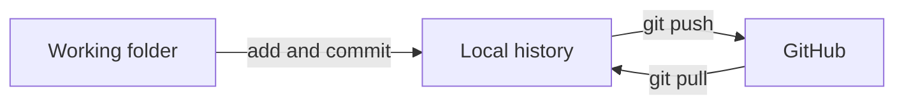

Your repository currently exists in one place: a folder on your laptop. That is fine until
the laptop is stolen, or until a lecturer asks to see the work. This lesson puts a copy
online.

## Make an account

Go to [github.com](https://github.com) and sign up. Two decisions worth a moment:

- **Your username becomes part of every URL you share**, and later part of your published
  site address. Pick something you would put on a CV. Not `xxdesign_bunny_99`.
- **Use an email you will keep** after the master ends.

The free plan covers everything in this section, including private repositories and website
hosting.

## Create a repository on GitHub

From the GitHub home page, use the **New** button (top left, next to the list of
repositories) or the `+` menu in the top right, then **New repository**. You will be asked
for:

- **Repository name** — no spaces. Hyphens instead: `interaction-sketches`.
- **Description** — one line, optional, worth writing.
- **Public or private** — public means anyone can read it. Coursework is usually fine
  public, and public is what makes it portfolio material. You can change this later.
- **Initialize with a README** — leave this **unticked** when you are connecting a folder
  you already have. An empty repository connects cleanly; a pre-filled one starts an
  argument about which version is correct.

After creating it you land on a page of setup instructions. What follows is the same thing,
explained.

## Connect your folder to it

A **remote** is a named copy of your repository that lives somewhere else. Adding one does
not move any files; it teaches your local repository an address.

```bash
git remote add origin https://github.com/USERNAME/REPOSITORY.git
```

Replace `USERNAME` and `REPOSITORY` with yours — the exact line, with your names already
filled in, is on the page GitHub just showed you. **`origin`** is a nickname, and the
conventional one for "the main copy online". Nothing about git requires that word; every
project uses it anyway.

Check it took:

```bash
git remote -v
```

Now send your commits:

```bash
git push -u origin main
```

**Push** means "send my commits to the remote copy". `main` is the branch you are sending.
`-u` links your local `main` to the remote one, so from then on `git push` on its own is
enough.

Refresh the GitHub page and your files are there, with your commit messages beside them.

## Authentication: not a password

The first push will ask who you are. **A GitHub account password will not work here** — that
was switched off in 2021 and every old tutorial that says otherwise is wrong. You have three
working options:

- **Sign in through the browser.** On macOS and Windows, git usually opens a browser window
  the first time and remembers the result. If that happens, take it: nothing else to do.
- **A personal access token** — a long generated string you paste in place of a password.
  You make one in GitHub's settings, under developer settings.
- **An SSH key** — a pair of files on your machine that proves your identity without typing
  anything. More setup once, less friction forever. If you plan to use git for the whole
  master, this is the one worth doing.

The exact screens move around, so rather than reproduce steps that will be stale by the time
you read them: the authentication section of GitHub's own documentation at
[docs.github.com/en/authentication](https://docs.github.com/en/authentication) covers all
three, with current screenshots.

:::caution[If a token appears on screen, copy it immediately]
GitHub shows a personal access token exactly once. Close the page without copying it and you
make a new one. Treat it like a password: never commit it into a repository, never paste it
into a chat.
:::

## The everyday loop

From here on, working looks like this, over and over. It is the pipeline from the last lesson
with one more stage on the end, and the only stage that needs a connection:



```bash
git status
git add .
git commit -m "Describe what changed"
git push
```

Edit, stage, commit, push. Commit whenever a piece of work is coherent; push whenever you
want the online copy to catch up.

If you edited a file **on the GitHub website** — the README, typically — your laptop does not
know about it. Fetch that change before you carry on:

```bash
git pull
```

**Pull** is the opposite of push: bring the remote copy's commits down into your local one.
When in doubt, pull before you start work.

## Getting someone else's repository

**Cloning** downloads a full copy of a repository, complete history included, onto your
machine. It is how you get a classmate's project, a library, or your own work onto a
different computer.

On any repository page there is a green **Code** button that gives you the URL. Then:

```bash
git clone https://github.com/USERNAME/REPOSITORY.git
cd REPOSITORY
```

Clone makes the folder for you, so run it from wherever you keep projects, not inside an
existing repository. The clone already has `origin` set to where it came from — no
`git remote add` needed.

You can clone any public repository on GitHub. Whether you can push back to it is a separate
question, and the subject of the next lesson.

## Do this now

- [ ] I have a GitHub account with a username I am happy to share
- [ ] I created an empty repository on GitHub, without a README
- [ ] I connected my practice folder with `git remote add origin ...`
- [ ] `git push -u origin main` succeeded and I can see my files on the website
- [ ] I got past authentication (browser sign-in, a token, or an SSH key)
- [ ] I edited a file locally, committed, pushed, and watched the website change
- [ ] I edited the same file on the website, then ran `git pull` and saw the change locally
- [ ] I cloned a repository — mine or a public one — into a different folder
