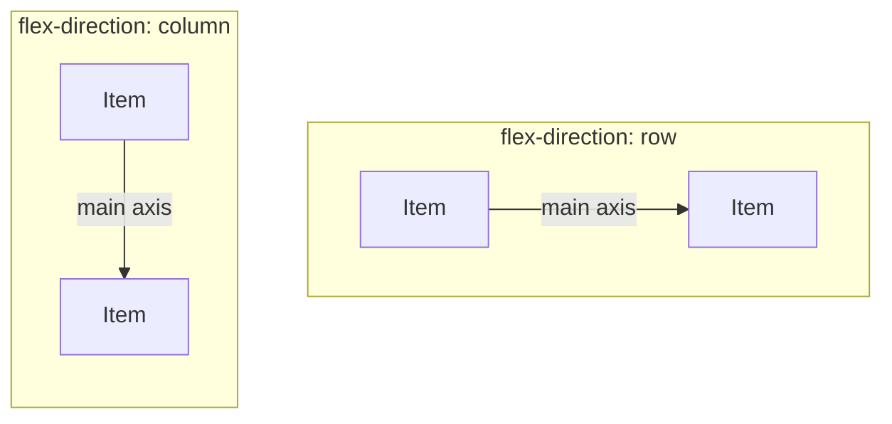

import LiveCode from '@components/LiveCode.astro';
import Quiz from '@components/Quiz.astro';

Left to itself, HTML stacks. Block elements run down the page, one per line, in the order you
wrote them. That is a sensible default for a document and useless for a layout — a navigation
bar, a row of cards, a logo on the left with links on the right.

**Flexbox** is how you say "put these side by side, and here is how to distribute and align
them". It is a set of alignment and distribution controls that will feel immediately familiar,
because they are the same controls as the align panel in any design tool.

## One property to start

Flexbox is switched on with a single declaration on the **parent** — the element that contains
the things you want to arrange. Its direct children then become **flex items** and line up in
a row.

<LiveCode
	title="display: flex"
	height={260}
	code={`

  
One

  
Two

  
Three

`}
/>

Delete `display: flex` and press Run: the three boxes go back to stacking. That is the whole
difference, and it is the only property that goes on the parent to begin with.

The container is the **flex container**; its children are **flex items**. Everything else in
this lesson is either a property of the container (most of them) or of an item (two of them).

## Gaps, before anything else

`gap` sets the space between items. It replaces the old habit of putting a margin on every
item and then removing it from the last one.

<LiveCode
	title="gap"
	height={260}
	code={`

  
One

  
Two

  
Three

`}
/>

## The two axes

This is the one concept in flexbox worth slowing down for. A flex container has two axes:

- The **main axis** is the direction items are laid along. In a row that is horizontal.
- The **cross axis** is perpendicular to it. In a row that is vertical.

The arrow is the main axis, and `flex-direction` is the property that turns it. The cross axis
is always the direction the arrow does not point in.

`flex-direction` chooses the main axis: `row` (the default, left to right) or `column` (top to
bottom). Two properties then do the aligning, and which visual direction each one affects
depends entirely on the direction you set:

- **`justify-content`** distributes items along the **main** axis.
- **`align-items`** aligns items across the **cross** axis.

In a row, `justify-content` moves things horizontally and `align-items` vertically. Set
`flex-direction: column` and the two swap over. Everyone gets this backwards at first; the
cure is to name the main axis out loud before reaching for a property.

## justify-content

Its values read like a distribute panel:

<LiveCode
	title="Distributing along the main axis"
	height={340}
	code={`

<!-- Try each of these in turn on .row above:
     flex-start | center | flex-end | space-between | space-around | space-evenly -->

  
One

  
Two

  
Three

`}
/>

`space-between` pins the first item to one end and the last to the other, spreading the
leftover space between them. It is what builds a header with a logo on the left and a menu on
the right — with two children and nothing else.

## align-items

The cross-axis one. Its most useful value is `center`, because vertical centring in CSS was
genuinely difficult before flexbox existed and is now one line.

<LiveCode
	title="Aligning across the cross axis"
	height={340}
	code={`

<!-- align-items values worth trying: stretch (the default) | flex-start | center | flex-end -->

  
Short

  
A taller item with two lines

  
Short

`}
/>

The default is `stretch`, which is why boxes in a row come out the same height as their tallest
neighbour without being told to. Cards in a grid look aligned for free; that is `stretch`
doing it.

Perfect centring, both directions, is `justify-content: center` and `align-items: center` on
the same container. Those two lines together are worth memorising.

## Letting an item take the leftover space

`flex-grow: 1` on an **item** — not the container — tells it to absorb whatever space is
spare. Everything else keeps its natural size.

<LiveCode
	title="One item takes the rest"
	height={280}
	code={`

  <strong>Logo</strong>
  

  <a href="#">Work</a>
  <a href="#">About</a>

`}
/>

The empty growing `div` pushes the links to the far edge. With two groups instead of four
items you would use `space-between`; with an odd arrangement, a growing spacer is the shortcut.

## Wrapping

By default, flex items refuse to go onto a second line and squeeze instead. `flex-wrap: wrap`
lets them drop down when they run out of room — which is a large part of responsive layout
handled without writing anything width-specific.

<LiveCode
	title="A card row that wraps"
	height={360}
	code={`

  
<h3>Breathing lamp</h3>
Physical computing

  
<h3>Field recorder</h3>
Sound and sensors

  
<h3>Wall of names</h3>
Data and type

`}
/>

`min-width` sets the point below which a card refuses to shrink, so it wraps instead.
`flex-grow: 1` then lets the ones that fit share the row evenly. Narrow your browser window
and the row rearranges itself.

:::note[Flexbox or grid?]
CSS has a second layout system, **grid**, for two-dimensional layouts — rows *and* columns
aligned to each other, like a page grid. Flexbox handles one direction at a time and covers
the large majority of everyday layout. Learn flexbox properly first; grid will make far more
sense afterwards, and `display: grid` behaves as an obvious cousin.
:::

## Try it

Build a page header: the name on the left, two links on the right, vertically centred, with a
gap between the links. You need `display: flex` and two other declarations on `.header`.

<LiveCode
	title="Challenge — a header"
	height={300}
	code={`

  <strong>Ares Bianchi</strong>
  

    <a href="#">Work</a>
    <a href="#">About</a>
  

`}
/>

<Quiz
	title="Check yourself"
	questions={[
		{
			q: 'Where does display: flex go?',
			options: [
				'On each item you want to arrange',
				'On the parent element that contains them',
				'On the body, once per page',
			],
			answer: 1,
			explanation:
				'Flexbox is a relationship between a container and its direct children. You switch it on for the parent, and the children become flex items automatically. Setting it on an item only affects that item\'s own children.',
		},
		{
			q: 'Your container has flex-direction: column. Which property now centres the items horizontally?',
			options: ['justify-content', 'align-items', 'text-align'],
			answer: 1,
			explanation:
				'In a column the main axis is vertical, so justify-content moves items up and down and align-items works across, which is horizontal. The two swap meaning with the direction — the reason for naming the main axis before choosing a property.',
		},
		{
			q: 'A row of three cards should sit side by side on a wide screen and stack on a narrow one, with no media query. What gets you closest?',
			options: [
				'flex-wrap: wrap on the container plus a min-width on the cards',
				'align-items: stretch on the container',
				'flex-direction: column on the container',
			],
			answer: 0,
			explanation:
				'Wrapping lets items move to a new line when they run out of room, and min-width sets the point at which that happens. flex-direction: column would stack them at every width, and align-items only affects the cross axis.',
		},
	]}
/>
