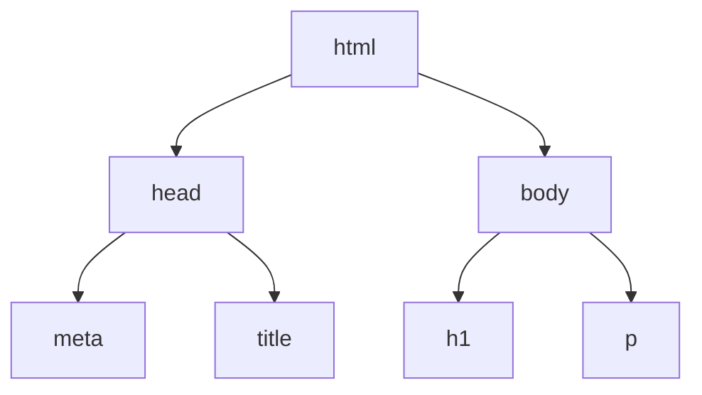

import LiveCode from '@components/LiveCode.astro';
import Quiz from '@components/Quiz.astro';

HTML has one idea in it, repeated: you wrap a piece of content in a label that says what that
content *is*. Learn the wrapping, learn a dozen labels, and you can describe any page.

## Tag, element, content

A **tag** is a word in angle brackets. Tags come in pairs — an opening tag and a closing tag,
the closing one carrying a slash:

```html
<p>Interaction design is a practice, not a subject.</p>
```

`<p>` opens, `</p>` closes, and `p` stands for paragraph. The opening tag, the closing tag and
everything between them is together called an **element**. So that line is one paragraph
element whose **content** is a sentence.

You will hear both words used loosely in class. Roughly: the tag is what you type, the element
is the thing that ends up on the page.

## Attributes

Some elements need extra information — where a link points, which image file to load. That
goes inside the opening tag as an **attribute**: a name, an equals sign, and a value in
quotes.

<LiveCode
	title="An attribute in action"
	code={`<a href="https://developer.mozilla.org">Look something up on MDN</a>`}
/>

The element is a link (`a`, for anchor). Its `href` attribute holds the destination. The
content between the tags — "Look something up on MDN" — is what the reader sees and clicks.
Change the content and the words change; change the `href` and the destination changes.

An element can carry several attributes, separated by spaces. Order never matters.

## MDN, where you look things up

The link in that example points at [MDN Web Docs](https://developer.mozilla.org), and it is
worth stopping on, because knowing where to look things up outlasts anything else in this
section. MDN is the reference for HTML, CSS and JavaScript: not a tutorial site and not a
forum, but the documentation itself, maintained by Mozilla with the people who build the
browsers. It is free, it needs no account, and it is the source your lecturers will quote.

The habit to form today is a search shape: type `mdn` and then the thing you are stuck on.
`mdn img`, `mdn flex-wrap`, `mdn line-height`. The MDN page is nearly always the first
result, and it is the one to open — above the forum answers, which are older than they look.

You almost never read one of those pages top to bottom. They all have the same four parts:

- **The opening paragraph** says what the thing is and what it is for. Frequently all you
  needed.
- **Examples** come next, and they run on the page — a code panel with the result beside it,
  editable in the same way as the boxes on this site. Reading the example is usually faster
  than reading the prose.
- **Syntax** lists every value the thing accepts. Skim it when the example is close but not
  what you want.
- **Browser compatibility** is the table at the bottom: which browsers support this, from
  which version. A tick in every column means use it and stop worrying. It only ever matters
  for something very new.

Two words of warning. MDN is written for people who already write code, so the first sentence
can be denser than the examples below it — scroll down before giving up. And a search will
turn up other reference sites alongside it, **w3schools** most often. They are easier to read
and less carefully maintained; where one disagrees with MDN, MDN is the one to trust.

## Nesting

Elements go inside other elements. This is **nesting**, and it is what turns a flat list of
tags into a structure.

<LiveCode
	title="Elements inside elements"
	code={`<p>Read the <a href="https://developer.mozilla.org">documentation</a> before you guess.</p>`}
/>

The link lives inside the paragraph. The paragraph is its **parent**; the link is its
**child**. An element that mostly exists to hold others is a **container**.

The one hard rule: an element opened inside another must be closed inside it too. This is
correct —

```html
<p>Read the <a href="...">documentation</a> first.</p>
```

— and this is not, because the paragraph closes while the link is still open:

```html
<p>Read the <a href="...">documentation</p></a>
```

Indenting nested elements by two spaces is how everyone keeps this straight. It changes
nothing about the page; it changes everything about whether you can read your own file in a
week.

## Elements with no content

A few elements wrap nothing, so they have no closing tag. An image has nothing to sit between
two tags — the file *is* the content:

```html

```

`src` is the file to load. `alt` is a text description of the image, read aloud by screen
readers, shown when the file fails to load, and read by search engines. It is not optional
politeness; write it every time. `<br>` (a line break) and `<hr>` (a thematic break, drawn as
a rule) work the same way.

<LiveCode
	title="alt text, doing its job"
	height={200}
	code={`
<p>There is no portrait.jpg next to this page, so the browser shows the alt text instead.
That is exactly what a blind reader gets, always.</p>`}
/>

In a real project `portrait.jpg` would be a file sitting in the same folder as your HTML, and
the browser would find it by that name.

## The document skeleton

Everything so far has been a fragment. A real `.html` file has a fixed frame around it, and
you will type this same skeleton at the start of every page you ever make:

```html
<!doctype html>
<html lang="en">
  <head>
    <meta charset="utf-8">
    <meta name="viewport" content="width=device-width, initial-scale=1">
    <title>Ares Bianchi — Interaction Design</title>
  </head>
  <body>
    <h1>Ares Bianchi</h1>
    <p>Interaction designer.</p>
  </body>
</html>
```

The indentation is drawing a tree. Every element sits inside exactly one parent, and the whole
document hangs off `html`:



Line by line:

- **`<!doctype html>`** tells the browser to use modern rules. It is not really a tag, it has
  no closing partner, and it must be the first line. Type it and move on.
- **`<html lang="en">`** wraps the entire document. `lang` states the language, which screen
  readers use to pick a pronunciation.
- **`<head>`** holds information *about* the page that is not drawn on it: the character
  encoding, the viewport setting, links to stylesheets, the tab title.
- **`<meta charset="utf-8">`** says which alphabet the file uses. Leave it out and accented
  characters turn into rubbish.
- **`<meta name="viewport" ...>`** is what makes the page behave on a phone. The
  [responsive design lesson](/ares_materials_estudi/html-and-css/responsive-design/) explains
  why. Copy it in for now.
- **`<title>`** is the browser tab label and the bookmark name. It is not a heading and does
  not appear on the page.
- **`<body>`** holds everything the reader actually sees.

The editable boxes on this site skip the skeleton because the browser fills in a sensible one
for you. Your own files should not.

## The dozen elements that cover most pages

**Headings** run `h1` to `h6` and carry the same meaning as heading levels in any document you
have laid out. `h1` is the page title, `h2` a section, `h3` a subsection. Use them for
hierarchy, never because you want text to be big — sizing is CSS's job, and skipping levels
breaks navigation for anyone using a screen reader.

<LiveCode
	title="Hierarchy"
	height={280}
	code={`<h1>Portfolio</h1>
<h2>Physical computing</h2>
<h3>Breathing lamp</h3>
<p>A lamp that matches the pace of the room it sits in.</p>
<h2>Interfaces</h2>
<p>Screen work, mostly for museums.</p>`}
/>

**Lists** come in two kinds: `ul` for an unordered list (bullets) and `ol` for an ordered one
(numbers). Both hold `li` items — a clear case of nesting, where the items are children of
the list.

<LiveCode
	title="Two kinds of list"
	height={240}
	code={`<ul>
  <li>Sensors</li>
  <li>Actuators</li>
</ul>

<ol>
  <li>Sketch</li>
  <li>Prototype</li>
  <li>Test</li>
</ol>`}
/>

**`div` and `span`** are the two elements that mean nothing at all. A `div` is a generic block
container — you reach for it when you need to group things to lay them out and no more
meaningful element fits. A `span` is the same idea for a run of text inside a line. They are
the plain rectangles of HTML: invisible until CSS gives them something.

<LiveCode
	title="Meaningless on purpose"
	height={220}
	code={`<style>
  .card { border: 1px solid #333; padding: 1rem; }
  .year { background: yellow; }
</style>

<div class="card">
  <h3>Breathing lamp</h3>
  <p>Built in <span class="year">2025</span> from a kit and some patience.</p>
</div>`}
/>

The `div` groups the card so it can take a border. The `span` marks two characters inside a
sentence so they can take a highlight. Neither adds meaning; both add a handle for CSS to grab
— which is what `class` is, and the next lesson is about exactly that.

:::tip[Prefer a meaningful element when one exists]
HTML has named containers — `header`, `nav`, `main`, `section`, `footer`, `article` — that
behave identically to a `div` but say what the region is. These are called **semantic**
elements: same box, more meaning. Screen readers use them to let someone jump straight to the
main content. Use `div` when nothing better fits, not as a default.
:::

## Try it

Turn the fragment below into a small profile: give it a heading, a paragraph, a list of two
things you want to learn, and a link to any site you like. Nest the link inside the paragraph.

<LiveCode
	title="Challenge"
	height={280}
	code={`<h1>Your name</h1>
<p>One sentence about you.</p>

<!-- Anything between these marks is a comment: a note for humans that the
     browser ignores. Add your list and your link below. -->`}
/>

<Quiz
	title="Check yourself"
	questions={[
		{
			q: 'In <a href="https://developer.mozilla.org">MDN</a>, what is href?',
			options: [
				'The element',
				'An attribute',
				'The content',
			],
			answer: 1,
			explanation:
				'href is an attribute: extra information carried inside the opening tag as name="value". The element is the whole link, and the content is the word MDN that the reader sees.',
		},
		{
			q: 'Where does the <title> element go, and what does it do?',
			options: [
				'In the body — it prints the page title at the top of the page',
				'In the head — it names the browser tab and the bookmark',
				'Anywhere in the file — it is another name for the h1',
			],
			answer: 1,
			explanation:
				'title lives in the head, which holds information about the page rather than content on it. The visible page title is an h1 in the body. A page normally wants both, and they often say the same thing.',
		},
		{
			q: 'You want a subheading to look smaller than the one above it, so you use h4 instead of h2. What is wrong with that?',
			options: [
				'Nothing — as long as the text ends up the right size',
				'Levels are structure; skipping one breaks navigation',
				'An h4 has to sit inside an h3 element to be valid',
			],
			answer: 1,
			explanation:
				'Headings are the document outline, the same outline you would build in a print layout. Pick the level that matches the structure, then set any size you want in CSS. Choosing levels by eye leaves anyone navigating by headings with a broken table of contents. Headings are not nested inside each other, either — they are siblings, and the level carries the hierarchy.',
		},
	]}
/>
