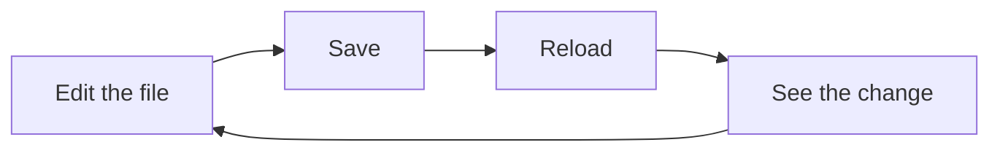

import LiveCode from '@components/LiveCode.astro';
import Quiz from '@components/Quiz.astro';

Every website you have ever looked at is a small pile of text files. There is no proprietary
format, no export step, no account needed to open one. If you can type into a text editor and
save the file, you can make a web page this afternoon.

## The browser is a rendering engine

A **browser** — Chrome, Firefox, Safari, Edge — is a program with one central job: read text
written in a language it understands, and draw the result on screen. Drawing that result is
called **rendering**, the same word you would use for a 3D render and roughly the same idea.
The file is the instruction. The page you see is the render.

You can watch this in reverse on any site. Right-click a page and choose **View Page Source**
(in Safari you first enable the Develop menu in Settings). What appears is the text the
browser was handed. It will look dense and unfriendly. It is still only text, and by the end
of this section you will be able to read most of it.

## Three languages, three jobs

A page is built from three languages. They are not alternatives — a real page uses all three,
each doing one thing.

| Language | Its job | Closest thing you already do |
|---|---|---|
| **HTML** | structure and content | a manuscript with its levels marked: title, heading, body, caption |
| **CSS** | appearance | the type spec, colour palette, grid and spacing |
| **JavaScript** | behaviour | what happens when someone actually touches the thing |

**HTML** stands for HyperText Markup Language. To *mark up* content is to label its parts:
this run of text is a heading, this one is a paragraph, this is an image, this is a link.
HTML says nothing about how any of it looks.

**CSS** stands for Cascading Style Sheets. It takes that marked-up content and decides
everything visual: typeface, size, colour, spacing, position, layout at every screen width.

**JavaScript** is a full programming language. It is what makes a button do something, an
animation run, a form validate.

:::note[This section is HTML and CSS only]
Structure and appearance are enough to build a real, complete, good-looking page — that is
what these six lessons cover. Behaviour is a bigger topic and gets its own section.
:::

## The smallest page that works

Below is a complete web page. Change the text, press **Run**, and the result panel redraws.
These editable boxes appear throughout the section: nothing you type in them can break
anything, and **Reset** always brings back the original.

<LiveCode
	title="A complete web page"
	code={`<h1>Ares Bianchi</h1>

Interaction designer. Currently learning to build things that respond.
`}
/>

That is genuinely all of it. Two elements, no setup. Now add appearance — the `style` block is
CSS, and it changes how the same content is drawn without touching the content itself:

<LiveCode
	title="Same content, styled"
	height={260}
	code={`

<h1>Ares Bianchi</h1>

Interaction designer. Currently learning to build things that respond.
`}
/>

Try changing `#666` to `crimson`, or `2rem` to `4rem`. Nothing here is precious.

## Make one on your own machine

Reading in a box on this site is useful; having a file of your own is the point.

1. Open **VS Code**, the code editor you installed earlier. A code editor is a text editor
   that understands the language you are typing — it colours the parts and warns you about
   typos.
2. **File → New Text File**.
3. Type the two lines from the first example above.
4. **File → Save As**, name it `index.html`, and save it to your Desktop. The `.html` at the
   end is the **file extension** — the part of a filename that tells your computer what kind
   of file it is. Without it, your machine treats the file as plain text and the browser will
   show you the tags instead of rendering them.
5. Find `index.html` on your Desktop and double-click it.

Your browser opens and shows your page.

## Nothing has been published

Look at the address bar. It reads something like `file:///Users/you/Desktop/index.html`, not
an address starting with `https://`. That prefix, `file://`, means the browser is reading a
file straight off your hard disk.

This matters more than it sounds:

- **No internet connection is needed.** Turn off your wifi and the page still opens.
- **No server is needed.** A *server* is a computer somewhere that hands out files when
  someone asks for them. Publishing a site means putting your files on one. You are nowhere
  near needing that yet.
- **Nobody else can see it.** The file exists on your laptop only.

You can build an entire site this way and only think about publishing at the very end.

## The loop

The whole of front-end work is one small cycle, and you will run it a few thousand times:

Save is `Cmd+S` on macOS, `Ctrl+S` on Windows; reload is `Cmd+R` or `Ctrl+R`.

Nothing compiles. Nothing builds. The browser re-reads the file from scratch every time you
reload, so if you saved it, you are looking at it. When a change appears not to have worked,
the first thing to check is always whether the file was actually saved — VS Code marks an
unsaved file with a dot instead of an × on its tab.

## Try it

Add a second paragraph to this page, and give the heading a different colour. You need one
more `p` element in the content, and one line in the `style` block.

<LiveCode
	title="Challenge"
	height={260}
	code={`

<h1>Add a colour to me</h1>

And add a second paragraph below this one.
`}
/>

## Check yourself

- [ ] I made `index.html` on my Desktop and opened it in a browser
- [ ] I changed the text, saved, reloaded, and saw the change
- [ ] I looked at the address bar and found `file://` there
- [ ] I opened View Page Source on a website I use every day

<Quiz
	title="Check yourself"
	questions={[
		{
			q: 'You double-click your HTML file and the browser shows the tags as visible text instead of a formatted page. What is the most likely cause?',
			options: [
				'The file was saved without the .html extension',
				'You are not connected to the internet',
				'You need to install a web server first',
			],
			answer: 0,
			explanation:
				'The extension is how your computer decides what a file is. Saved as index.txt, it is plain text and gets shown literally. Renaming it to index.html is the whole fix — and neither the internet nor a server is involved when you open a local file.',
		},
		{
			q: 'Which language decides that a line of text is a heading rather than a paragraph?',
			options: ['CSS', 'HTML', 'JavaScript'],
			answer: 1,
			explanation:
				'HTML labels what each piece of content is. CSS then decides what a heading looks like — 48px or 12px, black or grey. The two questions are deliberately kept apart, which is what lets one stylesheet restyle a thousand pages.',
		},
		{
			q: 'What does the address file:///Users/you/Desktop/index.html tell you?',
			options: [
				'The page is published and anyone with the link can see it',
				'The browser is reading a file directly from your hard disk',
				'The page is stored in your browser cache',
			],
			answer: 1,
			explanation:
				'file:// means local disk. The page exists only on your machine, works with the wifi off, and is invisible to everyone else until you deliberately publish it somewhere.',
		},
	]}
/>
