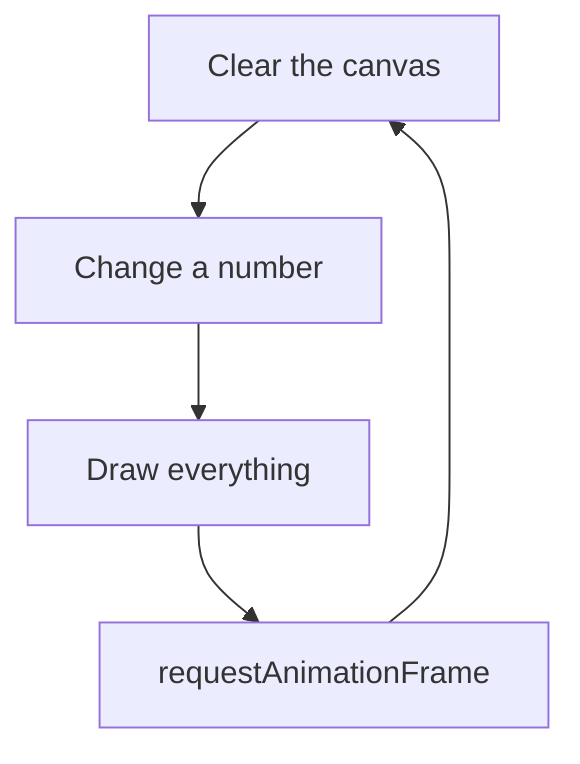

import LiveCode from '@components/LiveCode.astro';
import Quiz from '@components/Quiz.astro';

Animation on a canvas is not a special mode. It is the drawing you already know, repeated very
fast, with one number slightly different each time. That is the whole idea; the rest of this
lesson is bookkeeping.

## A frame

A **frame** is one complete drawing of the canvas. Play frames fast enough and the eye reads
movement — the same trick as film, at roughly the same rate. **Frame rate** is how many you
manage per second, written **fps**.

The loop for one frame is always these three steps:

1. Erase what was there
2. Change a number
3. Draw everything again

## requestAnimationFrame

You do not run this loop yourself with a `for` loop — that would freeze the browser. You ask
the browser to call your function immediately before it next repaints the screen, using
`requestAnimationFrame(name)`. It calls your function once. To keep going, your function asks
again at the end of itself.

```js
function draw() {
	// erase, change, draw
	requestAnimationFrame(draw);   // ask for the next one
}
draw();                          // start it off
```

Yes, the function schedules itself. It reads oddly the first time and then becomes invisible —
almost every sketch you write this semester has these five lines somewhere.



The three steps of a frame plus the line that asks for the next one. Take that last edge away
and you have a single drawing that never moves.

## Movement

One variable, changed by a small amount each frame. `x = x + 2` moves two pixels per frame,
which at sixty frames per second is 120 pixels a second.

<LiveCode title="A square crossing the canvas" height={300} code={`<canvas id="c" width="300" height="180" style="border: 1px solid #ccc"></canvas>

<script>
  const ctx = document.querySelector("#c").getContext("2d");
  let x = 0;

  function draw() {
    ctx.clearRect(0, 0, 300, 180);      // erase

    x = x + 2;                          // change
    if (x > 300) x = -40;               // wrap around

    ctx.fillStyle = "#1b1b1b";          // draw
    ctx.fillRect(x, 70, 40, 40);

    requestAnimationFrame(draw);
  }

  draw();
</script>`} />

Now put `//` in front of the `clearRect` line and press Run. Without the erase, every frame
stays on the canvas and the square paints a stripe. That is a bug most of the time and a
technique some of the time — trails, brushes and long-exposure effects are all "forget to
clear, on purpose".

`clearRect(x, y, width, height)` wipes a rectangular region back to transparent. Passing the
whole canvas is the usual case.

## Bouncing

Movement plus a direction that can flip. Keep the speed in its own variable and reverse its
sign when the shape reaches an edge.

<LiveCode title="Bounce off the walls" height={300} code={`<canvas id="c" width="300" height="180" style="border: 1px solid #ccc"></canvas>

<script>
  const ctx = document.querySelector("#c").getContext("2d");
  const radius = 20;
  let x = 40;
  let y = 40;
  let speedX = 3;
  let speedY = 2;

  function draw() {
    ctx.clearRect(0, 0, 300, 180);

    x = x + speedX;
    y = y + speedY;

    if (x < radius || x > 300 - radius) speedX = -speedX;
    if (y < radius || y > 180 - radius) speedY = -speedY;

    ctx.beginPath();
    ctx.arc(x, y, radius, 0, Math.PI * 2);
    ctx.fillStyle = "#ffe100";
    ctx.fill();

    requestAnimationFrame(draw);
  }

  draw();
</script>`} />

Change `speedX` to a decimal like `0.5` and it crawls. Negative numbers start it going the
other way. Nothing in there is clever, and that is the point.

## Easing

Constant speed reads as mechanical. **Easing** means moving a fraction of the remaining
distance each frame, so the shape starts fast and settles gently — the motion curve you already
know from prototyping tools, expressed as one line:

```js
x = x + (targetX - x) * 0.1;
```

Each frame it closes a tenth of the gap. A smaller factor is slower and softer; a larger one is
snappier. It never quite arrives, which does not matter at pixel resolution.

<LiveCode title="Follow the pointer, softly" height={300} code={`<canvas id="c" width="300" height="180" style="border: 1px solid #ccc"></canvas>
<p style="font: 13px sans-serif">Move the pointer over the canvas.</p>

<script>
  const canvas = document.querySelector("#c");
  const ctx = canvas.getContext("2d");

  let x = 150;
  let y = 90;
  let targetX = 150;
  let targetY = 90;

  canvas.addEventListener("mousemove", (event) => {
    targetX = event.offsetX;
    targetY = event.offsetY;
  });

  function draw() {
    ctx.clearRect(0, 0, 300, 180);

    x = x + (targetX - x) * 0.08;
    y = y + (targetY - y) * 0.08;

    ctx.beginPath();
    ctx.arc(x, y, 16, 0, Math.PI * 2);
    ctx.fillStyle = "#1b1b1b";
    ctx.fill();

    requestAnimationFrame(draw);
  }

  draw();
</script>`} />

Two lessons combine here: the event handler only *stores* the pointer position, and the
animation loop is the only thing that draws. Keeping input and drawing separate like this
scales to anything you build later.

## How fast is a frame, really

`requestAnimationFrame` runs at the refresh rate of the screen it is on. That is usually 60 fps,
but a recent laptop or phone may be 120, and a heavy sketch on a tired machine may drop to 30.
So `x = x + 2` is not a fixed speed — it is 2 pixels per frame, and frames are not all equal.

For coursework this rarely matters. When it does, the fix is that the browser passes your
function a timestamp in milliseconds, and you scale movement by the time elapsed rather than by
the frame:

```js
function draw(now) {
	// now - lastTime tells you how long the previous frame took
	requestAnimationFrame(draw);
}
```

Worth knowing exists. Not worth doing until something visibly runs at the wrong speed on another
machine.

:::tip[Nothing is moving]
If a sketch draws one frame and stops, the last line of your function is missing its
`requestAnimationFrame(draw)`. If nothing appears at all, the function was defined but never
called the first time.
:::

## Your turn

The circle below sits still. Give it a `size` variable that grows a little each frame, and
reverse the growth when it gets too big or too small, so it breathes.

<LiveCode title="Challenge" height={300} code={`<canvas id="c" width="300" height="180" style="border: 1px solid #ccc"></canvas>

<script>
  const ctx = document.querySelector("#c").getContext("2d");
  let size = 20;

  function draw() {
    ctx.clearRect(0, 0, 300, 180);

    // Change size here, and flip its direction at the limits.

    ctx.beginPath();
    ctx.arc(150, 90, size, 0, Math.PI * 2);
    ctx.fillStyle = "#ffe100";
    ctx.fill();

    requestAnimationFrame(draw);
  }

  draw();
</script>`} />

<Quiz
	title="Check yourself"
	questions={[
		{
			q: 'Your animation leaves a solid streak behind the moving shape. What is missing?',
			options: [
				'requestAnimationFrame at the end of the function',
				'clearRect at the start of the function',
				'beginPath before the shape',
			],
			answer: 1,
			explanation:
				'Canvas keeps whatever you painted. Without erasing at the start of each frame, every position the shape has ever had is still on screen. Some sketches leave it out deliberately, to get trails.',
		},
		{
			q: 'Why call requestAnimationFrame inside the function it runs, rather than using a for loop that repeats 10000 times?',
			options: [
				'The browser cannot repaint until your loop finishes, so the page would freeze',
				'A for loop cannot repeat often enough to keep up with the screen',
				'requestAnimationFrame runs your arithmetic faster than a loop does',
			],
			answer: 0,
			explanation:
				'The browser can only repaint between pieces of your code, not during them. A long loop finishes entirely before anything reaches the screen. requestAnimationFrame hands control back after each frame.',
		},
		{
			q: 'What does x = x + (targetX - x) * 0.1 do over several frames?',
			options: [
				'Moves x at a constant ten pixels per frame until it reaches targetX',
				'Moves x a tenth of the way to targetX each frame, so it slows as it arrives',
				'Sets x to a tenth of targetX, and then leaves it there for good',
			],
			answer: 1,
			explanation:
				'The gap shrinks every frame, so the step shrinks with it. That deceleration is what makes motion read as physical rather than mechanical — the same thing an ease-out curve does in a prototyping tool.',
		},
	]}
/>
