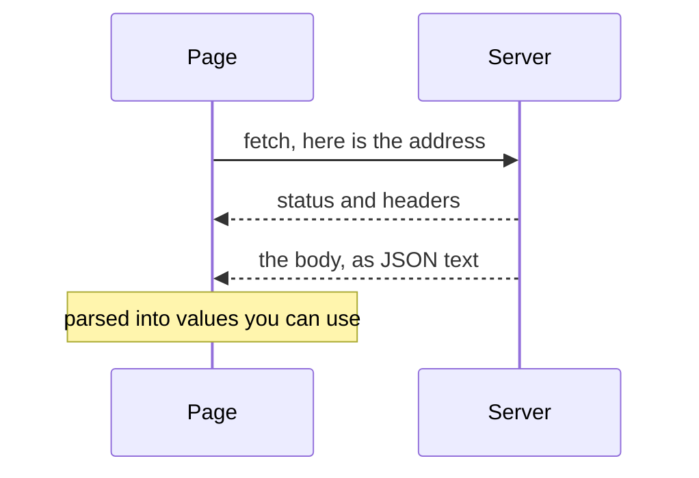

import LiveCode from '@components/LiveCode.astro';
import Quiz from '@components/Quiz.astro';

Everything so far has used numbers you invented. This lesson is about numbers somebody else
holds: a weather service, a museum catalogue, a sensor logging to a file, the output of a
machine learning model. The course calls this API usage, and it is four lines of code plus one
new idea.

## What an API is

An **API** — Application Programming Interface — is an agreed way for one program to ask another
for something. On the web that usually means a URL you can request, which answers with data
instead of a web page. Ask a weather service for Lugano and you get back numbers, not a
designed page with a sun icon. What the numbers look like is your problem, which is the point.

The format that comes back is almost always **JSON**: text laid out as named values and lists,
readable by both people and programs.

```json
{
	"city": "Lugano",
	"temperature": 21.4,
	"readings": [4, 9, 14]
}
```

That is the same shape as the objects and arrays you already wrote in JavaScript. The
difference is that this is *text* — a string of characters — until something turns it into
values you can use.

## JSON in, values out

`JSON.parse()` turns JSON text into a real object. `JSON.stringify()` goes the other way, for
when you need to send data or save it.

<LiveCode title="From text to elements" height={280} code={`<style>
  body { font-family: sans-serif; }
</style>

<h3 id="place"></h3>
<ul id="out"></ul>

<script>
  const text = '{"city": "Lugano", "readings": [4, 9, 14]}';

  const data = JSON.parse(text);

  document.querySelector("#place").textContent = data.city;

  const list = document.querySelector("#out");
  for (const value of data.readings) {
    const item = document.createElement("li");
    item.textContent = value + " degrees";
    list.append(item);
  }
</script>`} />

Add a reading to the array in the string and press Run. Once parsed, it is an ordinary object:
`data.city`, `data.readings[0]`, `data.readings.length`.

## fetch

`fetch(url)` asks the network for something. The complication is time: the answer travels over
a network and might take a second, or ten, or never arrive. JavaScript refuses to stand still
and wait, so `fetch` hands you a **promise** — a receipt for a value that is not here yet.

You need exactly two things about promises to get through the semester.

`await` means "stop here until that value arrives, then carry on with the real value". It only
works inside a function marked `async`. That is it. Everything else about promises can wait
until you need it.

```js
async function load() {
	const response = await fetch("data.json");
	const data = await response.json();
	console.log(data);
}

load();
```

Two awaits, because there are two waits. The first gets a **response** — headers, a status code,
the connection. The second reads the body of that response and parses it as JSON, which is also
not instant.



Your page carries on with everything else between those arrows. That is what `await` buys you:
the function stops, the browser does not.

:::caution[Your own file needs a server too]
`fetch("data.json")` for a file sitting next to your `index.html` works when the folder is
served — the **Live Server** extension in VS Code, at a `localhost` address. Opened directly as
`file://`, the browser blocks it. Same setup as the microphone lesson, same reason.
:::

## When it fails

A network request fails more often than any other code you will write, and it fails in two
different ways.

**The request never arrives.** No wifi, the server is down, the address is wrong. `fetch`
throws an error, which `try` / `catch` catches.

**The request arrives and the answer is bad.** The server says 404 (no such thing) or 500
(something broke on our side). This does *not* throw — you got a perfectly good answer, and the
answer is "no". You check `response.ok` yourself.

```js
async function load() {
	try {
		const response = await fetch("data.json");

		if (!response.ok) {
			throw new Error("Server said " + response.status);
		}

		const data = await response.json();
		show(data);
	} catch (error) {
		document.querySelector("#status").textContent = "Could not load the data.";
		console.log(error);
	}
}
```

`try` runs the risky code. If anything inside it throws, the rest of the block is abandoned and
`catch` runs with an `error` object describing what happened. Put a message on the page for the
visitor and the details in the console for you.

<LiveCode title="try and catch, without a network" height={250} code={`<style>
  body { font-family: sans-serif; }
</style>

<p id="out"></p>

<script>
  const broken = '{"city": "Lugano", "readings": [4, 9';   // truncated on purpose
  const out = document.querySelector("#out");

  try {
    const data = JSON.parse(broken);
    out.textContent = "Loaded " + data.city;
  } catch (error) {
    out.textContent = "Could not read that data: " + error.message;
  }
</script>`} />

Delete the `try` and `catch` lines, leaving the code inside, and press Run: the page goes blank
and the error is only in the console. That difference — broken and explaining itself, versus
broken and silent — is a design decision, and it is yours.

## Sending data out

Same function, extra instructions. The `method` says what kind of request, the `headers` say
what you are sending, and the `body` is the JSON text.

```js
await fetch(url, {
	method: "POST",
	headers: { "Content-Type": "application/json" },
	body: JSON.stringify({ city: "Lugano", reading: 21.4 }),
});
```

You will meet this when you call an AI model's API later in the course, which is exactly this
shape with a key added.

## Finding an API to try

Do not take a URL from a lesson — take it from the service's own documentation, because
endpoints change and a wrong one wastes an afternoon. Search for the official docs of something
you actually want data from. Open-Meteo (weather), the Metropolitan Museum of Art collection,
and Wikipedia all publish free APIs that need no account, which makes them good first attempts.

Two things to check in any documentation before you commit: whether it needs an **API key** (a
password identifying you, which must not be committed to a public repository), and whether it
allows browser requests. Some servers only answer other servers; a browser request to one fails
with a **CORS** error in the console. There is nothing you can do about that from your page —
it is the server's decision — so pick another source.

The reference for all of this is on
[MDN](https://developer.mozilla.org/en-US/docs/Web/API/Fetch_API/Using_Fetch).

<Quiz
	title="Check yourself"
	questions={[
		{
			q: 'What does await do?',
			options: [
				'Pauses the whole browser, including animation, until the data arrives',
				'Waits for the promised value, then continues with the real one',
				'Keeps retrying the request until the server finally answers',
			],
			answer: 1,
			explanation:
				'It suspends that one function while the browser gets on with everything else — animation, clicks, the rest of the page. It only works inside a function marked async.',
		},
		{
			q: 'Your fetch returns a 404 and your catch block never runs. Why not?',
			options: [
				'The status has to be read before the await, or catch never sees it',
				'The server answered, so fetch did not throw — you check response.ok yourself',
				'A catch block only runs for errors you threw yourself with new Error',
			],
			answer: 1,
			explanation:
				'fetch only throws when the request itself fails: no connection, bad address. A server that answers "not found" has answered. Checking response.ok and throwing yourself is how you route both failures into the same catch.',
		},
		{
			q: 'Why does JSON.parse exist, if JSON already looks like a JavaScript object?',
			options: [
				'What arrives over the network is text, and parse turns it into values',
				'JSON uses double quotes everywhere, which JavaScript has to convert',
				'Parsing checks the data against the shape your program expects',
			],
			answer: 0,
			explanation:
				'A response body is a string of characters. It looks like an object to you, but until it is parsed, data.city is meaningless. response.json() does both steps for you: read the body, then parse it.',
		},
	]}
/>
