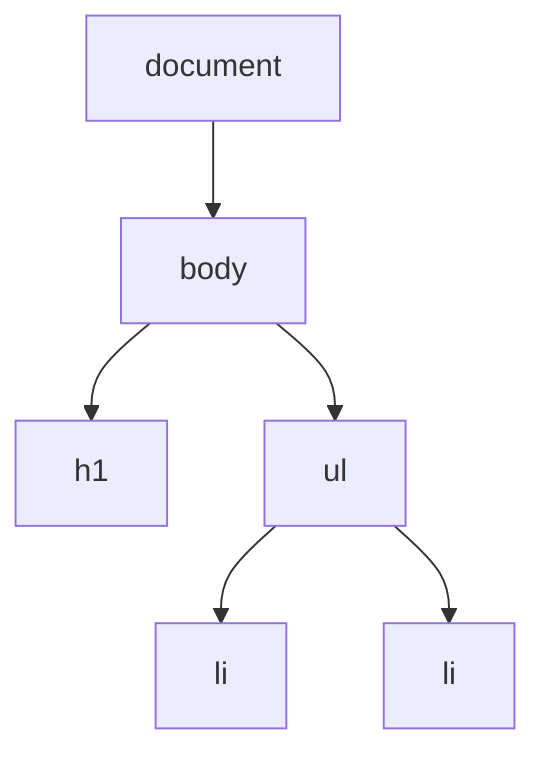

import LiveCode from '@components/LiveCode.astro';
import Quiz from '@components/Quiz.astro';

So far your JavaScript has talked to the console. Useful for learning, invisible to everyone
else. This lesson connects the language to the page, which is where the rest of the course
lives.

## The page is a tree of objects

When the browser loads your HTML it does not keep it as text. It builds a model of it in
memory: one object per element, nested exactly the way your tags were nested. That model is
the **Document Object Model**, or **DOM**.

This HTML:

```html
<body>
	<h1>Studio</h1>
	<ul>
		<li>Lamp</li>
		<li>Chair</li>
	</ul>
</body>
```

becomes a tree:



`body` holds an `h1` and a `ul`, the `ul` holds two `li`. Each of those is an
**element**: an object with properties you can read and change from JavaScript. Change one,
and the screen updates immediately. The HTML file on disk never changes; you are editing the
browser's live copy of it.

The browser hands you the whole tree in a ready-made variable called `document`.

## Finding one element

`document.querySelector()` takes a **CSS selector** — the same strings you used to style
things — and gives you back the first element that matches.

```js
document.querySelector("#greeting");  // the element with id="greeting"
document.querySelector(".card");      // the first element with class="card"
document.querySelector("h1");         // the first h1 on the page
```

If nothing matches, you get `null` — a value meaning "deliberately empty". Reaching into
`null` is the single most common beginner error, and it has its own section in
[When it breaks](/ares_materials_estudi/javascript/when-it-breaks/).

## Reading and changing text

`textContent` is the plain text inside an element. Read it, or assign to it to replace it.

<LiveCode title="Read the heading, then rewrite it" height={200} code={`<h2 id="title">Original heading</h2>
<p id="report"></p>

<script>
  const title = document.querySelector("#title");
  const report = document.querySelector("#report");

  report.textContent = "The heading used to say: " + title.textContent;
  title.textContent = "Written by JavaScript";
</script>`} />

Change the strings and press Run. The first render already ran the code — the "original"
heading you see is the rewritten one.

:::caution[textContent, not innerHTML]
There is a second property, `innerHTML`, that accepts tags rather than plain text. Anything you
assign to it is read as markup and built into real elements — which is fine for markup you
wrote, and a way in for markup somebody else wrote.

A `<script>` tag inserted this way does not run, and finding that out is what convinces people
the warning is imaginary. The attack does not use one. It uses an ordinary element with an
attribute that runs code: `` asks for an image that cannot exist, and
the browser dutifully runs the `onerror` code the moment it fails. There are dozens of
variations.

`textContent` parses nothing. It puts characters on the page and that is all, so a visitor
who types tags sees their tags. Use it unless you specifically need to insert markup.
:::

## Changing appearance

Two ways, and the second is almost always the better one.

`element.style` sets a CSS property directly on that one element. Hyphenated CSS names lose the
hyphen and gain a capital: `background-color` becomes `backgroundColor`, `font-size` becomes
`fontSize`. Values are strings, units included.

`element.classList` adds or removes a CSS class you already wrote in your stylesheet.
`add()`, `remove()`, and `toggle()` — which removes the class if it is there and adds it if it
is not.

<LiveCode title="Two ways to restyle" height={230} code={`<style>
  body { font-family: sans-serif; }
  .marked { background: #ffe100; }
</style>

<p id="a">Styled property by property from JavaScript.</p>
<p id="b">Given a class that the stylesheet already defines.</p>

<script>
  document.querySelector("#a").style.letterSpacing = "0.25em";
  document.querySelector("#b").classList.add("marked");
</script>`} />

Prefer `classList`. It keeps the design decisions in the CSS file where a designer can find
them, and leaves the JavaScript saying only *when* something is highlighted, not what
highlighted looks like.

## Making new elements

Three steps: create it, fill it, attach it. An element that is created but never appended
exists in memory and appears nowhere.

<LiveCode title="Build a list from an array" height={230} code={`<ul id="tools"></ul>

<script>
  const tools = ["VS Code", "Figma", "Fusion 360"];
  const list = document.querySelector("#tools");

  for (const name of tools) {
    const item = document.createElement("li");
    item.textContent = name;
    list.append(item);
  }
</script>`} />

Add a name to the array and press Run. This is the pattern behind most data-driven pages: an
array in, elements out.

## Finding several elements

`document.querySelectorAll()` returns every match rather than the first, as a list you can loop
over with `for...of`.

<LiveCode title="Change all of them at once" height={230} code={`<style>
  body { font-family: sans-serif; }
</style>

<p class="line">First</p>
<p class="line">Second</p>
<p class="line">Third</p>

<script>
  const lines = document.querySelectorAll(".line");
  let n = 1;
  for (const line of lines) {
    line.textContent = n + ". " + line.textContent;
    n = n + 1;
  }
</script>`} />

## Order matters

A script can only find an element the browser has already built. If your `<script>` sits above
the element it looks for, `querySelector` returns `null` and the code fails. Putting scripts at
the end of the `<body>`, as every example here does, avoids the problem entirely.

The full catalogue of what these properties can do lives on
[MDN](https://developer.mozilla.org/en-US/docs/Web/API/Document/querySelector). You need about
five of them for the whole first semester.

## Your turn

The list below is missing its subtitle and none of the items are highlighted. Add a paragraph
element containing "Semester 1" above the list, and give the second item the `marked` class.

<LiveCode title="Challenge" height={280} code={`<style>
  body { font-family: sans-serif; }
  .marked { background: #ffe100; }
</style>

<div id="panel">
  <h3>Courses</h3>
  <ul id="courses"></ul>
</div>

<script>
  const courses = ["Creative Coding", "Tangible Interfaces", "Making Sense of Data"];
  const list = document.querySelector("#courses");

  for (const name of courses) {
    const item = document.createElement("li");
    item.textContent = name;
    list.append(item);
  }

  // Write your two changes here.
</script>`} />

<Quiz
	title="Check yourself"
	questions={[
		{
			q: 'What does document.querySelector(".card") return when the page has no element with that class?',
			options: ['An empty element', 'null', 'An error that stops the page loading'],
			answer: 1,
			explanation:
				'It returns null — a value meaning "nothing here". No error happens at that moment. The error comes one line later, when you try to read or set a property on null.',
		},
		{
			q: 'You want a paragraph to turn yellow when something happens, and the yellow is already defined in your CSS as .marked. Which is the better line?',
			options: [
				'p.style.backgroundColor = "#ffe100"',
				'p.classList.add("marked")',
				'p.innerHTML = "<mark>text</mark>"',
			],
			answer: 1,
			explanation:
				'classList.add keeps the appearance in the stylesheet and leaves the JavaScript responsible only for the timing. Setting style directly scatters colour values through your code, where the next person to restyle the project will not think to look.',
		},
		{
			q: 'You run document.createElement("li") and set its textContent, but nothing appears on the page. Why?',
			options: [
				'A list item has to be created from the ul, not from document',
				'It exists in memory but was never appended to the page',
				'Elements made in JavaScript need a class before they are visible',
			],
			answer: 1,
			explanation:
				'Creating an element makes an object in memory. It becomes visible only once you attach it to an element that is already in the document, with append().',
		},
	]}
/>
