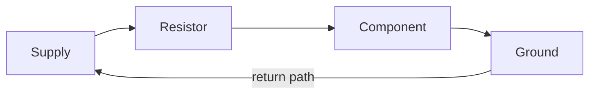

import Quiz from '@components/Quiz.astro';

You are about to build things that plug into the physical world. You do not need a physics
degree for that. You need four ideas and one small piece of arithmetic, and after that
everything else is looking numbers up.

The four ideas are voltage, current, resistance and ground. Water is a good enough model for
all of them.

## The water analogy

Picture a closed loop of pipe with a pump in it. Water goes round and round.

**Voltage** is the pressure the pump produces. It is a difference between two points, never
a property of one point on its own — the same way a step is a difference in height between
two floors. Measured in **volts** (V). When a board says `5V`, it means *five volts higher
than ground*.

**Current** is how much water is actually moving past a point each second. Measured in
**amperes** (A), usually in thousandths, **milliamps** (mA). A small indicator light wants
something like 5–20 mA.

**Resistance** is how narrow the pipe is. A narrow pipe lets less through for the same
pressure. Measured in **ohms** (Ω). A component built to be narrow on purpose is a
**resistor**.

**Ground** is the bottom of the loop — the reference point everything else is measured
against, and the path the water takes to get back to the pump. On a board it is labelled
`GND`. It is where the loop closes, and nothing works without it.

That last point is the one beginners drop. Electricity does not travel to a component and
stop there. It goes round. If there is no path back to ground, nothing happens at all.



Every circuit in this section is that ring. When something does not work, the first question is
which part of the ring is open.

:::note[Where the analogy leaks]
Water can spray out of an open pipe. Electricity cannot: an incomplete circuit does nothing
rather than leaking onto the table. Otherwise the model holds well enough for everything in
this section.
:::

## Ohm's law

The three quantities are locked together by one equation:

```
V = I × R

voltage (volts) = current (amps) × resistance (ohms)
```

More pressure through the same pipe means more flow. A narrower pipe at the same pressure
means less flow. The version you will use most often is the rearranged one:

```
I = V / R
```

That is all the maths in this section. Everything else is a lookup.

## What "5V" and "GND" mean on a board

Along the edge of a microcontroller board is a row of labelled holes or metal legs. A few of
them are not signals at all — they are the power supply, offered to you so you can feed the
components you attach:

- `GND` — ground, the return path and the zero-volt reference. There are usually several,
  all connected to each other internally. Use whichever is nearest.
- `3V3` or `5V` — a steady supply at that voltage, produced by the board from whatever comes
  in over USB.

Two things follow from this.

First, **every part of your circuit shares one ground.** If you power a sensor from the
board's `3V3` and feed its output to a pin, the sensor's ground and the board's ground must
be the same wire. Two circuits that do not share a ground cannot meaningfully talk to each
other.

Second, **boards run at different voltages, and it matters.** Some run their pins at 5 V,
many modern ones at 3.3 V. Putting 5 V into a pin that expects 3.3 V can destroy the chip
underneath. Before wiring anything on real hardware, look at your board's **pinout** — the
diagram naming every pin and what it does — and check which voltage it runs at. Your board's
manufacturer publishes one; for Arduino boards it is on
[docs.arduino.cc](https://docs.arduino.cc/).

## Why an LED needs a resistor

An **LED** — light-emitting diode — is a component that turns current into light. It has two
legs, and it only works one way round: the long leg (the **anode**) goes towards the positive
side, the short leg (the **cathode**) towards ground. Backwards, it stays dark.

Here is the part that surprises people. An LED is not a resistor. It does not politely take
the current it needs and ignore the rest. It drops a roughly fixed voltage across itself —
its **forward voltage**, around 2 V for a red one — and then takes as much current as the
circuit will physically allow. Connect it straight across 5 V and the answer to "as much as
the circuit will allow" is "far too much", and it burns out. Sometimes instantly, sometimes
after a bright week.

So you add a resistor to be the narrow part of the pipe. The sum works like this, for a red
LED on 5 V that wants about 20 mA:

```
voltage left for the resistor = 5 V − 2 V   = 3 V
resistance needed             = 3 V / 0.02 A = 150 Ω
```

In practice people reach for **220 Ω**, the nearest common value that errs on the safe side.
Slightly dimmer, comfortably alive. On a 3.3 V board the leftover voltage is smaller, so the
same 220 Ω gives you less current still, which is fine.

:::caution[Check the part, not your memory]
Forward voltage varies by colour — blue and white LEDs need more than red ones — and the
safe current varies by part. The number that matters is in the component's datasheet. When
you do not have it, more resistance is the safe direction to guess in: too much makes it dim,
too little makes it dead.
:::

The general rule behind this: **voltage is what you supply, current is what the circuit
draws.** Damage nearly always comes from current, and current is what a resistor is there to
hold back.

<Quiz
	questions={[
		{
			q: 'In the water analogy, what does ground correspond to?',
			options: [
				'The pump that pushes the water',
				'The point everything is measured against, and the path back to the pump',
				'The narrow section of pipe that slows the flow',
			],
			answer: 1,
			explanation:
				'Ground is the zero of the system and the return path that closes the loop. A circuit with no route back to ground does nothing at all, which is why GND is on every wiring diagram you will ever read.',
		},
		{
			q: 'You wire an LED directly between 5V and GND, with no resistor. What happens?',
			options: [
				'It lights at normal brightness — the LED only draws what it needs',
				'Nothing, because an LED needs a resistor to conduct at all',
				'It draws far more current than it is built for and burns out',
			],
			answer: 2,
			explanation:
				'An LED does not limit its own current. It drops its forward voltage and then takes whatever the rest of the circuit permits, which without a resistor is far too much. The resistor is what sets the current.',
		},
		{
			q: 'Which rearrangement of Ohm’s law tells you the current flowing through a resistor?',
			options: ['I = V / R', 'I = V × R', 'I = R / V'],
			answer: 0,
			explanation:
				'From V = I × R, dividing both sides by R gives I = V / R. More voltage means more current; more resistance means less. This is the only calculation you need in this section.',
		},
	]}
/>
