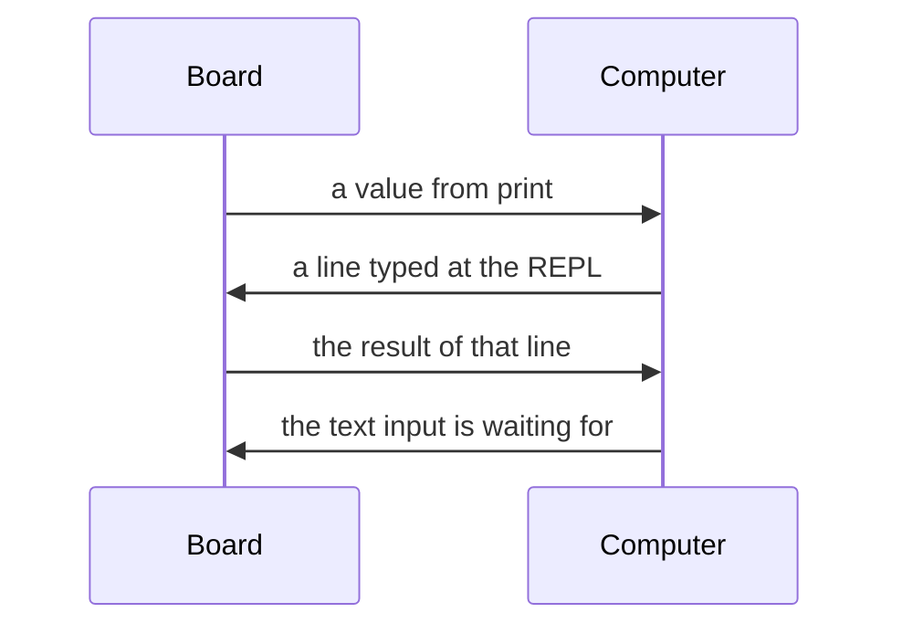

import Embed from '@components/Embed.astro';
import Quiz from '@components/Quiz.astro';

Your board has no screen. When something goes wrong — and something will — you cannot open a
console the way you did in the browser. What you have instead is one cable, and everything
goes down it.

## Serial

**Serial** communication means sending data one bit after another along a single connection,
as opposed to sending several at once on parallel wires. It is old, it is simple, and it is
how a microcontroller has talked to a computer for decades.

Both ends have to agree on the speed, measured in bits per second and called the **baud rate**.
**115200** is the usual choice. Get it wrong and you do not get an error — you get a stream of
plausible-looking garbage characters, which is a useful thing to recognise, because it means
the cable is fine and only the setting is wrong. Boards that connect over USB usually negotiate
this for you, and then the setting does not matter at all.

You already used serial in the last two lessons without being told. Everything `print()`
produces goes out over it.

```python
from machine import ADC, Pin
import time

knob = ADC(Pin(26))

while True:
    print("raw:", knob.read_u16())
    time.sleep(0.5)
```

In Wokwi, that output appears in the **serial monitor**, the panel below the diagram. On a real
board it appears in whatever program you used to load the code — Thonny, Arduino Lab for
MicroPython, or a terminal.

`print()` is your debugger here. There is no breakpoint, no step-through, no inspector. Printing
a value at the point you stopped understanding the program is the entire technique, and it is
enough far more often than it deserves to be.

## The REPL

The cable carries traffic in both directions, and the other direction is more interesting than
it first sounds.

A **REPL** — Read, Eval, Print, Loop — is a live prompt into a running interpreter. It reads a
line you type, evaluates it, prints the result, and waits for the next one. MicroPython has one
built in, and it is attached to the serial connection, which means you get a Python prompt
*inside the board while it is running*.

You reach it by ending the program:

- In Wokwi, the REPL appears in the serial monitor when `main.py` finishes, or when you press
  `Ctrl+C` to interrupt it.
- On a real board, the tool you used to load the code shows the same prompt.

It looks like this:

```
>>> from machine import Pin
>>> led = Pin(15, Pin.OUT)
>>> led.value(1)
>>> led.value(0)
>>> 2 + 2
4
```

Every line runs the instant you press Enter. The LED comes on while you sit there.

This changes how you work. Instead of editing `main.py`, running it, watching, editing again,
you poke the hardware directly and find out what it does. Is the sensor on the right pin?
`ADC(Pin(26)).read_u16()` at the prompt, and you know. Does the servo reach that position?
Try it. When you have found the numbers that work, you write them into the file.

Two things worth knowing at the prompt: `help()` prints an overview, and `Ctrl+C` interrupts a
program that is stuck in a loop and gives you the prompt back. That second one is the escape
hatch when a board seems unresponsive.

## Reading values back

Your program can read what you type too. `input()` waits for a line to arrive over serial and
returns it as text:

```python
from machine import Pin, PWM

led = PWM(Pin(15))
led.freq(1000)

while True:
    text = input("brightness 0-100: ")
    percent = int(text)
    led.duty_u16(int(percent * 65535 / 100))
```

Type a number into the serial monitor, press Enter, the LED changes. Note `int(text)` — what
arrives is always text, never a number, and forgetting to convert it is a rite of passage in
every language.

Three different things — printing, the prompt, and reading a line back — and one cable
carrying all of them, in both directions:



`input()` **blocks**: nothing else in the program happens while it waits. That is fine for a
tool you are driving by hand and wrong for anything that also has to watch a sensor. Reading
serial without blocking is a real topic and a later one — for now, know that this is a
convenience, not a foundation.

## The bridge back to the web

Section 4 left you able to draw on a canvas, respond to events and fetch data in a browser.
This section leaves you able to measure the physical world. Serial is where the two meet.

Modern Chrome and Edge implement the **Web Serial API**: `navigator.serial` lets a web page ask
the user for permission to open a serial port and then read from it, in ordinary JavaScript, no
plugin and no server. A board printing sensor readings is, from the page's point of view, a
data source like any other — and everything you know about canvas and events applies to it
unchanged.

The part that is your responsibility is the format. Keep it boring:

```python
print(f"{light},{pressure},{distance}")
```

One line per reading, values separated by commas, always the same fields in the same order.
That is **CSV**, and it is a good decision for three separate reasons: the browser splits it
with one call to `split(",")`, you can paste the serial monitor's contents straight into a
spreadsheet to plot it, and you can read it with your own eyes while debugging.

Two honest caveats. Web Serial is not supported in every browser — Safari and Firefox do not
implement it — so treat it as a prototyping tool rather than something to ship. And it needs a
physical board: Wokwi runs inside the browser with no port to open, so this is one exercise
that waits for the kit you get in class.

The alternative, when the board has Wi-Fi, is for it to send readings over the network to a
page instead. Same idea, different cable, and a different course.

## Confirm it works

The panel below is a fresh Raspberry Pi Pico MicroPython project. Add a potentiometer on
`GP26` and an LED on `GP15`, paste the programs into `main.py`, and press play — the serial
monitor underneath the diagram is where `print()` lands and where you type, without leaving
the page.

<Embed src="https://wokwi.com/projects/new/micropython-pi-pico" title="Wokwi simulator" height={720} />

- [ ] I printed a sensor reading in a loop and watched it change in the serial monitor
- [ ] I stopped the program with `Ctrl+C` and got a `>>>` prompt
- [ ] At the prompt, I turned the LED on and off by typing two lines
- [ ] At the prompt, I read the potentiometer once with `ADC(Pin(26)).read_u16()`
- [ ] I used `input()` to set the LED brightness by typing a number
- [ ] I made the program print two values per line separated by a comma
- [ ] I copied that output into a spreadsheet and produced a chart from it
- [ ] I can say what `print()`, the REPL and `input()` each use the same cable for

<Quiz
	questions={[
		{
			q: 'What is a REPL?',
			options: [
				'The file a microcontroller runs when it starts up',
				'A live prompt that runs each line as you type it',
				'The program that copies your code onto the board',
			],
			answer: 1,
			explanation:
				'Read, Eval, Print, Loop. Because MicroPython’s REPL is attached to the serial connection, you get a Python prompt inside the running board — which is the fastest way to find out what a pin or a sensor is actually doing.',
		},
		{
			q: 'The serial monitor shows a stream of meaningless characters instead of your text. What is the most likely cause?',
			options: [
				'The USB cable is damaged and dropping bytes',
				'The baud rate at the two ends does not match',
				'The program crashed and printed its error',
			],
			answer: 1,
			explanation:
				'Both ends must agree on the speed. When they disagree the bytes still arrive, they are cut in the wrong places, so you get plausible-looking nonsense rather than an error. Garbage on the line usually means a setting is wrong, not a cable.',
		},
		{
			q: 'Your program does `count = input("how many? ")` and then `count + 1`. What happens?',
			options: [
				'It works: MicroPython converts the text for you',
				'It fails, because input() hands you text, not a number',
				'It waits forever, because input() never returns',
			],
			answer: 1,
			explanation:
				'What arrives over serial is always characters. Converting with int() or float() is your job, and forgetting to do it is one of the most common bugs there is — in every language, not only this one.',
		},
	]}
/>
