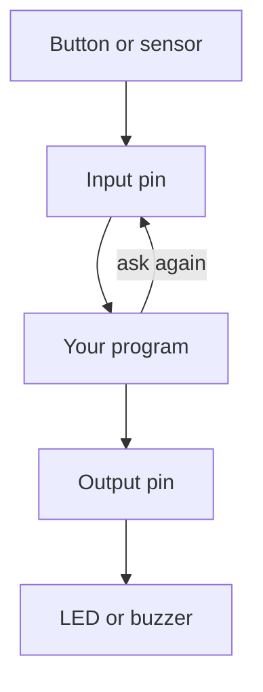

import Quiz from '@components/Quiz.astro';

A **microcontroller** is a computer small enough to be a single chip, cheap enough to be
disposable, and built for one job: reading things in the world and switching things on and
off in response.

The useful mental image is a tiny computer with legs. The legs are how it touches everything
else.

## What it does not have

Starting from what is missing is faster than starting from what is there. Compared to your
laptop, a microcontroller has:

- **No operating system.** Nothing boots. There is no desktop, no file manager, no
  notification you have to dismiss.
- **No screen and no keyboard**, unless you attach some.
- **One program.** It is stored in the chip's memory, it starts the instant power arrives,
  and it runs until power goes away. There is nothing to return *to*, which is why every
  program you will write ends in an endless loop.
- **Almost no memory.** Kilobytes where your laptop has gigabytes. You will not notice for
  anything in this section, and you will notice immediately the day you try to hold an image
  in it.

| | Laptop | Microcontroller |
|---|---|---|
| Operating system | yes | none |
| Programs at once | dozens | one |
| Starts | when you press the button | when power arrives |
| Stops | when you shut it down | when power is removed |
| Talks to the world through | screen, keyboard, network | its pins |
| Memory | gigabytes | kilobytes |
| Costs | a lot | a few euros |

The trade is deliberate. Your laptop cannot tell you what a switch did four milliseconds ago,
because an operating system is busy doing forty other things. A microcontroller has nothing
else to do, so it can.

## Pins

A **pin** is one electrical connection into the chip — one of the legs. On a board they are
brought out to a row of labelled holes along the edge, so you can wire to them.

Pins come in two kinds. A few are **power pins**: `GND`, and one or two supply pins such as
`3V3` or `5V`. Those are not programmable; they are the board offering you electricity. The
rest are **general-purpose input/output** pins, usually written **GPIO**, and those are the
ones your code controls. They are numbered, and the numbering is specific to the board:
`GP15`, `D2`, `IO4` are all real naming schemes on real boards.

The document that tells you which is which is the board's **pinout**: a diagram of the board
with every pin labelled and its abilities noted. You will look at it constantly and you should
never guess in its place. A pin number that is correct on one board is meaningless on another.

## Digital and analog

**Digital** means two states and nothing between them: on or off, high or low, 1 or 0. For a
pin, "high" means it is at the board's operating voltage — 3.3 V or 5 V depending on the board
— and "low" means it is at ground, 0 V. A button, a switch, an LED being lit or unlit: all
digital.

**Analog** means a continuous range rather than two states. A dimmer instead of a light
switch. A knob turned a third of the way, a room that is somewhat bright, a temperature of
19.4 degrees. Sensors that measure quantities produce analog signals: a voltage that slides
smoothly between 0 V and the supply.

A chip can only hold numbers, so an analog voltage has to be converted into one. That is done
by an **analog-to-digital converter**, or **ADC** — a piece of hardware built into the chip
that samples the voltage on a pin and reports a number proportional to it. Only some pins are
wired to it, which is another thing the pinout tells you. There is a whole lesson on this
later.

## Input and output

The same GPIO pin can usually do either job, and your code declares which:

- **Input** — the pin listens. It measures whether the voltage applied to it from outside is
  high or low, and reports that to your program. The pin does not supply anything.
- **Output** — the pin drives. Your program sets it high or low, and the pin actively holds
  its voltage there, supplying current to whatever is attached.

Almost everything you build this semester is that one shape, run over and over for as long as
the power is on:

The program never waits to be told. It reads the pin, decides, drives the other pin, and comes
straight back to read again.

The important limit: an output pin can supply only a small current, typically somewhere between
a few and a few tens of milliamps depending on the chip, with a further limit on all pins added
together. Enough for an LED with a resistor. Not remotely enough for a motor. Check your chip's
datasheet for the real figures before you rely on them — this is a number worth knowing exactly
rather than approximately.

## What an Arduino board actually is

**Arduino** is not the chip. It is a board built around a chip, plus everything you would
otherwise have to build yourself before the chip is usable:

- The **microcontroller** itself, soldered in place.
- A **USB connector**, so you can power it and talk to it from your laptop with an ordinary
  cable.
- A **voltage regulator**, which turns whatever voltage arrives into the steady one the chip
  needs.
- **Headers** — the rows of labelled holes exposing the pins in a sane order with names
  printed next to them.
- A **bootloader** or equivalent, a small permanent program that lets you load your own code
  over USB rather than with special hardware.

Arduino also means the ecosystem: the documentation, the examples, and the fact that a
generation of designers and artists have already asked your question somewhere. That is most
of the value.

The program living in the chip is called **firmware** — the word for software stored on a
device and running the moment it powers up. This matters for the next lessons: to write
MicroPython for a board, you first put the **MicroPython firmware** on it. That firmware is a
Python interpreter, and once it is there the board's whole job is to run the Python file you
give it. You will not have to do the installing yourself for a while — the simulator has it
already, and the course will walk you through it on the real board.

<Quiz
	questions={[
		{
			q: 'Why does every microcontroller program end in an endless loop?',
			options: [
				'Because a loop runs faster than a straight line of code',
				'Because there is no operating system to return to',
				'Because MicroPython refuses to run a program without one',
			],
			answer: 1,
			explanation:
				'On a laptop a finished program returns to the operating system. A microcontroller has none — when your code runs out there is nothing to do next, so a program that is meant to keep working has to keep looping until power is removed.',
		},
		{
			q: 'What is the difference between a digital and an analog signal on a pin?',
			options: [
				'Digital signals are fast and analog ones are slow',
				'Digital is two states; analog is a continuous range',
				'Digital pins are outputs and analog pins are inputs',
			],
			answer: 1,
			explanation:
				'Digital is a switch, analog is a dial. Reading an analog voltage as a number needs an analog-to-digital converter, which is built into the chip and wired to only some of the pins — the pinout tells you which.',
		},
		{
			q: 'You want to drive a small motor directly from an output pin. Why is this a bad idea?',
			options: [
				'The pin holds a voltage far too high for a motor',
				'A pin supplies milliamps; a motor wants far more',
				'Motors need an analog pin and most pins are digital',
			],
			answer: 1,
			explanation:
				'Output pins are rated for milliamps; motors want hundreds of milliamps or more. The pin should carry the decision, not the power — which is what a transistor or a motor driver is for.',
		},
	]}
/>
