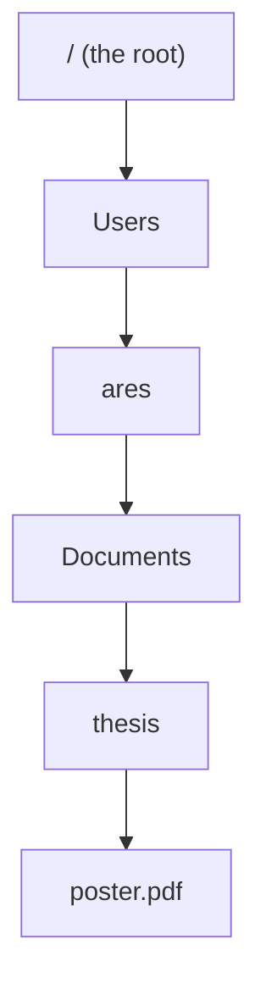

import Quiz from '@components/Quiz.astro';

You have been using files since you were a child. The gap is not what a file is — it is
that programming tools never hand you a Finder window. They ask you to *name* the file, in
writing, exactly. Almost every error you will meet in the next two years says some version
of "file not found", and almost every one of them is a sentence written in a grammar nobody
ever taught you.

This lesson is that grammar.

## A file is a name and some data

A **file** is a lump of data with a name attached — a photograph, a paragraph, a song, a
program. A **folder** is a container for files and other folders. Programmers usually call
a folder a **directory**; the two words mean the same thing, and both will be said in
class.

Folders inside folders make a tree, and everything on your machine lives somewhere in that
tree. Nothing floats loose. A file "on the desktop" is in a folder called Desktop.

## The extension

The bit after the last dot in a name — `.pdf`, `.png`, `.js` — is the **file extension**.
It is a label, not a conversion. Renaming `notes.txt` to `notes.js` translates nothing; it
only changes what programs assume about the contents. That assumption still matters,
because it decides which application opens the file and how a browser reads it.

Both macOS and Windows hide extensions by default, which is exactly the wrong setting for
you. Turn them on now:

- **macOS** — Finder, then Finder → Settings (Cmd+,) → Advanced → tick *Show all filename
  extensions*.
- **Windows** — open File Explorer, then the View menu → Show → tick *File name
  extensions*.

From now on you can see the difference between `logo.png` and `logo.png.jpg`, which is the
kind of thing that eats an afternoon.

## A path is an address

A **path** is the written address of a file or folder: the list of folders you would open,
in order, to reach it.

```
/Users/ares/Documents/thesis/poster.pdf
```

Read it left to right. Each `/` means "go into". So: the root of the disk, then `Users`,
then `ares`, then `Documents`, then `thesis`, and inside that a file called `poster.pdf`.
Drawn as the tree it describes:



The path is that chain of names, written on one line with slashes between them. Nothing
more is going on.

The two operating systems write this differently, and the difference is only cosmetic:

| | macOS and Linux | Windows |
|---|---|---|
| Separator | `/` | `\` (a backslash) |
| Where the tree starts | one root, `/` | one root per drive, `C:\` |
| Your personal folder | `/Users/ares` on macOS, `/home/ares` on Linux | `C:\Users\ares` |

That personal folder is your **home folder**: your Desktop, Documents, Downloads and
everything else you own live inside it. It has a shorthand, `~` (tilde), which every Unix
shell understands. So on a Mac, `~/Downloads` means `/Users/ares/Downloads`.

On Windows, `~` needs one caution, and it is the whole point of the next section. The shell
you will be typing into is Linux, and there `~` is the **Linux** home — never
`C:\Users\ares`. Your Windows home is still reachable, under a different address; the table
below shows how the two line up.

## Windows: you will be writing the left-hand column

The backslash column is what File Explorer shows you and what a Windows program prints.
It is not what you will type. Once you have
[installed WSL2](/ares_materials_estudi/your-machine/wsl2/) — the next lesson but one — the
shell you work in is Linux, so everything you write uses forward slashes and one root.

The two views describe the same disk, and this is how they line up:

| What it is | Windows writes it | You will write it |
|---|---|---|
| Your Windows home | `C:\Users\ares` | `/mnt/c/Users/ares` |
| Your Windows Downloads | `C:\Users\ares\Downloads` | `/mnt/c/Users/ares/Downloads` |
| Your Linux home | `\\wsl$\Ubuntu\home\ares` | `/home/ares`, or `~` |

Two rules turn one into the other: a drive letter becomes `/mnt/` plus that letter in
lowercase, and every backslash becomes a forward slash. `C:\Users\ares\Desktop` is
`/mnt/c/Users/ares/Desktop`, and there is no third rule.

The Linux home in that last row is a genuinely separate place, not a folder on `C:`. It is
where your project files will live, and the WSL2 lesson explains why. Windows also accepts
the newer spelling `\\wsl.localhost\Ubuntu` for that same address — both forms open the same
folder, and you will see each of them in documentation.

:::note[Where downloads go]
Your browser puts everything in your Downloads folder unless you tell it otherwise — which
is `~/Downloads` on a Mac, and `/mnt/c/Users/ares/Downloads` from the Linux shell on
Windows, because the browser is a Windows program and saves on the Windows side. "I
downloaded it but I cannot find it" nearly always means "it is in Downloads and I did not
look".
:::

## Absolute and relative

An **absolute path** starts at the root or at your home folder. It is the full postal
address, and it means the same thing typed from anywhere on the machine.

```
/Users/ares/Documents/thesis/poster.pdf
```

A **relative path** starts from wherever you currently are — your **working directory**,
the folder a program is "standing in" at the moment. It is "second door on the left":
correct only if you are standing in the right corridor.

```
images/logo.png
```

Two special names appear in relative paths, and they are worth memorising:

- `.` means "the folder I am in right now"
- `..` means "the folder one level up" — the **parent folder**

So `../images/logo.png` reads as: go up one level, then into `images`, then the file.

## Why programmers care about this at all

Three reasons, all of them practical.

**Tools take paths as text.** A terminal command, a line of code, a configuration file —
none of them can point at something with a mouse. If the address is wrong by one
character, nothing happens.

**Projects move.** A website you build on your laptop has to keep working when it is
uploaded to a server where nobody has a folder called `/Users/ares`. Relative paths
survive the move; absolute ones break. This is why a webpage refers to its own image like
this:

```html

```

and never with the full address from your disk.

**Errors are usually path errors.** Long before you write a real bug, you will spend hours
on a program that cannot find a file that is definitely, visibly there — under a slightly
different name, or one folder over.

## Name files so they do not fight you

A habit worth starting today, because it costs nothing and saves a lot:

- **No spaces.** Use hyphens: `final-poster.pdf`, not `final poster.pdf`. In a terminal a
  space is how one instruction is separated from the next, so `my file.txt` reads as two
  separate things.
- **Lowercase.** Machines differ on whether `Logo.png` and `logo.png` are the same file.
  Your laptop probably says yes; the server your work ends up on says no.
- **No accents or special characters.** `piñata.png` will work most of the time and fail
  memorably once.
- **Dates as `2026-07-28`.** Written that way they sort correctly on their own.

## Do this on your machine

- [ ] Filename extensions are now visible in Finder or File Explorer
- [ ] I can write out the absolute path of my Downloads folder from memory
- [ ] I copied the full path of a real file (macOS: hold Option, right-click the file, choose *Copy … as Pathname*. Windows: hold Shift, right-click, choose *Copy as path*)
- [ ] Windows: I rewrote that copied path in the Unix form, starting `/mnt/c/`
- [ ] I renamed one file to lowercase-with-hyphens

<Quiz
	questions={[
		{
			q: 'You are standing in the folder /Users/ares/projects/site. What does the relative path ../notes.txt point to?',
			options: [
				'/Users/ares/projects/site/notes.txt',
				'/Users/ares/projects/notes.txt',
				'/Users/ares/notes.txt',
			],
			answer: 1,
			explanation:
				'Two dots mean one level up. From /Users/ares/projects/site that is /Users/ares/projects, and the file sits directly inside it. Two levels up would be written ../../notes.txt.',
		},
		{
			q: "You rename a file from portrait.png to portrait.jpg. What have you changed?",
			options: [
				'The image is converted to a JPEG when it is next opened',
				'Only the label; the data inside is still a PNG file',
				'Nothing — the extension is a hint for humans, not software',
			],
			answer: 1,
			explanation:
				'An extension is a claim about the contents, not a conversion, and nothing performs one later. The bytes are still a PNG, so software that trusts the name tries to read them as a JPEG and fails. Nor is it only a hint for you: it is what decides which program opens the file. Converting means re-exporting from an image program.',
		},
		{
			q: 'Why does a website use images/logo.png rather than /Users/ares/site/images/logo.png?',
			options: [
				'A browser cannot reach files outside the project folder',
				'The full path works too, but shorter names are tidier',
				'It still resolves after the project is uploaded to a server',
			],
			answer: 2,
			explanation:
				'A relative path describes the position of the file inside the project, so the whole folder can be moved, zipped or uploaded and the link still resolves. The absolute path names a folder that exists only on your laptop. Nothing forbids it and nothing is stopping the browser: the folder /Users/ares does not exist on the server.',
		},
		{
			q: 'File Explorer shows a file at C:\\Users\\ares\\Desktop\\brief.pdf. How is that same file written in a Linux shell on the same Windows machine?',
			options: [
				'C:/Users/ares/Desktop/brief.pdf',
				'/mnt/c/Users/ares/Desktop/brief.pdf',
				'~/Desktop/brief.pdf, since ~ is your home folder',
			],
			answer: 1,
			explanation:
				'Two rules, no more: the drive letter becomes /mnt/ plus that letter in lowercase, and every backslash becomes a forward slash. Turning the slashes round is not enough on its own — C:/ means nothing to a Linux shell. Nor is the tilde right: inside WSL2 it is the Linux home, a different folder on the same disk.',
		},
	]}
/>
