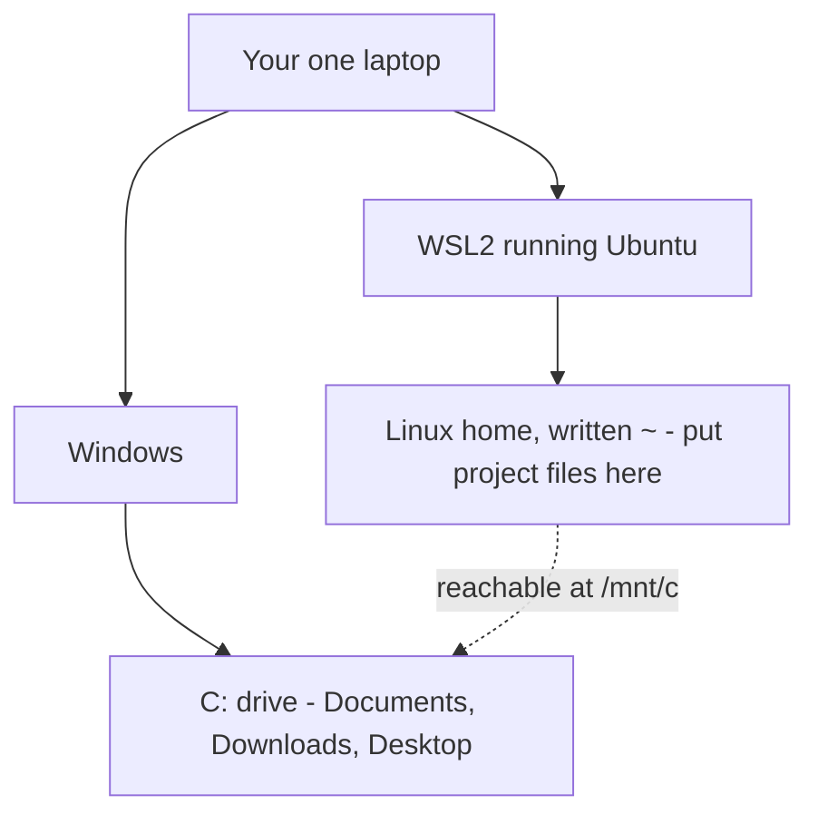

import Quiz from '@components/Quiz.astro';

You opened a terminal in the last lesson. On a Mac, that terminal is already the one every
tutorial, every lecturer and every error message you will meet was written for. On Windows
it is not — and this lesson closes that gap, in about twenty minutes, most of which is
waiting for a download.

:::note[Reading this on a Mac?]
Skip the whole lesson. macOS is already a Unix system and you have nothing to install.
Come back only if you end up working on a Windows machine, which is likely enough at some
point that it is worth knowing this page exists.
:::

## The problem it solves

**Unix** is the family of operating systems that macOS and Linux both descend from. They
share a vocabulary — `ls`, `cd`, `pwd`, `sudo` — that has barely changed in fifty years,
and effectively all programming documentation is written in it.

Windows is not part of that family. Its own shell, **PowerShell**, is a capable piece of
software, but it is a *different* one: it lists a folder with `dir`, separates paths with
backslashes, installs software with a different tool, and reports errors in its own
wording. None of those differences is hard on its own.

The trouble is that there are hundreds of them, and you meet one every time you copy a
command from a tutorial, follow a lecturer's screen, or paste an error into a search box.
It is not a wall you climb once. It is a small tax on every single thing you do for two
years.

WSL2 removes the tax.

## What WSL2 actually is

**WSL** stands for Windows Subsystem for Linux. **WSL2** is its second version, and the
one everybody means when they say WSL. Microsoft ships a real **Linux kernel** — the core
of an operating system, the part that talks to the hardware and hands out memory, files and
processing time to everything else — and runs it alongside Windows on your machine.

Three things it is *not*, because each is a common worry:

- **Not an emulator.** Nothing is imitating Linux or translating for it. That is genuine
  Linux, running genuinely, and programs cannot tell the difference.
- **Not a virtual machine you have to manage.** A **virtual machine** is a whole second
  computer pretending to exist inside your real one, with a window, a memory allowance and
  a boot sequence you look after. WSL2 uses that machinery underneath, but hides all of it:
  there is nothing to size, nothing to boot, nothing to shut down. It starts when you open
  the terminal.
- **Not a replacement for Windows.** Windows stays exactly as it is. Your files stay where
  they are, your applications keep working, and nothing is reformatted or moved. You are
  adding a shell, not swapping an operating system.

## Linux, distributions, Ubuntu

**Linux** is a free operating system and the one nearly every web server in the world runs
on. It does not come as a single product. It comes as **distributions**: the same core
packaged up with different tools, different defaults and different names. Ubuntu, Debian
and Fedora are three of them.

**Ubuntu** is the most widely used, it is what WSL installs unless you ask for something
else, and it is the right choice for you. Not because it is technically better, but because
when you search for an error message at midnight, the person who answered was using it.

## Installing it

Open **PowerShell as Administrator**: click Start, type `powershell`, then right-click
*Windows PowerShell* and choose **Run as administrator**. Windows will ask you to confirm.
Then type one line:

```powershell
wsl --install
```

That downloads WSL, the Linux kernel and Ubuntu. It takes a few minutes. When it finishes
it will ask you to **restart your computer**. Do that before anything else — the install is
not finished until you have.

After the restart, a terminal window opens on its own and spends a while saying it is
installing. Then it asks you two questions.

**Enter new UNIX username.** Lowercase, no spaces — your first name is fine. This does not
have to match your Windows username and nothing breaks if it does not.

**Enter new UNIX password.** Two things about this one:

- It is **a Linux password, not your Windows password**. It is new, you are inventing it
  now, and it will never be typed into Windows. Choose something you can type quickly,
  because you will type it whenever a command starts with `sudo`.
- **Nothing appears on screen while you type it.** No dots, no stars, no moving cursor. The
  terminal has not frozen and your keyboard has not stopped working — hiding the length of
  a password is deliberate, and it is a Unix convention you met in the terminal lesson.
  Type it, press Enter, type it again when asked.

When that finishes you are looking at a prompt like this:

```
ares@LAPTOP-8H2K4:~$
```

That is Ubuntu. You now have a Unix shell — **bash**, the standard Linux one — on a Windows
laptop, and every command in every lesson after this one will work in it exactly as written.

## Opening it again tomorrow

Two ways, and they land in the same place:

- **Start menu → Ubuntu.** It behaves like any other application. Pin it to the taskbar.
- **Windows Terminal**, which is the terminal application from the last lesson. Click the
  small downward arrow next to the plus in the tab bar and choose **Ubuntu** from the list.

Windows Terminal is the nicer of the two — tabs, sensible copy and paste, and PowerShell
still one tab away for the rare occasion you want it. It is preinstalled on Windows 11, and
free from the Microsoft Store on Windows 10. If you want Ubuntu to be what opens by
default, that is in Settings → Startup → Default profile.

## Where your files are now

This is the part everyone gets wrong, and getting it right on day one saves a genuinely
frustrating afternoon later.

You have one laptop and two views of its storage. Windows sees a `C:` drive with your
Documents, Downloads and Desktop in it. Ubuntu has its own file tree, with a home directory
at `~` that starts out empty. Each can reach into the other.



**From Linux, your Windows drives are under `/mnt/c`.** `mnt` is short for *mounted*, which
is the Unix word for a disk that has been attached to the tree. So the Downloads folder you
see in File Explorer is:

```sh
/mnt/c/Users/ares/Downloads
```

**From Windows, your Linux home is a network location.** Type this into the address bar of
File Explorer, or into the Start menu:

```
\\wsl$\Ubuntu\home\ares
```

The files are ordinary files. You can open them in Photoshop, drag them onto a browser
window, attach them to an email.

### Keep project work in the Linux home

Here is the rule, and it is worth writing down:

**Your project folders belong in `~`, not in `/mnt/c`.**

Reaching across the boundary between the two filesystems is slow. Not slow in an abstract
way — a git command that takes half a second in `~` can take fifteen seconds on `/mnt/c`,
and a build that takes ten seconds can take several minutes. Everything still *works*. It
works badly enough to make you think you have done something wrong, which is worse.

So `/mnt/c` is for reaching a file that already lives on the Windows side: a photograph
from your camera, a PDF someone sent you, an export from Figma. Everything you make in the
next two years lives in your Linux home.

### The door between them

From inside Ubuntu, this opens the folder you are standing in as a normal File Explorer
window:

```sh
explorer.exe .
```

Remember that `.` means "the folder I am in right now". It is the fastest way to get from a
terminal to a window when you want to look at an image, drag a file somewhere, or show a
classmate what you have.

That trick is worth noticing for what it reveals: you can run Windows programs from the
Linux shell, by name, with `.exe` on the end. The two halves are not sealed off from each
other. They are one machine.

## If it does not work

Three things account for nearly every failed install. Beyond these, take the exact error
message to [learn.microsoft.com](https://learn.microsoft.com) and search for *WSL* — it is
Microsoft's own documentation and it is kept current.

**Your Windows is too old.** `wsl --install` needs Windows 11, or Windows 10 version 2004
and later. Press Windows+R, type `winver`, press Enter, and a small box tells you which
version you have. If it is older, update Windows first.

**Virtualisation is switched off.** WSL2 needs a processor feature called virtualisation,
which some laptops ship with disabled in the **BIOS** — the small settings program built
into the machine itself, which runs before Windows starts. Open Task Manager, go to the
Performance tab and select CPU: there is a line reading *Virtualization*. If it says
Disabled, you have to turn it on in the BIOS. Getting there differs by manufacturer, so
search for your laptop's model plus "enable virtualization in BIOS" rather than trusting a
generic set of steps.

**You did not restart.** The installer says so and it means it. A surprising share of
"WSL is broken" is a machine that has not been restarted yet.

## Do this on your machine

- [ ] I ran `wsl --install` in an Administrator PowerShell and restarted afterwards
- [ ] I chose a Linux username and a Linux password, and I know the password is not my Windows one
- [ ] I can open Ubuntu again from the Start menu or from the Windows Terminal tab list
- [ ] `whoami` in Ubuntu prints the Linux username I chose
- [ ] I ran `ls /mnt/c/Users` and recognised the folder names as my Windows users
- [ ] I ran `explorer.exe .` and a File Explorer window opened
- [ ] I found my Linux home from Windows by typing `\\wsl$\Ubuntu` into File Explorer
- [ ] I understand that project folders go in `~` and not in `/mnt/c`

<Quiz
	questions={[
		{
			q: 'What is WSL2?',
			options: [
				'A program that translates Linux commands into Windows ones',
				'A real Linux kernel running alongside Windows on the same machine',
				'A replacement for Windows that you boot into instead',
			],
			answer: 1,
			explanation:
				'It is genuine Linux, not an imitation of it, and it runs at the same time as Windows rather than instead of it. Your Windows files, applications and settings are untouched — you have added a shell, not swapped an operating system.',
		},
		{
			q: 'Ubuntu asks you for a password during installation. Which password is it asking for?',
			options: [
				'Your Windows password',
				'Your Microsoft account password',
				'A new password you invent now, used only inside Linux',
			],
			answer: 2,
			explanation:
				'It is a brand new Linux password with no connection to Windows. You will type it whenever a command starts with sudo, and nothing appears on screen while you do — that is deliberate, not a frozen terminal.',
		},
		{
			q: 'Where should you keep the project folders you build during the master?',
			options: [
				'In /mnt/c/Users/you/Documents, so File Explorer can see them easily',
				'In your Linux home directory, ~',
				'It makes no difference at all',
			],
			answer: 1,
			explanation:
				'Both locations work, but reaching across from Linux into the Windows filesystem is slow enough to be painful — a git command or a build can take ten or twenty times longer. Keep work in ~, and use /mnt/c only to reach files that already live on the Windows side.',
		},
		{
			q: 'You are in a folder in Ubuntu and want to look at its contents in a normal File Explorer window. What do you type?',
			options: [
				'explorer.exe .',
				'open .',
				'You cannot — the two filesystems are sealed off from each other',
			],
			answer: 0,
			explanation:
				'explorer.exe . opens the current Linux folder as an ordinary Windows window, where the dot means "the folder I am in right now". It also shows something useful: Windows programs can be run by name from the Linux shell, because this is one machine, not two.',
		},
	]}
/>
